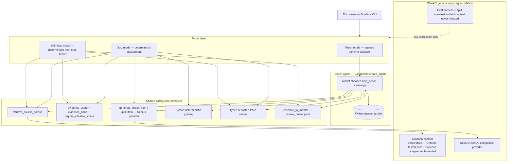

# GenAcademy Coach

Learners re-watch lectures hoping a concept clicks. GenAcademy Coach replaces that loop with an
adaptive, grounded AI tutor: it retrieves citeable course evidence, explains in the learner's chosen
style and teaching lens, checks understanding with a grounded question, and when the learner stumbles,
the model chooses a different explanation strategy at runtime — not a hardcoded Python branch. When it
cannot cite the answer, it refuses and escalates to a human mentor instead of guessing. Three shipped
modes (teach, quiz, skill-gap diagnosis) share the same grounded core. The product promise is simple:
**grounded from retrieved course citations, or refuse and escalate**.

Current conservative dev evidence: **7/10 overall, 7/8 teachable** on the merged-main baseline in
[`docs/teach-loop-status.md`](docs/teach-loop-status.md). The 2 non-passing non-teachable scenarios are
safe low-retrieval refusals, and the held-out `test` split remains unused.

Built as the Week-3 "Agentic Leap" project of the Mastering Agentic AI Bootcamp, layered on the
author's Week-2 RAG system (`genacademy-rag` / GenAcademy Compass).

Architecture entry points:
[`docs/architecture-diagrams.md`](docs/architecture-diagrams.md) for the end-to-end diagram and
[`docs/architecture.md`](docs/architecture.md) for the design decisions and trust boundary. For a
course-concept walkthrough grounded in this build, see
[`docs/agent-concepts-from-genacademy-coach.md`](docs/agent-concepts-from-genacademy-coach.md).

## Quick Verification Path

```bash
uv run pytest -q                                         # full regression suite
uv run ruff check .                                      # lint clean
uv run python scripts/check_eval_leak.py                 # held-out split untouched
uv run python scripts/check_memory_leak.py               # memory stores only safe state
uv run python scripts/run_memory_demo.py \
  --user-id demo-user --topic "agent harness"             # optional memory recall
```

With provider credentials and local corpus:

```bash
GENACADEMY_PROVIDER=nebius GENACADEMY_COACH_STOP_THRESHOLD=0.40 \
  uv run python scripts/eval_teach_loop.py --split dev    # redacted dev eval
```

Expected proof points: redacted teach traces contain hashes, unsupported topics refuse, the HF Space is
only a deployment shell without private corpus/index, and optional memory scaffolding recalls safe
learner-state without becoming a citation or grounding source.

## The Agentic Leap: What Changed From Week 2

The Week-2 project provided the RAG foundation: embedder, vectorstore schema/factory, chunking pipeline,
citation metadata, provider boundary, eval harness, and refusal-first discipline.

This project adds the agentic layer:

| Handout Requirement | Implementation | Key Files |
|---|---|---|
| **Multi-step agentic task** | Teach loop: intake → retrieve → explain → check → grade → runtime decide → update profile → loop | [`teach_session.py`](src/genacademy_coach/teach_session.py) |
| **Tool calls** | 6 tools: `retrieve_course_corpus`, `generate_check_item`, `grade_understanding`, `update_profile`, `write_trace`, `escalate_to_mentor` | [`teach_tools.py`](src/genacademy_coach/teach_tools.py) |
| **State management** | Within-session `LearnerProfile` + optional off-by-default Mem0 episodic memory | [`teach_types.py`](src/genacademy_coach/teach_types.py), [`memory.py`](src/genacademy_coach/memory.py) |
| **Human-in-the-loop** | Refusal → `review_queue.jsonl` entry → mentor escalation | [`escalation.py`](src/genacademy_coach/escalation.py) |
| **Tool failure / recovery** | 6 mechanisms: retry/validation, confidence bands, source fallback, human escalation, faithfulness fallback, stop/progress guard | [`teach_session.py#_enforce_grounding`](src/genacademy_coach/teach_session.py) |
| **Eval / "how it worked"** | Deterministic eval on dev split, redacted diagnostics, held-out test never used | [`scripts/eval_teach_loop.py`](scripts/eval_teach_loop.py) |
| **Architecture diagram** | End-to-end trust-boundary diagram plus focused Mermaid views for teach, quiz, skill-gap, state, failure handling, and eval boundary | [`docs/architecture-diagrams.md`](docs/architecture-diagrams.md) |

Additional shipped features beyond the teach-loop MVP:
- Grounded Quiz Mode with deterministic Python grading of selected option IDs
- Skill-Gap Diagnosis composing teach/quiz traces into a cited next-step plan
- Same-topic lens switching (low-code/no-code, code-heavy, bridge)
- Local Gradio UI with allow-listed demo trace cards: decision basis, labeled action/band/score status
  chips, citation summaries, and collapsed metadata
- Cohort login gate (bcrypt, seed-secret accounts, no default creds in the shared deploy) with
  server-side admin account creation
- Privacy-first episodic memory scaffolding (salted hashes only, off by default)
- Hugging Face Space deployment shell; Pinecone adapter implemented, Chroma is the tested retrieval path,
  and no private corpus is uploaded

Teach mode uses the course-recommended LangChain `create_agent`: a pre-assembled, LangGraph-backed
agent. LangChain compiles the model/tool loop into a graph and runs it on LangGraph's runtime, so the
project satisfies the LangChain + LangGraph track without hand-authoring a `StateGraph`. Explicit
`langgraph.*` work (graph authoring, checkpointer, interrupts) is deferred until durable cross-session
memory, HITL pause/resume, or multi-mode coordination earns it.

## System Architecture

One LangChain `create_agent` loop handles the adaptive teach mode. Quiz and Skill-Gap are deterministic
pull-ins over the same retrieval, grounding, trace, and refusal primitives.



### Why This Architecture

Three load-bearing decisions (full rationale in [`docs/decisions.md`](docs/decisions.md)):

1. **`create_agent`, not raw `StateGraph`.** The handout's LangChain + LangGraph track is satisfied
   through the course-recommended pre-assembled, LangGraph-backed agent runtime. Explicit graph
   authoring is deferred until durable cross-session memory, HITL pause/resume, or multi-mode
   coordination outgrows the current loop. (AD-3)
2. **One source-prioritized retriever, not three tools.** Every chunk carries `source_type`; slides and
   handouts are preferred for teaching, notes fill gaps, transcripts are support/fallback. One retriever
   reduces sparse-index risk. (AD-4)
3. **Deterministic grading gate, not LLM self-assessment.** The pass/fail decision uses normalized
   answer matching plus citation-resolves checks. The inherited Week-2 LLM judge is available only as a
   secondary faithfulness audit. (AD-6)

## Status

| Surface | Status | Notes |
|---|---|---|
| Grounded teach loop | Shipped | LangChain `create_agent` chooses `next_action` and strategy; Python enforces grounding, citations, turn limits, and refusal safety. |
| Refusal + mentor queue | Shipped | Unsupported topics refuse and write local review-queue events instead of answering from model priors. |
| Redacted eval + leak guard | Shipped | Dev evidence is `7/10` overall and `7/8` teachable on 2026-06-16; held-out `test` split remains unused. |
| Same-topic lens switch | Shipped | The learner can switch among low-code/no-code, code-heavy, and bridge teaching lenses for the same topic. |
| Grounded Quiz Mode | Shipped pull-in | Generates cited MCQs from retrieved spans and grades selected option IDs deterministically in Python. |
| Skill-Gap Diagnosis | Shipped pull-in | Produces a deterministic, cited next-step report from teach/quiz traces and review-queue events. |
| Local Gradio UI | Shipped | Thin web view over teach, quiz, and skill-gap workflows; Teach trace cards show `Decision basis` plus labeled `action ...` / `band ...` status chips, while raw trace JSON remains local. Quiz defaults to visible generated questions for the local/private demo, while backend direct calls hide quiz text unless explicitly requested. Core logic has no web-framework imports. |
| Cohort auth/admin | Shipped | Cohort login gate with bcrypt password hashes, deploy seed-secret accounts, no default creds accepted in the shared deploy, and server-side admin-only account creation. |
| Hugging Face Space | Deployment shell | Private Space smoke-passes HTTP. Pinecone adapter support is implemented, but Chroma remains the tested path and no approved hosted corpus/index is seeded yet, so the shell shows an empty-corpus notice. |
| Cross-session memory | Scaffolded off by default | Mem0 adapter and local demo are implemented after the privacy slice. It is disabled unless `MEM0_API_KEY` and `GENACADEMY_COACH_MEMORY_USER_SALT` are set, and it never supplies facts, citations, grading, or refusal decisions. |
| Mock interview / admin upload / voice | Roadmap | Deferred until they earn separate plans and privacy reviews. |

Private course material, traces, review queues, screenshots, and handoff packaging stay local-only.
Local handoff materials can live under ignored `localdocs/`.
The repository tracks structure, code, redacted metrics, and safety checks.

## Scope

In scope for the Week-3 submission:

- Adaptive teach loop with runtime `next_action` and `strategy` chosen by the `create_agent` teach loop.
- Deterministic Python enforcement for grounding, refusal/escalation, grading, turn safety, and trace
  redaction.
- Grounded Quiz Mode and Skill-Gap Diagnosis as pull-ins over the same retrieval, citation, grading,
  trace, and refusal primitives.
- Cohort auth/admin as a bounded login gate: bcrypt password hashes, seed-secret accounts for deploys,
  no default creds accepted in the shared deploy, and server-side admin-only account creation.
- Privacy-first memory scaffolding, used to keep learner state per member without treating memory as
  course evidence.

Deliberately deferred:

- Direct ElevenLabs voice, mock interview, multimodal inputs, and admin upload. Each adds a new privacy
  or review surface, so each needs its own plan.
- Explicit LangGraph graph authoring. The current agent uses LangChain `create_agent` on LangGraph's
  runtime, while the repo intentionally avoids direct `langgraph.*` imports.
- Public corpus hosting. The HF Space is a deployable shell; private course corpus/index files stay
  local unless an approved public-safe corpus is prepared.

## Eval Evidence

The documented eval number is intentionally conservative: the merged-main dev run in
[`docs/teach-loop-status.md`](docs/teach-loop-status.md) reports `7/10` overall and `7/8` teachable on
10 dev scenarios. The 2 non-teachable non-passes are safe low-retrieval refusals, and the remaining
teachable miss is documented as a model/decision-path diagnostic rather than overfit away here.

This is a small-N dev regression signal, not a benchmark claim. The held-out `test` split is not run,
indexed, copied into prompts, tuned against, or used in demos.

## Safety & Privacy

- `scripts/check_eval_leak.py` protects the held-out eval split discipline.
- `scripts/check_memory_leak.py` scans memory artifacts for raw topic, answer, corpus, or eval text.
- `SAFE_TEACH_TRACE_FIELDS`, `SAFE_QUIZ_TRACE_FIELDS`, and the Gradio trace summary allow-list
  grader-visible trace fields. Local/private demo trace cards can show the rendered `Decision basis`,
  labeled `action ...` / `band ...` status chips, scores, strategies, citation summaries, and tool-call
  summaries; raw learner answers, raw trace JSON, generated quiz trace text, tutor prose, and retrieved
  span text stay out of exported trace artifacts.
- `user_id_hash` salts authenticated cohort identity before memory lookup/write-back.
- Cohort login is a bounded gate, not enterprise auth: passwords are bcrypt-hashed through the reused
  Week-2 store, admin account creation is checked server-side from the authenticated request user, seed
  accounts are supplied through deploy secrets, and the live Space verification accepted configured
  admin/member secrets while rejecting default admin/member credentials.
- The refusal-or-cite gate requires retrieved citation evidence for course facts; low evidence refuses
  and writes a review-queue row instead of answering from model priors.
- Memory is learner-state only. It can seed style/lens/state, but it never provides citations, course
  facts, retrieval input, grading, or refusal decisions.

## Design Principles

- **Grounded or refuse.** The tutor only teaches what it can cite from retrieved course spans.
- **Runtime agenticity.** In teach mode, the model chooses `advance`, `drill`,
  `re_explain_differently`, `refuse_escalate`, or `stop` from observations. The local demo UI labels
  these as status chips such as `action advance` and `band confirm`, not clickable controls.
- **Deterministic grading.** Quiz and check grading are Python gates, not LLM self-assessment.
- **Citations captured at retrieval.** Citations are derived from retrieved span metadata, never
  reconstructed by the model.
- **Pure core, thin view.** Retrieval, teaching, grading, diagnosis, and trace logic stay in the core;
  Gradio is only a presentation wrapper.
- **Protected eval split.** The held-out `test` split is never indexed, prompted, tuned against, or
  used for local examples.
- **Privacy-first artifacts.** Teach traces, review queues, and memory payloads store hashes and
  allow-listed metadata instead of raw learner answers, generated tutor text, or corpus snippets.

## Build-in-Public: Decisions Under Pressure

I kept a running log of every non-obvious surprise during the build — the full trail is in
[`docs/build-learnings.md`](docs/build-learnings.md). The public-series plan is in
[`docs/linkedin-agentic-ai-series-plan.md`](docs/linkedin-agentic-ai-series-plan.md). Format:
*what I believed → what I found → the reusable principle.* Three examples:

- **"A pivot can silently break the safeguard your old design depended on."** Switching to my own course
  notes almost contaminated the held-out eval set because the quiz-yourself questions lived *inside* the
  notes I was now indexing. The real student chat questions are corpus-independent — they're the leak-safe
  held-out set.

- **"If Python computes the canonical grade, tool calls cannot be allowed to overwrite it."** After
  moving answer grading to the session boundary, the agent's tool calls could still overwrite the
  canonical grade mid-turn. The fix: lock the grade to the check item it belongs to and clear the lock
  on ownership change.

- **"A working refusal path can hide a retrieval problem unless you count it."** The first dev eval
  showed the agent mostly refusing safely. Without per-reason diagnostic counts, all failures collapsed
  into "failed eval" and pointed in the wrong direction.

## Documentation

- [`AGENTS.md`](AGENTS.md) — working agreement and project guardrails.
- [`specs/mission.md`](specs/mission.md) — project scope and audience.
- [`specs/tech-stack.md`](specs/tech-stack.md) — stack decisions and constraints.
- [`specs/roadmap.md`](specs/roadmap.md) — shipped work, active work, and future pull-ins.
- [`docs/architecture-diagrams.md`](docs/architecture-diagrams.md) — system and flow diagrams.
- [`docs/agent-concepts-from-genacademy-coach.md`](docs/agent-concepts-from-genacademy-coach.md) —
  course agent concepts mapped to the actual Teach, Quiz, Skill-Gap, grounding, memory, and trace
  components.
- [`docs/decisions.md`](docs/decisions.md) — load-bearing architecture decisions.
- [`docs/genacademy-rag-foundation.md`](docs/genacademy-rag-foundation.md) — Week-2 reuse contract.
- [`docs/hugging-face-deployment-plan.md`](docs/hugging-face-deployment-plan.md) — deployment wrapper
  and public-data constraints.
- [`docs/teach-loop-status.md`](docs/teach-loop-status.md) — redacted teach-loop status and eval
  evidence.
- [`docs/build-learnings.md`](docs/build-learnings.md) — implementation lessons and tradeoffs.
- [`docs/linkedin-agentic-ai-series-plan.md`](docs/linkedin-agentic-ai-series-plan.md) —
  public-safe build-in-public post series plan.
- Ignored `localdocs/` — local-only demo scripts, screenshots, and DOCX packets; never publish or
  commit generated screenshots/raw trace artifacts without separate review.
- [`docs/superpowers/plans/2026-06-17-skill-gap-diagnosis.md`](docs/superpowers/plans/2026-06-17-skill-gap-diagnosis.md)
  — reviewed plan behind the Skill-Gap Diagnosis slice.
- [`docs/superpowers/plans/2026-06-17-skill-gap-ui-wrapper.md`](docs/superpowers/plans/2026-06-17-skill-gap-ui-wrapper.md)
  — thin-view plan for the Gradio Skill-Gap tab.

## Local Setup

```bash
uv sync
cp .env_example .env
```

Fill `.env` with provider credentials. The local course corpus and generated traces are intentionally
gitignored.

The Gradio app is cohort-auth gated by default. Local seeded accounts come from the reused Week-2
SQLite user store; set `GENACADEMY_SEED_ADMIN_PASSWORD` and `GENACADEMY_SEED_MEMBER_PASSWORD` as
secrets before any shared deployment. The shared deploy was verified with configured seed secrets
accepted and default admin/member credentials rejected. Set `GENACADEMY_COACH_AUTH_ENABLED=false` only
for an intentional local no-login demo.

Memory is off by default. To enable the Mem0 adapter for local cohort runs, set both `MEM0_API_KEY`
and `GENACADEMY_COACH_MEMORY_USER_SALT`; leaving either blank uses a no-op memory provider.

Launch the local UI:

```bash
uv run python app.py
```

For a no-login local recording that focuses on the teach/quiz/trace walkthrough, run:

```bash
GENACADEMY_COACH_AUTH_ENABLED=false \
GENACADEMY_COACH_SERVER_NAME=127.0.0.1 \
uv run python app.py
```

If the login is part of the recording story, use non-sensitive seed credentials and avoid showing real
deployment passwords on camera.

Run verification:

```bash
uv run pytest -q
uv run ruff check .
uv run python scripts/check_eval_leak.py
uv run python scripts/check_memory_leak.py
```

Run the redacted dev eval when provider credentials and the local corpus are available:

```bash
GENACADEMY_PROVIDER=nebius GENACADEMY_COACH_STOP_THRESHOLD=0.40 \
  uv run python scripts/eval_teach_loop.py \
    --split dev \
    --limit 10 \
    --json-out eval/runs/teach-loop-dev.json
```

Do not run or tune against `--split test` until final evaluation/reporting.
