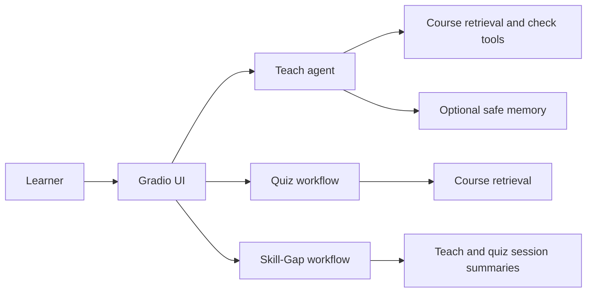

# Agent Concepts Through GenAcademy Coach

This note maps the agent concepts from the course slides to the project we built. The useful mental
model is:

**Teach is the agentic proof. Quiz and Skill-Gap are deterministic workflows. Gradio is the view.
Python owns the safety boundary.**

That distinction is what keeps the project honest. The app does not call everything an agent just
because an LLM is involved.

## Project Compass

| Surface | What it is | Why it is designed that way |
|---|---|---|
| Teach | Supervised single-agent loop | LangChain `create_agent` chooses `next_action` and `strategy` at runtime from learner observations. |
| Quiz | Deterministic grounded assessment | The provider drafts cited MCQs, but Python validates and grades selected option IDs. |
| Skill-Gap | Deterministic diagnosis workflow | It composes teach traces, quiz traces, review-queue events, and retrieval into a cited next-step report. |
| Gradio app | Thin view | UI renders controls and safe trace cards; core behavior stays in testable Python modules. |
| Memory | Optional safe learner-state recall | Memory can personalize style/lens hints, but it never supplies facts, citations, grades, or refusal decisions. |

Check yourself: if the model is choosing the next step from an observation, it is agentic. If Python is
following a fixed path, it is a workflow.

## Agent, Chatbot, Workflow

| Concept | In the slides | In this project |
|---|---|---|
| Chatbot | One user message in, one answer out | Not the main product shape. A plain "answer my question" interface would not prove the adaptive tutor. |
| Workflow | Developer fixes the path ahead of time | Quiz and Skill-Gap. They retrieve, validate, grade, summarize, and stop through known code paths. |
| Agent | Goal plus tools; model chooses next step in a loop | Teach. The model chooses `advance`, `drill`, `re_explain_differently`, `refuse_escalate`, or `stop` from runtime evidence. |

Anchors: `src/genacademy_coach/teach_agent.py`, `src/genacademy_coach/teach_session.py`,
`src/genacademy_coach/quiz_session.py`, `src/genacademy_coach/skillgap_session.py`.

The course phrase "if the path is fixed, it is a workflow" is the cleanest way to explain the product:
GenAcademy Coach uses both, deliberately.

## The Teach Agent Loop

The Teach loop is the project version of reason -> act -> observe -> adapt.

| Loop part | Project component |
|---|---|
| Goal | Teach the requested course topic in the selected style and track lens. |
| State | `LearnerProfile`, current turn, active check item, topic hash, style, lens, recent observations. |
| Tools | Retrieve course corpus, generate check item, grade understanding, update profile, escalate to mentor. (Trace writing is a Python side-effect, not a model tool.) |
| Observation | Retrieved spans, evidence band, citation presence, learner answer grade, tool results, refusal state. |
| Runtime decision | `CoachAgentResponse.next_action` and `strategy`. |
| Stop condition | Turn limits, low grounding, explicit stop, progress guard, or mentor escalation. |

The model is allowed to teach and choose the next pedagogy move. It is not allowed to decide whether
course evidence exists, whether an answer is grounded, or whether a grade is correct.

Check yourself: when the learner gives a partial answer, the interesting product moment is not the
explanation text. It is whether the next action changes because of the observation.

## Agent Vocabulary And Components

| Term | Course meaning | GenAcademy Coach mapping |
|---|---|---|
| Agent | System that pursues a goal with tools and runtime decisions. | Teach loop. |
| Action | One thing the agent decides to do this turn. | Advance, re-explain, drill, refuse/escalate, or stop. |
| Observation | Result that feeds the next turn. | Retrieval band, citations, learner answer grade, tool result, refusal reason. |
| Tool | A callable capability with a name and schema. | Course retrieval, check generation, grading, profile update, escalation. |
| State | What the system currently knows. | Topic, style, lens, active check, learner profile, trace metadata. |
| Memory | Recalled learner context. | Optional safe learner-state facts, not course facts. |
| Planner | The part deciding what should happen next. | The `create_agent` response selecting `next_action` and strategy. |
| Executor | Code that runs the selected action/tool. | Python functions and typed tool wrappers. |
| Knowledge | Domain content used to answer. | Week-2 course corpus and citations. |
| Perception/input | What the system receives. | Topic, learner answer, style, lens, prior session summary. |
| Communication | How components pass information. | Typed Python objects, Gradio events, trace cards, review queue rows. |
| Environment | External systems the agent can affect. | Mostly local app state; no irreversible production writes. |
| Supervision/control | Constraints around behavior. | Grounding thresholds, citation checks, auth, review queue. |
| Monitoring/observability | Visibility into what happened. | Trace cards, tests, lint, leak checks, demo QA. |
| Learning/adaptation | Improving from feedback. | Session profile updates and optional Mem0 learner-state recall. |
| Security/safety | Boundaries that prevent bad outcomes. | No secrets, no raw private data in commits, no held-out test leakage. |
| Evaluation | Measuring whether it works. | Dev evals, regression tests, Playwright smoke, manual demo paths. |

## Autonomy And Control

GenAcademy Coach is not fully autonomous. It sits closer to a supervised or semi-autonomous system:

| Autonomy question | Project answer |
|---|---|
| Who chooses the next teaching move? | The Teach agent chooses at runtime. |
| Who decides whether evidence is good enough? | Python grounding gates. |
| Who decides whether to refuse? | Python thresholds and citation checks force refusal or escalation. |
| Who can see the steps? | The local/private demo UI shows allow-listed trace cards. |
| Who approves risky outcomes? | Mentor review queue handles unsupported or low-confidence cases. |

This is the right level for a tutor over private course material. Full autonomy would be the wrong
product shape because the cost of bluffing is high: it teaches the learner the wrong thing.

## Tools And MINT

The project follows the MINT principle: Minimal Intelligence, Necessary Tools.

| Slide idea | Project decision |
|---|---|
| More tools is not automatically better | We use one source-prioritized course retriever instead of separate slide, handout, notes, and transcript tools. |
| Read tools are safer than write tools | Most tools are read or metadata-write. Mentor escalation writes a bounded review queue row. |
| Tool schema matters | Tool calls use typed structures and tested core paths. |
| Agents pick wrong tools when the toolset is too broad | Explicit MCP, A2A, and multi-agent tool networks are deferred until an eval shows the need. |

Anchors: `src/genacademy_coach/teach_tools.py`, `src/genacademy_coach/foundation.py`,
`specs/tech-stack.md`, `docs/decisions.md`.

The senior-builder move here was boring on purpose: do not add tool breadth until the narrow toolset
fails in a measurable way.

## Memory

The project separates memory from evidence.

| Memory type | Course meaning | Project mapping |
|---|---|---|
| Working memory | Current prompt, recent tool results, current task state | Current Teach turn, retrieved spans, active check item, grade, trace metadata. |
| Session memory | Conversation/session history | `LearnerProfile` and recent turns inside the running session. |
| Long-term memory | Durable facts/preferences across sessions | Optional Mem0 safe state: style, lens, topic hashes, counts. Off by default. |
| Semantic memory | Stable facts/preferences | Safe learner preferences only, not course facts. |
| Episodic memory | Prior events/actions | Safe event summaries and hashes, not raw learner text or generated tutor prose. |
| Procedural memory | How something is done | Mostly code and prompt policy today: adapt style, re-explain, drill, advance, refuse. |
| Vector memory | Find by similarity | Possible backend for learner-state recall; course retrieval already uses vector search. |
| Graph memory | Find by relationships | Future option for learner -> concept -> struggle -> recommendation links. |

Memory can make the tutor feel continuous, but it must not become a hidden evidence source. Course facts
still come only from retrieval with citations.

Anchors: `src/genacademy_coach/memory.py`, `scripts/check_memory_leak.py`,
`docs/architecture.md`.

## Mem0 Write And Read Path

Mem0's mental model is useful even if the backing store changes: extract, store, retrieve. For this
project, memory is not the course knowledge base. Memory is the learner-state layer around the
grounded tutor.

### Write Path

| Mem0 step | Project mapping | Guardrail |
|---|---|---|
| Conversation | A Teach turn, quiz result, refusal event, or Skill-Gap run creates an event. | Do not store raw learner text, private corpus spans, generated tutor prose, screenshots, or raw trace JSON. |
| Extract | Distill safe learner-state facts from the event. | Keep facts about learning state, style, lens, topic hashes, counts, and timestamps. |
| Append | Add a new memory rather than silently overwrite the old one. | A later success can coexist with an earlier struggle; history should not vanish. |
| Link | Attach by salted user, topic hash, session, and time. | Raw identifiers and private content stay out of memory metadata. |

Public-safe memory examples:

- `learner prefers analogy style`
- `learner practiced agent harness`
- `learner struggled with loop vs workflow`
- `learner improved after drill on citations`

Things that are not memory:

- the retrieved course span itself
- the full learner answer
- raw trace JSON
- generated quiz screenshots
- secrets, tokens, or private corpus text

### Read Path

| Mem0 step | Project mapping | Guardrail |
|---|---|---|
| Query | A new Teach request or check continuation asks what learner context is useful. | Query only within the current user scope. |
| Search | Retrieve relevant learner-state memories by topic, style, lens, and recent struggle. | Do not retrieve every past event. |
| Rank | Keep only a small, useful top-k memory set. | Over-retrieval is a common memory bug. |
| Inject | Add a compact hint into the Teach context. | Memory never becomes a citation or source of truth. |

The most important rule is simple: memory can personalize the teaching move, but evidence still comes
from retrieval over the course corpus.

## Memory At Scale

The Mem0 slides framed scale around accuracy, latency, and tokens. GenAcademy Coach uses the same
trade-off, but at demo scale.

| Scale pressure | What it means | Project design choice |
|---|---|---|
| Accuracy | Recall the right learner state. | Store only high-signal learner facts and keep course facts in RAG. |
| Latency | Memory can run on every turn. | Memory is optional and compact; the app should still work when it is off. |
| Tokens | Every injected fact spends context. | Inject summaries, not full history. |

Do not quote benchmark numbers from slides or vendor pages in public docs unless they have just been
re-checked from the source. Model prices, latency, and benchmark claims move quickly.

## Where Memory Can Go Next

| Mem0 direction | GenAcademy Coach interpretation |
|---|---|
| Portable personal memory | A learner profile that follows the same cohort member across Teach, Quiz, and Skill-Gap. |
| Multiplayer memory | Future mentor/admin views that summarize cohort struggles without exposing raw learner text. |
| Temporal and reasoning-aware recall | Old confusion should decay after the learner demonstrates understanding. |
| Memory as infrastructure | A shared learner-state layer that multiple teaching surfaces can use. |

The product lesson: memory is a differentiator only when it improves the next teaching move. Saving
everything is not memory design. It is just a larger prompt bill and a larger privacy surface.

## Planning, Feedback, And Progress

The Teach agent does not write a long plan up front. It plans one teaching move at a time:

1. Retrieve citeable context.
2. Teach the concept.
3. Ask a check question.
4. Observe the learner answer.
5. Choose the next move.

That is closer to "plan one step at a time" than "planner-executor." It is slower than a single answer,
but it is the point of the product: the learner response changes the route.

The project guards against bad agent loops with:

| Failure mode | Guard |
|---|---|
| Repeating the same action forever | Turn limits and stop/progress protection. |
| Continuing from weak retrieval | Evidence bands and citation-present checks. |
| Ignoring the learner answer | Boundary grade locks and active check state. |
| Treating tool output as truth without validation | Python grading, citation checks, and faithfulness fallback. |

Anchors: `src/genacademy_coach/teach_session.py`, `src/genacademy_coach/grounding.py`,
`src/genacademy_coach/teach_types.py`.

## Confidence, Review Queues, And Human Checkpoints

The slides use STOP, CONFIRM, and PROCEED as a useful mental model. The project uses calibrated
retrieval bands instead of an LLM self-rating:

| Band | Current project threshold | Behavior |
|---|---:|---|
| STOP | below `0.40` | Refuse and/or escalate because evidence is too weak. |
| CONFIRM | `0.40` to `0.85` | Continue carefully with trace evidence and citation checks. |
| PROCEED | above `0.85` | Strong retrieval evidence, still citation-gated. |

The exact numbers are project-calibrated, not universal. If you quote them publicly, say they are the
current GenAcademy Coach thresholds, not general agent thresholds.

Human checkpoints appear where the project needs control:

- unsupported topic -> refusal and mentor review queue
- low grounding -> stop/refuse instead of guessing
- public/demo trace -> allow-listed evidence only
- deployment -> private corpus and generated indexes stay out of the hosted shell

Anchors: `src/genacademy_coach/escalation.py`, `docs/teach-loop-threshold-calibration.md`,
`README.md`.

## Observability

An agent without observability is hard to debug and hard to trust. GenAcademy Coach makes the loop
inspectable through safe traces:

| Observable signal | Project example |
|---|---|
| Trace | Decision basis, action, band, score, strategy, citation count, tool-call summary. |
| Tool history | Retrieval, check generation, grading, profile update, mentor escalation. |
| State | Topic hash, input hash, active check ownership, learner profile counts. |
| Metrics | Dev eval pass counts, refusal reasons, leak checks, lint/tests. |
| Error categories | Low retrieval, faithfulness fallback, grading mismatch, UI state confusion. |

The UI lesson we learned the hard way: a trace value must look like status, not like a broken button.
That is why status chips now read `action advance` and `band confirm`.

Anchors: `src/genacademy_coach/trace.py`, `src/genacademy_coach/web/gradio_app.py`,
`docs/build-learnings.md`.

## Cost And Latency

Loops multiply cost and latency. The project keeps that visible in the architecture:

| Cost/latency pressure | Project response |
|---|---|
| Every extra LLM turn adds time | Quiz and Skill-Gap are workflows, not extra agents. |
| Every tool call can fail | Toolset is small and read-mostly. |
| Every retry can waste tokens | Teach has run limits and fallback paths. |
| Model choice can drift | Provider/model IDs, pricing, and latency should be re-checked before public claims. |

If you write a public post about latency rankings or model providers, re-check the source on the day of
posting. Model speed, price, and IDs change.

Anchors: `src/genacademy_coach/teach_agent.py`, `docs/build-learnings.md`, `specs/tech-stack.md`.

## Decision Tree: Which Tool For Which Task

The useful design question is not "Can this be an agent?" It is "What is the lightest thing that can do
the job?"

| Question | If yes | Project example |
|---|---|---|
| Can one prompt answer with no data or action? | Prompt-only. | Not the core product, because the tutor must cite course evidence. |
| Is the path fixed and predictable? | Workflow. | Quiz generation/scoring and Skill-Gap diagnosis. |
| Is it just retrieve and answer? | RAG. | The Week-2 `genacademy-rag` foundation. |
| Is one tool call enough, no loop? | Tool calling. | A simple provider or retrieval call. |
| Does the next step depend on observations? | Agent. | Teach deciding `advance`, `re_explain_differently`, `drill`, `refuse_escalate`, or `stop`. |

This also explains the difference between deterministic and workflow:

- Deterministic is a property: the same inputs follow the same rules and produce the same kind of path.
- Workflow is a structure: a predefined sequence of steps.
- A workflow can be deterministic.
- Quiz is a deterministic assessment workflow.
- Skill-Gap is a deterministic analysis workflow.
- Teach is an agentic workflow because the model chooses the next teaching action from learner
  observations at runtime.

## Human Review Patterns

The project does not perform irreversible external actions, but it still uses human-review thinking.
The refusal/escalation path is the review boundary.

| Pattern | Meaning | Project mapping |
|---|---|---|
| Approve | Ship the recommendation as-is. | A mentor could accept a grounded coaching response. |
| Reject | Kill the output. | Unsupported topics refuse instead of fabricating. |
| Edit | Human fixes, then ships. | Future mentor view can rewrite a weak explanation. |
| Retry | Run again with a hint. | Learner answer causes re-explain or drill. |
| Escalate | Pass to someone with more authority or context. | Out-of-corpus topics escalate to a mentor. |
| Annotate | Approve/reject and tag why. | Future eval data can tag "bad citation", "weak retrieval", or "unclear check". |
| Override | Human chooses a different action. | Future admin can mark a concept as understood despite agent uncertainty. |

The local review **queue records** are already shipped: mentor escalation and unsupported-topic refusals
write a bounded, allow-listed row today. What is still **planned** is a mentor-facing review
**UI/workbench** to triage those rows, which would surface:

- task/topic
- recommended next action
- reason summary
- evidence/citations
- tool-call summary
- confidence band
- learner-safe state summary

Today those same allow-listed, learner-safe fields already render as the shipped UI trace cards — not
decoration, but the human-readable audit trail a future mentor workbench would build on.

## Risks We Actually Faced

| Slide risk | Project version | Guard |
|---|---|---|
| Agents get stuck in loops | Teach controls could appear to rerun the same state if the UI did not label the active check clearly. | Start/Submit split, active check state, Playwright regression. |
| Hallucinated tool calls | Model should not invent course facts or unsupported actions. | Small tool registry, schema validation, Python gates. |
| Wasted tokens | Repeated generation is slow and brittle for demos. | Cached foundation, simple demo defaults, deterministic pull-ins. |
| Bad decisions | Agent might advance after a weak learner answer. | Deterministic grading and boundary grade lock. |
| Wrong tools | Too many retrievers would invite routing mistakes. | One source-prioritized retriever. |
| Weak evals | Safe refusal can hide retrieval gaps. | Dev split diagnostics, reason counts, leak checks. |
| Unclear goals | A vague tutor could become a generic chatbot. | Scope is fixed: teach cited course concepts and adapt from learner observations. |
| High-cost tool calls | Repeated retrieval and generation can slow the demo. | Keep the loop short, make Quiz/Skill-Gap deterministic, and use cached/local resources where possible. |
| Sensitive actions | Raw learner data, private corpus text, and secrets could leak. | `.gitignore`, leak checks, safe trace cards, no raw traces or private corpus in commits. |
| Irreversible operations | Deploys, deletes, and external writes are risky agent actions. | The app is read-mostly; review/escalation writes are bounded and local. |
| Low tolerance for errors | Teaching the wrong concept is costly even in a demo. | Grounded-or-refuse policy, citation checks, and mentor escalation. |

This is the "failure path is the demo" lesson: the interesting parts of the project are the places where
it refuses, stops, or asks for review.

## Multi-Agent Patterns

The runtime app is intentionally not a multi-agent system yet.

| Pattern | Project status |
|---|---|
| Single agent | Teach uses one `create_agent` loop with a bounded toolset. |
| Router | Not needed yet. The three modes are selected by UI/CLI, not an LLM router. |
| Supervisor | Not in runtime. Builder/reviewer separation exists in the development process. |
| Subagents | Used by development tools to research docs/plans faster, not part of the product architecture. |
| Handoffs | Mentor escalation is a review-queue handoff to a human, not an agent-to-agent handoff. |
| Explicit LangGraph graph | Deferred until durable HITL pause/resume, cross-session coordination, or complex state earns it. |

This is a good public lesson: not building multi-agent architecture can be the correct senior decision.

## Orchestration Framework Mapping

The framework slides list the primitives an agent framework usually provides. GenAcademy Coach uses a
small subset.

| Framework primitive | Project mapping |
|---|---|
| State management | `TeachSessionState`, active check ownership, learner profile, quiz session results. |
| Tool registry | Bounded Teach tools in Python, exposed through LangChain `create_agent`. |
| Routing primitives | UI chooses Teach, Quiz, or Skill-Gap; Teach agent chooses the next teaching action. |
| Tracing and observability | Safe trace cards, decision basis, action, band, score, strategy, tool summaries. |
| Persistence | Optional safe memory and local session state. |
| Human checkpoints | Refusal/escalation and future mentor review queue. |

The current contract is deliberate: LangChain `create_agent` gives the agent loop, while explicit
LangGraph authoring stays deferred until the app needs durable pause/resume, cross-session handoffs, or
more complex routing than the current Teach loop.

## Single-Agent And Multi-Agent Architecture

The shipped product is intentionally a single-agent architecture plus deterministic workflows.

That is a product architecture choice. During development, multiple AI agents helped review and improve
the app, but the runtime product does not become multi-agent just because multiple builders touched the
repo.

Multi-agent architecture should be earned. Good triggers would be:

- enough tools in one agent prompt that tool selection quality starts to drop
- truly independent subtasks
- separate expert domains
- a validator that must be independent from the generator
- latency tolerance measured in seconds, not instant UI feedback

Until those triggers appear, one focused Teach agent is easier to test, explain, and debug.

## Development Lifecycle

The project followed the Agent Development Lifecycle in miniature:

| ADLC phase | What happened here |
|---|---|
| Scope | Adaptive grounded tutor, not a general course chatbot. |
| Prototype | Teach loop first, with retrieval, check, grade, and trace. |
| Build | Add Quiz, Skill-Gap, UI, auth, safe memory as bounded pull-ins. |
| Evaluate | Dev evals, regression tests, lint, leak checks, manual UI QA. |
| Deploy | Private Hugging Face Space shell, no private corpus uploaded. |
| Monitor/improve | Build learnings, PR review, trace-card UX fixes, threshold calibration. |

The strongest product lesson is not "agents are powerful." It is "agents are useful only when the
boundary around them is explicit."
