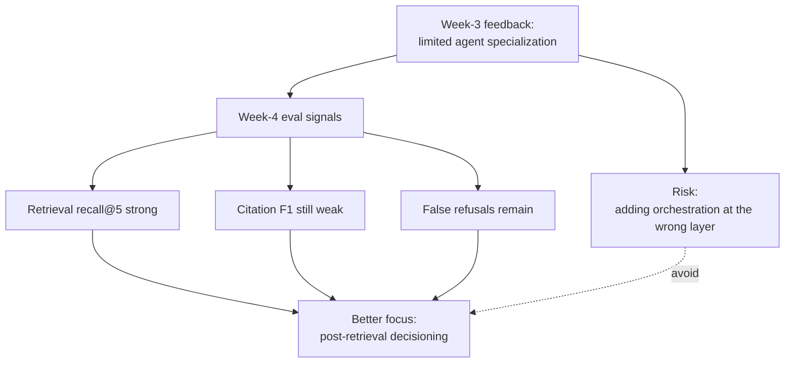
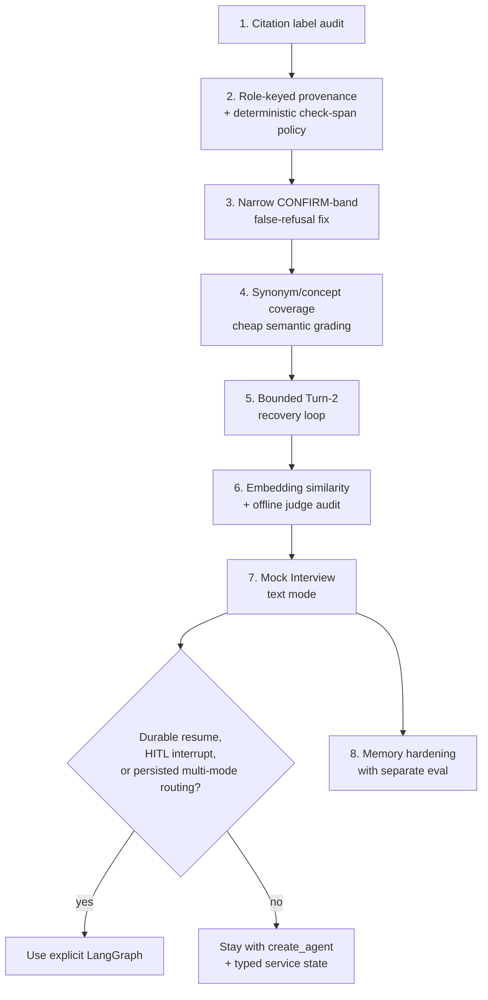
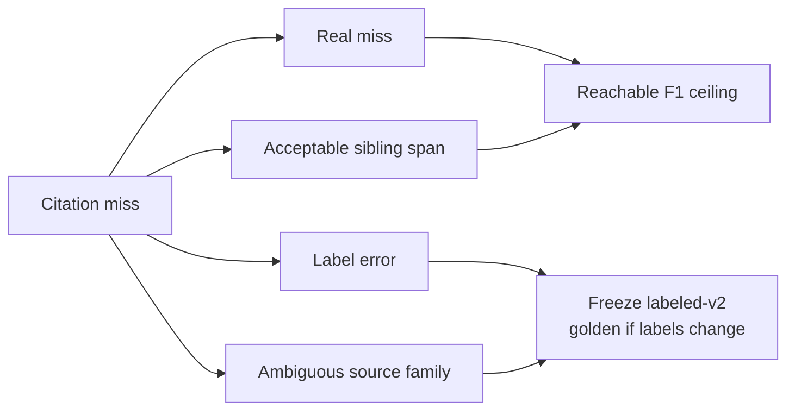
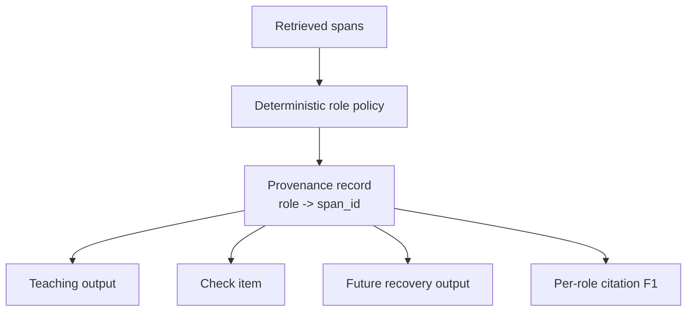
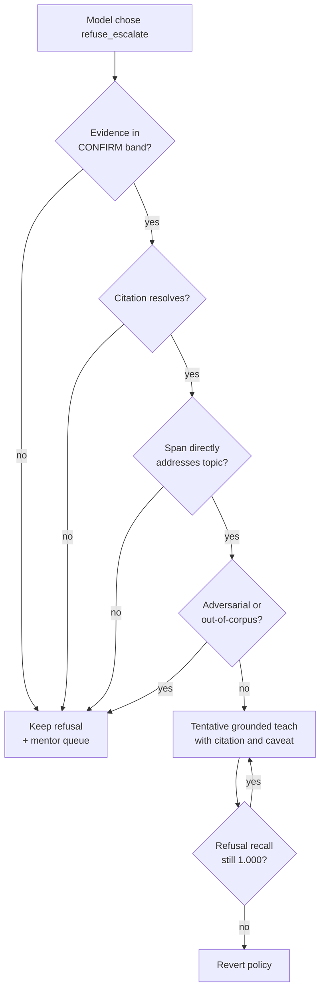
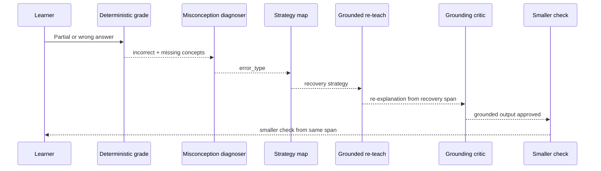
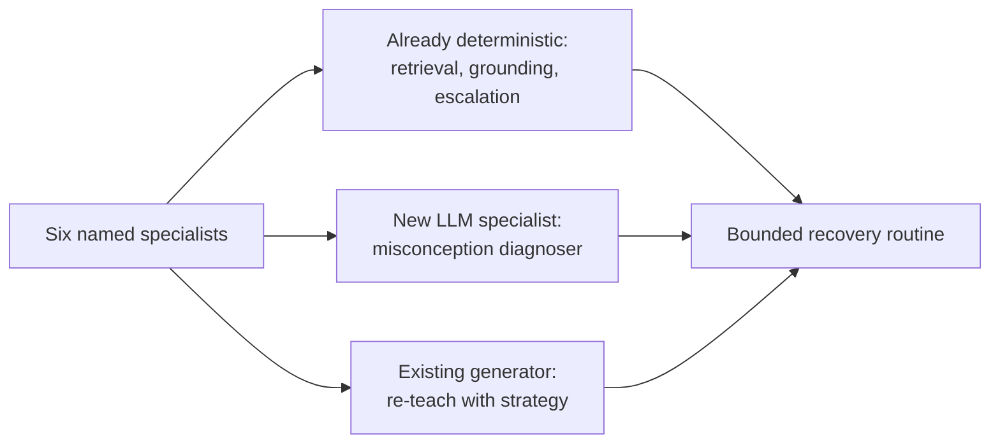
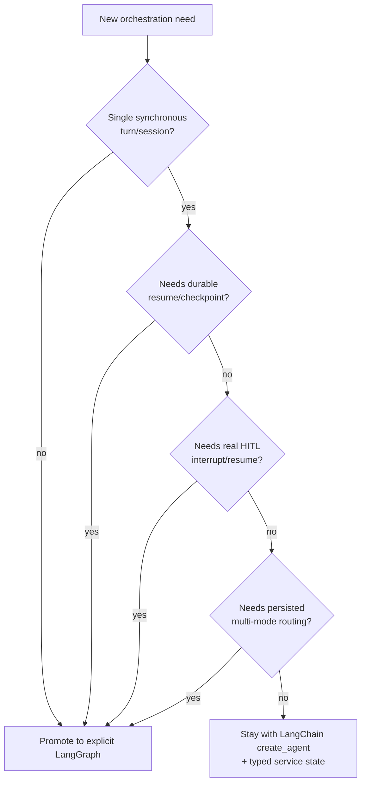

# Agentic Orchestration Improvement Review

Status: learning note, not an approved implementation plan.
Date: 2026-06-26.

This note captures the post-Week-3 discussion about improving GenAcademy Coach after the grading
feedback:

> Limited agent specialization.

The goal is to preserve the project's core strength, a grounded tutor that refuses when it cannot cite
course evidence, while deciding where agentic orchestration should actually be added. The short answer is:
fix provenance and false-refusal precision first, then add bounded Turn-2 recovery specialization, and
defer explicit LangGraph until durable/HITL/multi-mode orchestration earns it.

## Context

GenAcademy Coach is already more than a one-shot RAG chatbot. The shipped teach loop retrieves course
evidence, explains from citeable spans, asks a grounded check question, grades the learner answer, and
chooses a next action.

The Week-4 eval work changed the discussion. Retrieval was not the primary remaining problem:

| Signal | Interpretation |
|---|---|
| Retrieval recall@5 around 1.000 | Expected evidence is usually available to the system. |
| Refusal recall around 1.000 | The never-bluff guardrail is working. |
| Citation F1 improved but remains below target | The agent often uses a weaker or mismatched span after retrieval. |
| Refusal precision remains below target | The tutor still over-refuses some teachable or borderline cases. |
| Main failures are post-retrieval | The next improvements should target span selection, refusal policy, and recovery behavior. |

That means the answer to "limited specialization" is not "add many agents." The answer is to specialize
the parts of the loop where the eval shows a real product problem.

## The Core Diagnosis



The important architectural read is:

- Citation mismatch is mostly a provenance and span-selection issue.
- False refusal is a confidence-band and policy issue.
- Turn-2 recovery is a real specialization opportunity, but it should sit behind the two red-metric
  fixes.
- Explicit LangGraph is not justified by a single synchronous recovery loop.

## Options Considered

| Option | What it means | Decision | Reasoning |
|---|---|---|---|
| Add six specialist agents now | Evidence Curator, Diagnoser, Strategist, Tutor, Critic, Router as separate agents | Reject | Most of those roles already exist as deterministic code paths. Separate agents add latency and complexity without targeting the red metrics first. |
| Fix citation provenance first | Track the role of each selected span and score citation quality by role | Accept | Directly targets citation F1 and preserves the "citations captured at retrieval" guardrail. |
| Add a broad CONFIRM-band salvage path | Teach tentatively whenever evidence is in the CONFIRM band | Reject as too broad | CONFIRM is a wide band. Salvage must be rare and conjunction-gated, not a blanket behavior. |
| Add a narrow false-refusal fix | Salvage only when evidence is CONFIRM, citeable, on-topic, not adversarial, and the model refused anyway | Accept with tripwire | Targets refusal precision while keeping refusal recall as the hard guardrail. |
| Build bounded Turn-2 recovery | Diagnose learner error, choose strategy, re-teach from same span, ask smaller check | Accept after prior fixes | This is the best answer to "limited specialization," but only after citation/refusal mechanics are stable. |
| Import LangGraph now | Hand-author explicit graph nodes for the teach loop | Defer | The current recovery loop is synchronous and can run inside the current boundary. LangGraph is earned by durable resume, HITL interrupt, or persisted multi-mode orchestration. |
| Add GraphRAG | Build a course knowledge graph | Defer | Current retrieval recall does not show a measured recall gap. |
| Let memory personalize recovery now | Store preferred recovery strategies and repeated misconception patterns | Defer | It would make recovery evals path-dependent and hard to reproduce. |

## Final Decision

The final roadmap is:

1. Run a citation label audit.
2. Add role-keyed provenance and deterministic check-span policy.
3. Add a narrow CONFIRM-band false-refusal policy with a refusal-recall tripwire.
4. Pull forward cheap synonym/concept-coverage grading.
5. Add a bounded, stateless Turn-2 recovery loop.
6. Add the rest of semantic grading before mock interview.
7. Build mock interview as a separate planned feature.
8. Consider explicit LangGraph only when durable state, HITL pause/resume, or persisted multi-mode routing
   appears.
9. Harden memory later, with its own privacy and eval plan.



## Reasoning Behind Each Decision

### 1. Citation Label Audit First

Before changing product behavior, split citation misses into categories:

- real product miss
- acceptable sibling span
- label error
- ambiguous source-family match

If labels change, create a new labeled golden version and re-run the baseline against that version. Do
not mix relabeling gains with product gains. Otherwise, citation F1 can improve simply because the
goalposts moved.



### 2. Role-Keyed Provenance Instead Of Four Hardcoded Anchors

The initial idea was four fields:

- `teaching_span`
- `check_span`
- `recovery_span`
- `final_answer_span`

The better abstraction is one provenance record keyed by role:

```text
provenance:
  - role: teaching
    span_id: ...
    source_type: slide
    selected_at: retrieval
  - role: check
    span_id: ...
    source_type: handout
    selected_at: check_generation
```

Why this is better:

- It generalizes to quiz, skill-gap, and mock interview.
- It keeps one invariant: provenance is captured when evidence is selected, never reconstructed later.
- It allows roles like `recovery`, `followup`, or `interview_probe` later without changing the schema
  shape.
- It can express when `final` simply references the same span as `teaching`.



### 3. Narrow CONFIRM-Band False-Refusal Fix

Do not lower STOP. Do not salvage sub-threshold cases. Do not teach from weak evidence just because the
agent was too cautious.

The safe policy is a conjunction:



This policy needs new borderline dev/seed cases. If it only flips the known 2 or 3 false-refusal cases,
it is row-specific tuning, not a general improvement.

### 4. Cheap Semantic Grading Before Recovery

The recovery loop fires from the boundary grade. If grading is too literal, a correct answer phrased
differently can be marked wrong, which triggers unnecessary recovery and corrupts the recovery eval.

Move the lightweight semantic layer earlier:

- synonym groups
- concept coverage groups
- supported alternative phrasing

Keep heavier grading later:

- embedding similarity
- evidence-bound model grading or LLM judge as offline audit/tie-break, only after AD-13 eval and
  egress gates are met

### 5. Bounded Turn-2 Recovery Loop

Turn-2 recovery is the specialization feature, but it should be small and bounded.



Rules:

- one recovery cycle only
- no memory dependency
- smaller check must use the same span as the recovery re-teach
- grounding critic must run on recovery output
- after one cycle, advance, drill, stop, or escalate

This provides real specialization without six separate agents.

## Why Not Six Agents?

The proposed six roles were:

| Proposed role | Final treatment |
|---|---|
| Evidence Curator | Deterministic retrieval/provenance policy. |
| Misconception Diagnoser | New bounded LLM specialist. |
| Pedagogy Strategist | Deterministic map from error type to strategy. |
| Recovery Tutor | Existing generation path, constrained by selected span and strategy. |
| Grounding Critic | Existing Python grounding gate. |
| Mentor Router | Existing escalation/review queue path. |

Only the diagnoser is clearly a new cognitive role. The rest should remain deterministic or reuse
existing code paths. This keeps latency, privacy surface, and trace complexity under control.



## LangGraph Decision

Explicit LangGraph is deferred.

`create_agent` remains sufficient while the workflow is:

- synchronous
- single-session
- no true pause/resume
- no durable checkpoint
- no persisted multi-mode graph

LangGraph becomes justified when one of these is required:

- resume a learning/interview session across browser reloads or days
- pause for mentor review and resume from the same state
- persist Teach -> Quiz -> Skill-Gap -> Interview as coordinated nodes
- audit long-running multi-turn state transitions



Mock Interview is the likely neighborhood for LangGraph, but the feature name alone is not enough. An
interview can still start as a `create_agent` session if it is synchronous and not durable. LangGraph is
earned by durable state or HITL, not by ambition.

## Memory Decision

Memory stays out of Turn-2 recovery for now.

Why:

- If memory changes the recovery strategy, the recovery eval becomes path-dependent.
- The same input could produce different recovery behavior depending on past sessions.
- Baseline comparison becomes harder unless evals seed memory state explicitly.

Near term, memory remains:

- style
- teaching lens
- topic hashes
- counts
- safe learner-state summaries

Deferred memory-hardening ideas:

- preferred recovery strategy
- repeated misconception patterns
- recovery success by concept
- decay after demonstrated understanding

Those belong in a separate memory-hardening slice with retention, consent, and eval decisions.

## Evaluation Plan By Phase

| Phase | Evidence required |
|---|---|
| Citation audit | Miss taxonomy plus reachable citation-F1 ceiling. If relabeling occurs, freeze a labeled-v2 golden set and re-run baseline against it. |
| Role-keyed provenance | Per-role citation F1 improves, overall F1 improves, latency stays flat, retrieval recall@5 and refusal recall do not regress. |
| CONFIRM-band false-refusal fix | False-refusal rate drops on a new borderline subset, refusal precision improves, refusal recall remains 1.000. |
| Synonym/concept grading | New scorer version reported separately, agreement/regression checked against existing deterministic scorer. |
| Evidence-bound verifier/grader | Deferred until deterministic/embedding paths leave a labeled residual gap; requires AD-13 scorer/verifier versioning, egress approval, redacted artifacts, and no frozen `test` split. |
| Turn-2 recovery | Recovery success improves versus the current single-shot re-explain on the same scenarios; grounded citation preserved; recovery latency stays under a declared ceiling. |
| Mock interview | Separate plan and privacy review before build; explicit LangGraph only if durable state or HITL is required. |
| Memory hardening | Separate eval with seeded memory states, retention policy, and privacy review. |

## Risks And Mitigations

| Risk | Why it matters | Mitigation |
|---|---|---|
| Goalpost-moving on citation F1 | Relabeling can look like product improvement. | Report relabel delta separately from product delta. |
| CONFIRM-band over-salvage | Caveated unsupported teaching can still become bluffing. | Use conjunction gate and refusal-recall tripwire. |
| Recovery loop latency | Extra model hops can undo recent latency gains. | One recovery cycle, one diagnoser call, declared latency ceiling. |
| Grounding drift during re-explain | "Different explanation" tempts model priors. | Run grounding critic on recovery output and same-span smaller check. |
| Memory-dependent evals | Personalization makes baselines non-reproducible. | Keep recovery stateless until memory hardening. |
| Framework theater | Adding LangGraph or agents for optics can weaken reliability. | Promote only when durable/HITL/multi-mode needs appear. |
| Eval overfitting | Fixing only named failures does not generalize. | Add new borderline dev/seed cases before claiming policy success. |

## Learning Takeaways

1. Agent specialization should follow eval evidence, not rubric anxiety.
2. If retrieval recall is healthy, do not reach for GraphRAG or more retrievers first.
3. Citation quality is often a provenance problem, not a generation problem.
4. False-refusal precision must never be improved by weakening refusal recall.
5. A small specialist sub-routine can be more credible than a large multi-agent story.
6. Memory can personalize teaching later, but it can also poison reproducibility if introduced too early.
7. LangGraph is a durability and coordination tool, not a badge of agentic maturity.

## One-Line North Star

Fix provenance and refusal precision first; then add bounded Turn-2 specialization with reproducible evals;
reserve explicit LangGraph for durable, HITL, or persisted multi-mode workflows.
