# GenAcademy Coach - Architecture & Agentic-Flow Diagrams

> **Purpose:** portfolio-ready architecture diagrams for the grounded tutor, deterministic pull-ins, and
> privacy boundaries.
> **Status:** shipped/planned map. The CLI + local Gradio teach/quiz/Skill-Gap surfaces are shipped.
> The private Hugging Face Space is
> a live deployment shell with no private corpus uploaded.
> Direct voice, admin upload, cross-session memory, and mock interview remain planned pull-ins.
> The constitution (`../AGENTS.md`, `../specs/*`, `docs/decisions.md`) is canonical.

## The Spine

> My agent helps a **Gen Academy cohort learner** master a course concept in a **web chat**, replacing
> the re-watch-the-lecture-and-hope-it-clicks loop. It retrieves citeable course evidence, explains in
> the learner's style and chosen teaching lens, checks understanding, and when the learner stumbles,
> chooses a different explanation strategy at runtime. The same learner can switch between
> no-code/low-code, code-heavy, or bridge explanations for the same topic. It hands off to a human
> mentor when it cannot cite the answer. The current dated dev evidence is `7/10` overall and `7/8`
> teachable, with safe refusals preserved instead of forcing unsupported answers.

| Framework field | Coach |
|---|---|
| **Agent goal** | Teach one course concept until the learner can pass a grounded check-question. |
| **Where used** | Local Gradio web chat and CLI for teach/quiz/Skill-Gap; Hugging Face shell for deployment proof; ElevenLabs voice is a later pull-in over the same engine. |
| **Steps** | teach: intake -> retrieve -> explain -> check -> grade -> runtime decide -> update profile -> loop/report. Quiz and Skill-Gap compose the same retrieval, grounding, trace, and refusal primitives. |
| **Tools** | Teach tools: `retrieve_course_corpus` (READ), `generate_check_item` (Nebius), `grade_understanding`, `update_profile`, `write_trace`, `escalate_to_mentor` (WRITE/HITL). Deterministic pull-ins reuse the same retrieval, grading, trace, and review-queue primitives. |
| **State** | Within-session learner profile: style, track lens, optional bridge source, known, struggled, coverage, turn budget, transcript. |
| **Never do** | Answer from model priors, fabricate citations, index held-out eval questions, or silently skip failure handling. |
| **HITL** | Refuse and write a review-queue entry when confidence is low, evidence is missing, or the learner flags an issue. |
| **Failure handling** | Retry/tool validation, confidence thresholds, source fallback, human escalation, stop/progress guard. |
| **Success measure** | Dated dev eval and redacted traces; deterministic grounded grader; citations resolve to retrieved spans; held-out `test` split remains unused. |

## 1. Product Surface and Deployment Boundary

The shipped application surface is local-first because it runs against the private course corpus. The Hugging
Face Space proves deployability, but it intentionally stays a shell until a public-safe corpus subset is
approved and uploaded.

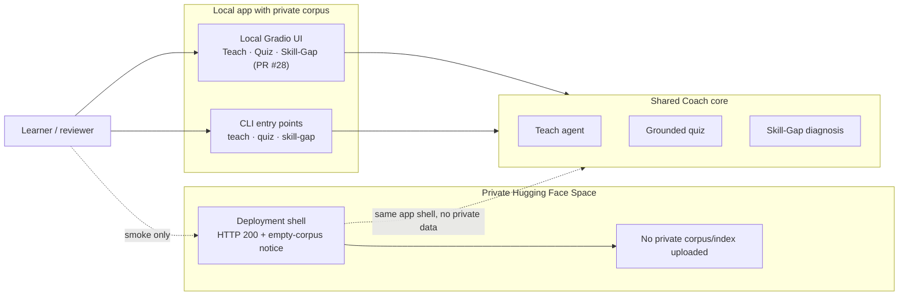

## 2. System Architecture

One LangChain `create_agent` loop handles the adaptive teach mode on LangGraph's internal runtime.
Quiz Mode and Skill-Gap Diagnosis are deterministic pull-ins over the same retrieval, grounding, trace,
and refusal primitives. Most tools read; only escalation/review-queue writes.

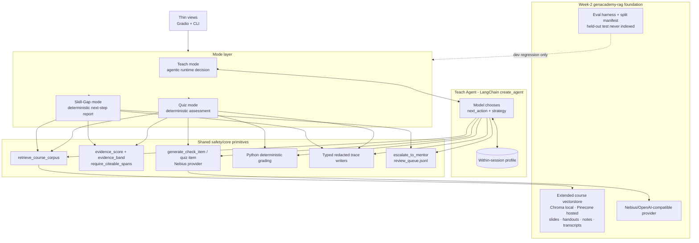

## 3. Adaptive Teach Loop

The MVP is agentic only if the model chooses the next action from observations. Python enforces
thresholds, schema, citation presence, max turns, and stop conditions.

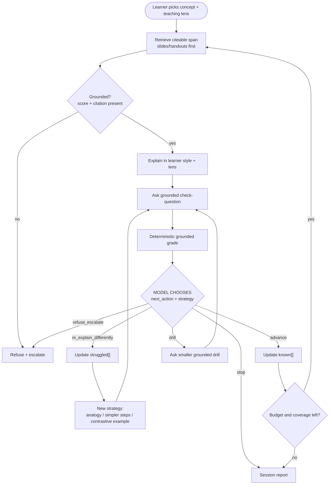

## 4. Teach Agent Orchestration

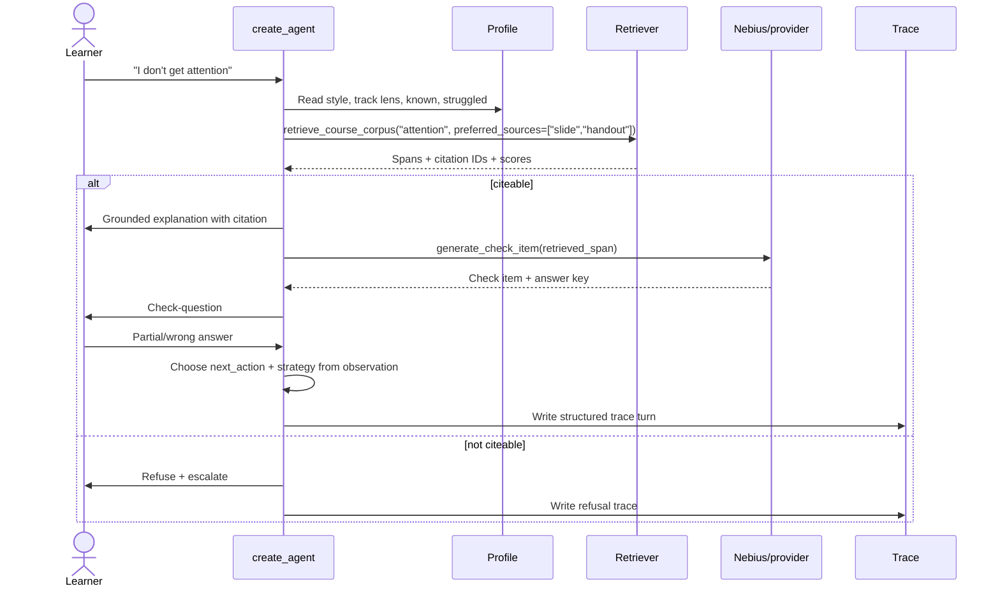

## 5. Grounded Quiz Mode Flow

Quiz Mode is a deterministic assessment pull-in. The model may draft a multiple-choice item from a
retrieved span, but Python pins the citation, validates grounding, owns the answer key, and grades the
selected option.

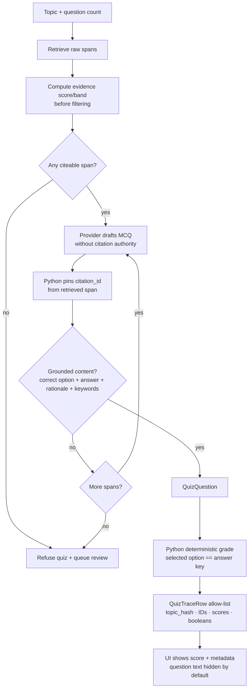

## 6. Skill-Gap Diagnosis Flow

Skill-Gap Diagnosis is the standout workflow. It composes existing evidence instead of adding a memory
provider or a second agent loop: quiz grades, teach trace struggles, and review-queue events produce a
ranked gap list; each gap then retrieves citeable next-step material or refuses/escalates.

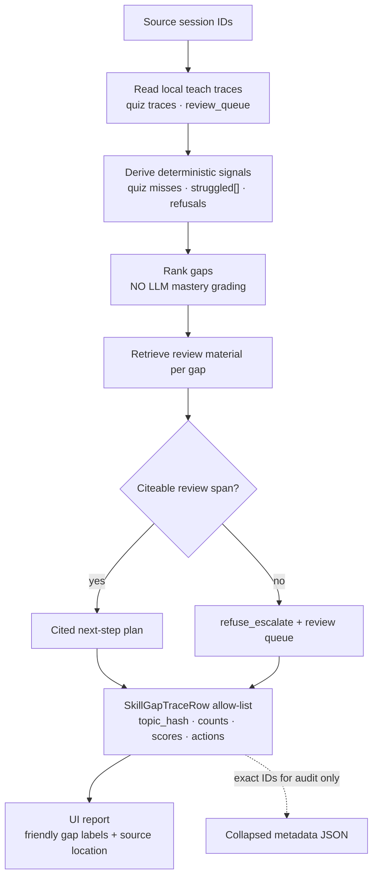

## 7. Local UI Flow and Redaction Boundary

The UI is a thin view. It makes the grounded tutor legible without moving private data into public
surfaces or adding web-framework imports to the core.

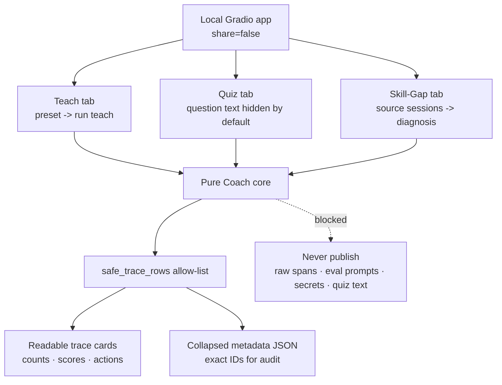

## 8. Failure Handling

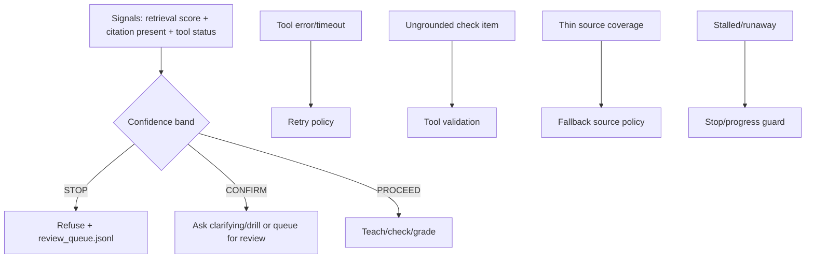

## 9. State

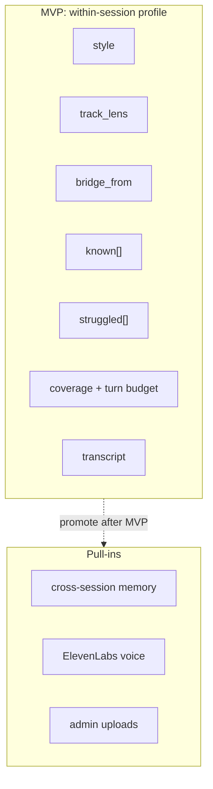

## 10. Corpus and Eval Boundary

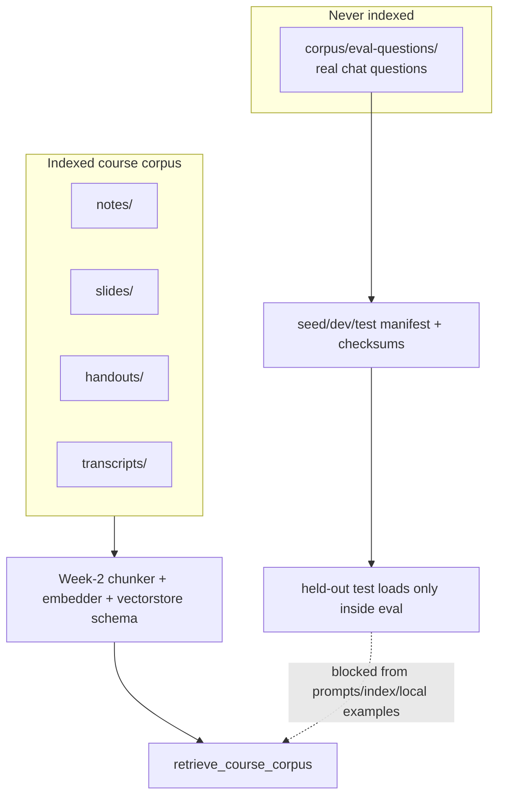

## 11. Modes and Pull-Ins

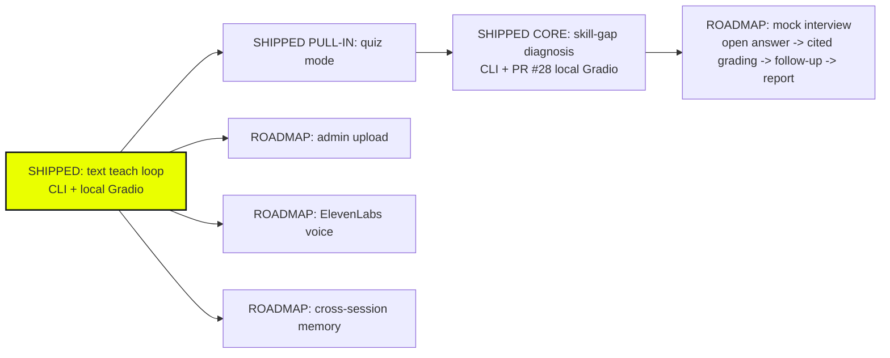

## 12. Deliverable Mapping

| Handout requirement | Architecture answer |
|---|---|
| Multi-step task | Teach loop from intake through report. |
| Tools | Retriever, Nebius item generation, grader, profile update, trace writer, escalation. |
| State | Within-session profile. |
| Human-in-the-loop | Refusal + review queue. |
| Tool failure / recovery | Retry, validation, fallback, confidence bands, escalation, stop guard. |
| How it worked | Dev eval, redacted traces, local UI screenshots, Skill-Gap evidence, and honest numbers; held-out `test` remains unused. |
| Assessment/gap diagnosis pull-ins | Quiz and Skill-Gap diagrams show deterministic grading/ranking over shared grounded primitives, not second agent loops. |
| Architecture diagram | Diagrams 1-11 in this file. |
