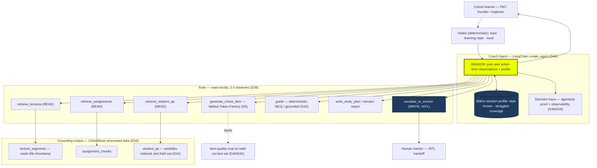
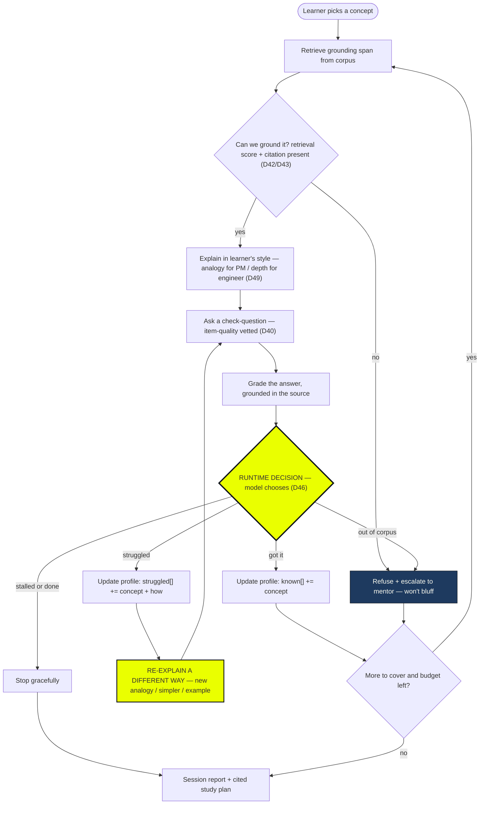
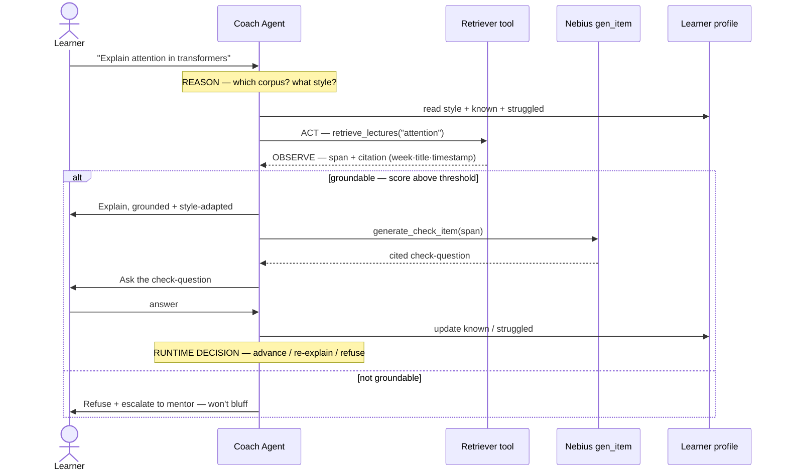
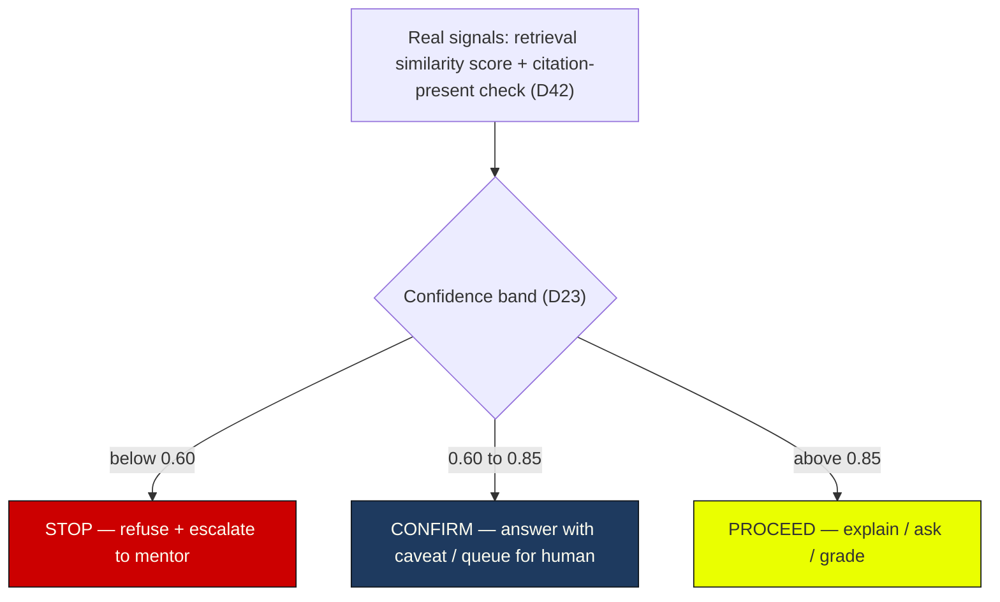
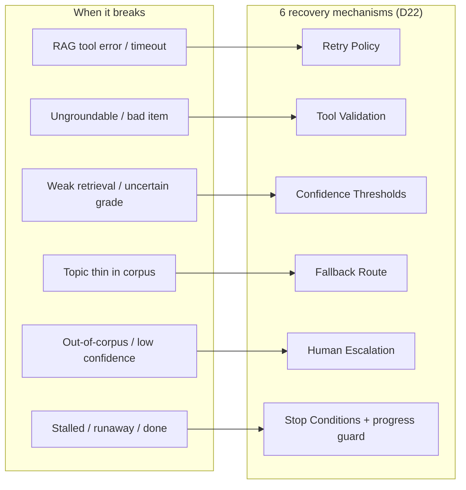
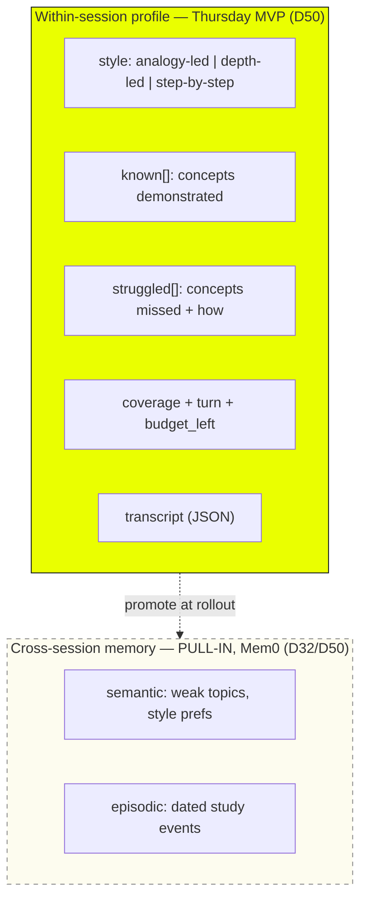
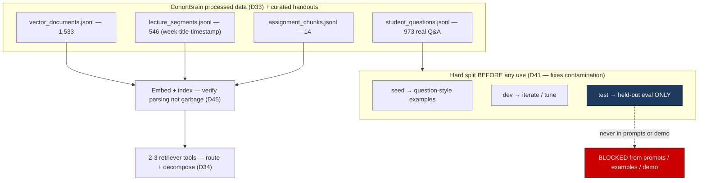
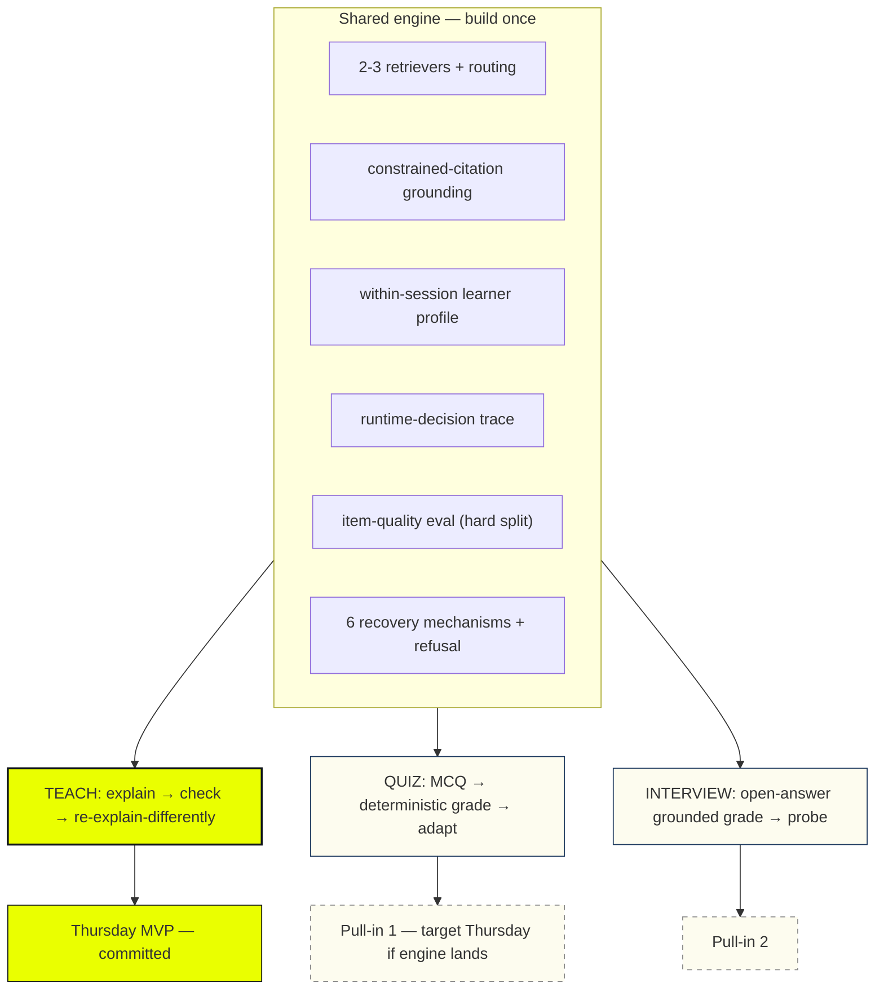
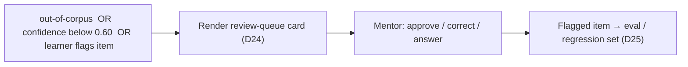

# GenAcademy Coach — Architecture & Agentic-Flow Diagrams

> **Purpose:** one visual companion to the spec — how the Coach is *actually* wired and how the agent *decides at runtime*. These diagrams double as the handout's required **architecture diagram** and the spine of the Google Doc / GitHub README.
> **Status:** design artifact (no code yet — D52 gate). **Date:** 2026-06-14.
> **Canonical source:** these diagrams reflect the project **constitution** (`../specs/mission.md`, `../specs/tech-stack.md`, `../specs/roadmap.md`, `../AGENTS.md`), distilled from the original Week-3 design spec. The constitution is canonical; these diagrams are the faithful visual derivative (if they ever disagree, the constitution wins).
> **Read with:** the constitution above. References to "spec §0/§15", "board §5", and decision tags like `(D46)` point at the **brainstorm archive** (the Week-3 planning folder: the full design spec, decision log D1–D52, and project board) — to migrate as needed.
> **Rendering:** Mermaid (renders natively on GitHub).

---

## The spine (handout Primer + framework — current adaptive-tutor version)

> **One-liner.** My agent helps a **GenAcademy cohort learner** *master a course concept* in a **web chat**, replacing the *re-watch-the-lecture-and-hope-it-clicks* loop that eats an evening and still leaves gaps. It **explains the concept grounded in the course corpus, checks understanding, and — when the learner stumbles — re-explains a different way** (analogy for a PM, depth for an engineer) on its own using **3 retrieval tools + an item generator**, hands off to a **human mentor** when a question falls outside the corpus or its grounding confidence drops below threshold (*it refuses to bluff*), and **I'll know it works when a learner goes from "I don't get it" to passing a grounded check-question in under 10 minutes, 8 times out of 10 — on a held-out test set it never saw during tuning.**

| Framework field | Coach |
|---|---|
| **Agent goal** | Teach one course concept until the learner can pass a grounded check-question — adapting *how* it explains to how they learn. |
| **Where used** | Web chat (cohort app), text MVP; voice later. |
| **Steps, in order** | intake (topic · style · track) → retrieve grounded source → explain in style → ask check-question → grade grounded → diagnose gap → **runtime decide: advance / re-explain-differently / drill / refuse+escalate** → loop → session report + study plan. |
| **What it can do** | `retrieve_lectures` *(READ)* · `retrieve_assignments` *(READ)* · `retrieve_student_qa` *(READ)* · `generate_check_item` *(Nebius; gen, no side-effect)* · `grade` *(deterministic / grounded)* · `write_study_plan` *(compute)* · `escalate_to_mentor` *(**WRITE**, HITL)*. |
| **What it remembers** | Within-session learner profile (style · known · struggled · coverage). Cross-session = Mem0 pull-in. |
| **Never do** | Assert an ungrounded fact · grade with a fabricated citation · put the held-out **test** set in prompts/demos · ask a question whose answer isn't in a retrieved span. |
| **HITL** | Refuse + escalate when confidence below 0.60 (out-of-corpus / unsure); learner can flag any item → review queue. |
| **When it breaks** | 6 recovery mechanisms: retry · tool-validation · confidence bands · fallback route · human escalation · stop/progress-guard. |
| **How I know it worked** | End-to-end: passing grounded check-answer in under 10 min, 8/10 sessions on a **held-out** test set + supporting item-quality eval on the hard split. |

---

## 1. System architecture (components & data flow)

What sits where: a deterministic intake, one `create_agent` loop that reasons over a within-session profile, a small read-mostly toolset, the grounding corpus, and the two demo assets (trace + eval). One **WRITE** action (escalate); everything else reads.



**What to notice:** one agent, not a pipeline of micro-services (MINT restraint). The yellow **REASON** node is the only "smart" hop — it chooses which tool and what to do next. No MCP / no A2A (D30): three retrievers plus a generate/grade/plan toolset over one corpus — no protocol needed.

---

## 2. The core adaptive teach loop — *the agenticity proof*

This is the loop the Thursday MVP ships. The yellow diamond is the heart of the "real agent, not RAG-with-a-wrapper" defense: the next action is **chosen at runtime from the learner's answer**, so the path is unpredictable (D21/D46).



**What to notice:** at least **5 runtime decisions per session** (which corpus, groundable?, got-it vs struggled, re-explain vs refuse, continue vs stop). The **re-explain-a-different-way** edge is the demo's emotional beat ("it explained it three ways until it clicked"). But the agenticity proof is **not** that this branch exists — a hardcoded loop could fake it — it's the **D46 runtime trace**: the model chose *which* retriever to call, read the learner's actual answer, and picked the next strategy (re-explain vs advance vs refuse) from that observation. **Show the trace, not just the branch.**

---

## 3. One teach-turn — the ReAct (Reason → Act → Observe) cycle

Zooming into a single turn: how the agent reasons, calls a tool, observes the result, and only then decides. This is the loop that makes it an agent rather than a single LLM call.



**What to notice:** the profile is read **before** acting and written **after** observing — that read/adapt/write cycle is "remembers what you know," within-session (D50). Nebius does the one rich generative call (D5).

---

## 4. Failure handling — confidence bands → 6 recovery mechanisms

The handout's "one last thing": a build that falls over on the first tool failure is unfinished. This is where we spend the last day. Confidence is computed from **real signals** (retrieval similarity + citation-present), never an LLM self-rating (D42).



Every failure maps to one of the six named mechanisms (D22) — naming them the lecture's way = a complete-looking failure story and coverage of all 5 lecture failure modes (loops / hallucinated tool calls / wasted tokens / bad decisions / wrong tools).



**What to notice:** the demo deliberately triggers at least one of these live (out-of-corpus refusal is the cleanest) — that's the line between a demo and a build.

---

## 5. State — the within-session learner profile

The handout calls state "the hard part." Ours is explicit and small: a session-scoped profile that drives every next explanation. Durable cross-session memory is intentionally a pull-in (dashed), so it doesn't eat the failure-path polish.



**What to notice:** "remembers what you struggled with" is real in the MVP — just within one session. The cross-day version is the same shape promoted into Mem0 (semantic + episodic), which is why it's a clean fast-follow, not a rewrite.

---

## 6. Corpus → indexes → eval split (the contamination fix)

Where grounding comes from, and the codex-caught leak we fixed: `student_questions.jsonl` was both seed *and* gold. The hard split (D41) happens **before** any prompt construction; the test set never touches prompts, examples, or the demo.



**What to notice:** item-quality eval (answerability, unique-correct, distractor validity, citation support, no span-leakage) runs on `test` only — deterministic grading alone would mask bad items (D40).

---

## 7. Three modes, one engine

The user wants all three modes; **teach is the committed Thursday floor, quiz then interview are the top pull-ins** targeted for Thursday only if the engine lands early. They're cheap to add **because they share one engine** — the bulk of the work (retrieval, grounding, profile, trace, eval, recovery) is built once, so a shippable demo always exists even if the pull-ins slip.



**What to notice:** quiz adds a deterministic grader (no model — cheap); interview adds open-answer grounded grading + a follow-up probe (the bit that costs real time). The agenticity claim is strongest in interview (truly open path) and present in teach (re-explain branch).

---

## 8. Human-in-the-loop — the review-queue card

HITL has to be *meaningful* for a read-mostly tutor (few high-stakes writes). Ours is genuine: refuse + escalate out-of-corpus / low-confidence questions, and let the learner flag any item. The escalation renders as the lecture's review-queue template (D24), and the flag feeds the eval set (D25).



```text
┌─ ESCALATION CARD ──────────────────────────────────┐
│ Task:         Grade learner answer on "X"          │
│ Recommended:  Escalate — outside current corpus    │
│ Reasoning:    retrieval score 0.41  (STOP band)    │
│ Evidence:     no supporting span found             │
│ Tool calls:   retrieve_lectures, retrieve_qa  ▸    │
│ Confidence:   ▰▰▱▱▱  0.41                           │
└────────────────────────────────────────────────────┘
```

**What to notice:** the card shows *source evidence and confidence*, never a bare "low confidence" flag — that's the anti-pattern the lecture calls out. The flag→eval loop means the **regression / dev eval set grows from real use** — the held-out **test** set stays frozen (D41).

---

## 9. Roadmap — Thursday MVP → pull-ins → north star

Everything is kept; only the MVP is committed; pull-ins land by priority as time allows (D51). This is the picture for the writeup's "what's next" and the build-in-public arc.

```mermaid
flowchart LR
    MVP["THURSDAY MVP: adaptive teach loop + within-session profile + grounding + eval + trace"]
    MVP --> P1["Quiz mode"]
    P1 --> P2["Interview mode"]
    P2 --> P3["Track-aware retrieval"]
    P3 --> P4["Cross-session memory (Mem0)"]
    P4 --> P5["Caching + model tiering"]
    P5 --> P6["Voice (ElevenLabs)"]
    P6 --> P7["Multimodal slide questions"]
    P7 --> P8["Cohort rollout — multi-user / auth / cost"]
    P8 --> P9["Flashcards / mind-map artifacts"]
    P9 --> P10["GraphRAG — graph_seed.json"]
    P10 --> North["NORTH STAR: full adaptive tutor, deployed to the cohort"]

    style MVP fill:#EAFF00,stroke:#0F1419,stroke-width:2px
    style North fill:#1E3A5F,stroke:#0F1419,color:#FDFCEF
```



---

## Traceability — diagram → decisions

| Diagram | Primary decisions it visualizes |
|---|---|
| 1 System architecture | D33 (corpus) · D34 (N retrievers) · D44 (create_agent) · D5 (Nebius) · D30 (no MCP/A2A) · D29/D46 (trace) |
| 2 Teach loop | D21/D46 (runtime decisioning) · D48 (teach MVP) · D49 (track-as-style) · D42/D43 (ground/refuse) |
| 3 ReAct turn | D50 (within-session memory) · D5 (Nebius gen) · D42 (real-signal threshold) |
| 4 Failure handling | D22 (6 mechanisms) · D23 (confidence bands) · D42 (real signals) · D26 (progress guard) |
| 5 State | D50 (within-session core) · D32 (Mem0 pull-in) |
| 6 Corpus/eval | D33/D37 (data) · D34 (routing) · D40 (item-quality) · D41 (hard split) · D45 (verify parsing) |
| 7 Three modes | D47 (tutor reframe) · D48 (teach MVP) · D2/D51 (quiz+interview pull-in) |
| 8 HITL | D24 (review-queue card) · D25 (flag→eval) · D13 (HITL designed-in) |
| 9 Roadmap | D51 (pull-in roadmap) · D39 (cut list) · board §5 |

## Status — settled in the constitution; what's actually still open

The framework and scope below are **settled** in the constitution (`../specs/`) — *not* open questions for a planning agent:

- **Framework:** `create_agent` for the whole week (`../specs/tech-stack.md`). It's built on LangGraph, so middleware / typed state / checkpointers / HITL-interrupt middleware are available later **without a rewrite** — promote to an *explicit* LangGraph graph only when cross-session memory or a real pause/resume interrupt lands.
- **Thursday MVP:** the teach loop; quiz + interview are pull-ins (`../specs/roadmap.md`).
- **Success metric + eval protocol:** `../specs/mission.md` (measurable protocol) + `../specs/tech-stack.md` (hard-split, held-out, leak-checked).
- **Decision rationale + rejected alternatives:** `decisions.md`.

**Genuinely still open — a pre-build task, not a design question:**

- **Corpus:** confirm CohortBrain attribution/permission + pin a corpus version before any data lands. No corpus is committed.

---

*Diagrams visualize the constitution (`../specs/` + `../AGENTS.md`); `(D##)` tags map to `decisions.md` (major calls) and the brainstorm archive (full history). No application code yet — the build follows the approved plan (`../AGENTS.md` §2, gate 1). Next: `writing-plans` for the teach-loop MVP.*
