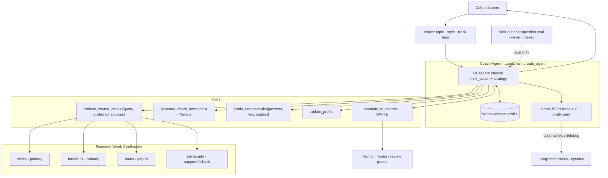
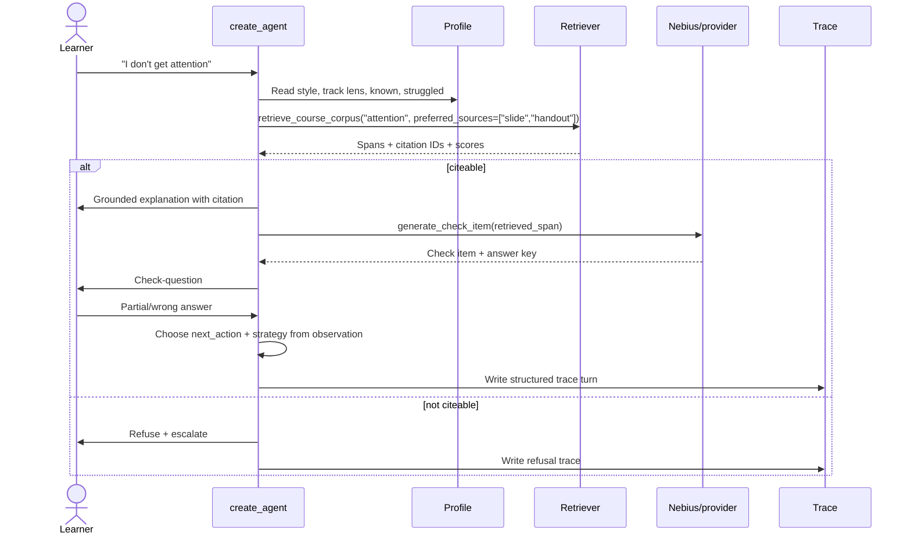
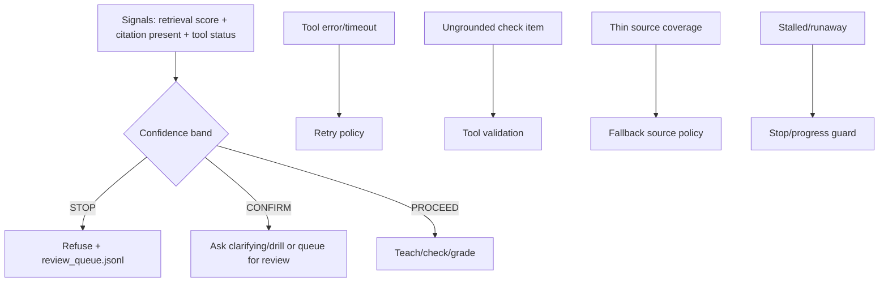
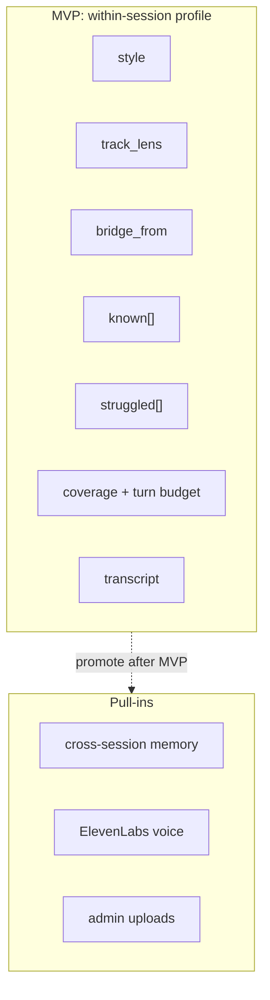
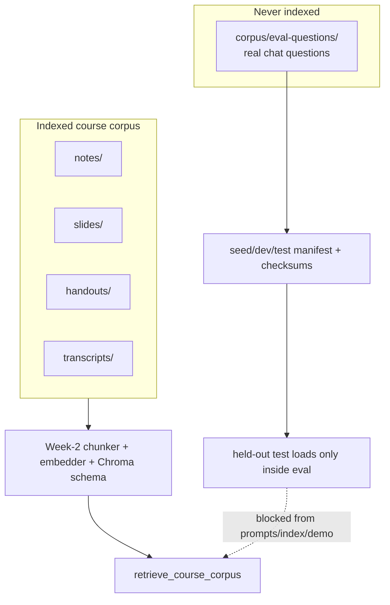
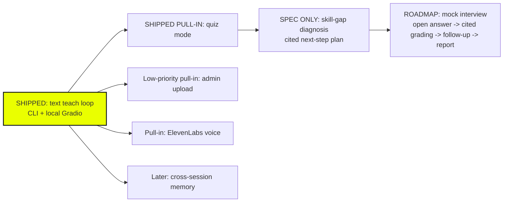

# GenAcademy Coach - Architecture & Agentic-Flow Diagrams

> **Purpose:** the handout-required architecture diagram and the visual spine for the Google Doc/video.
> **Status:** shipped/planned map. The CLI + local Gradio teach/quiz surfaces are shipped; direct voice,
> admin upload, cross-session memory, and mock interview remain planned pull-ins.
> The constitution (`../AGENTS.md`, `../specs/*`, `docs/decisions.md`) is canonical.

## The Spine

> My agent helps a **Gen Academy cohort learner** master a course concept in a **web chat**, replacing
> the re-watch-the-lecture-and-hope-it-clicks loop. It retrieves citeable course evidence, explains in
> the learner's style and chosen teaching lens, checks understanding, and when the learner stumbles,
> chooses a different explanation strategy at runtime. The same learner can switch between
> no-code/low-code, code-heavy, or bridge explanations for the same topic. It hands off to a human
> mentor when it cannot cite the answer, and I know it works when held-out learner-sim scenarios reach a
> correct grounded answer 8 times out of 10.

| Framework field | Coach |
|---|---|
| **Agent goal** | Teach one course concept until the learner can pass a grounded check-question. |
| **Where used** | Local Gradio web chat and CLI for the MVP; ElevenLabs voice is a pull-in over the same engine. |
| **Steps** | intake -> retrieve -> explain -> check -> grade -> runtime decide -> update profile -> loop/report. |
| **Tools** | `retrieve_course_corpus` (READ), `generate_check_item` (Nebius), `grade_understanding`, `update_profile`, `write_trace`, `escalate_to_mentor` (WRITE/HITL). |
| **State** | Within-session learner profile: style, track lens, optional bridge source, known, struggled, coverage, turn budget, transcript. |
| **Never do** | Answer from model priors, fabricate citations, index held-out eval questions, or silently skip failure handling. |
| **HITL** | Refuse and write a review-queue entry when confidence is low, evidence is missing, or the learner flags an issue. |
| **Failure handling** | Retry/tool validation, confidence thresholds, source fallback, human escalation, stop/progress guard. |
| **Success measure** | Held-out chat-question scenarios; deterministic grounded grader; citations resolve to retrieved spans. |

## 1. System Architecture

One `create_agent` loop on LangGraph's internal runtime, one source-prioritized retriever over the
extended Week-2 corpus, and local trace/eval artifacts. Most tools read; only escalation writes. The
diagrams below label the architecture; current shipped surfaces are CLI + local Gradio teach/quiz, while
voice, memory, admin upload, and mock interview remain planned.

## 2. Adaptive Teach Loop

The MVP is agentic only if the model chooses the next action from observations. Python enforces
thresholds, schema, citation presence, max turns, and stop conditions.

## 3. One ReAct Turn

## 4. Failure Handling

## 5. State

## 6. Corpus and Eval Boundary

## 7. Modes and Pull-Ins

## 8. Deliverable Mapping

| Handout requirement | Architecture answer |
|---|---|
| Multi-step task | Teach loop from intake through report. |
| Tools | Retriever, Nebius item generation, grader, profile update, trace writer, escalation. |
| State | Within-session profile. |
| Human-in-the-loop | Refusal + review queue. |
| Tool failure / recovery | Retry, validation, fallback, confidence bands, escalation, stop guard. |
| How it worked | Held-out eval, trace, demo run, honest numbers. |
| Architecture diagram | Diagrams 1-7 in this file. |
