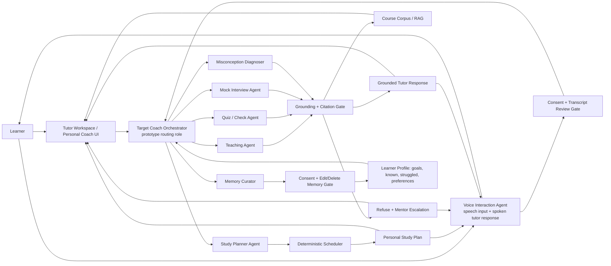
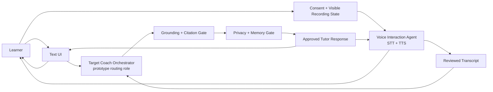

# GenAcademy Coach — Agent Orchestration Flow

**Purpose:** reviewer-readable architecture flow for the July 11 pitch package. This complements the
visual one-pager and storyboard by showing the target control topology: learner surface →
orchestration role → specialist agents → deterministic trust gates → learner-facing result.

**Status labels for the pitch:** the grounded teach loop, refusal, citations, and eval traces are the
evaluated pattern; quiz/check and skill-gap are shipped support surfaces. The Personal Coach,
memory-profile UI, mock interview, study planner, and voice I/O are target lanes to build
incrementally behind the same gates.

## Core Orchestration Diagram

## Voice I/O In The Core Loop

Voice is a first-class input/output mode for the same tutor loop. The learner can speak instead of
typing, and the coach can return the answer as text plus spoken audio at the same time. The voice
agent still does not answer directly: it captures speech, manages consent/transcript review, and speaks
only the grounded response that already passed retrieval, citation, refusal, privacy, and trace gates.

## Pitch Line

GenAcademy Coach is not a single chatbot. It is a grounded learning orchestrator: specialist agents
teach, interview, diagnose gaps, plan study, curate memory, and support simultaneous text/voice
interaction, while
deterministic services control retrieval, citations, refusal, grading, scheduling, privacy, and
evaluation.

## What This Addresses

- **Limited agent specialization:** each specialist owns a distinct cognition rather than being a
  renamed copy of the same prompt.
- **Trust boundary:** the model can choose teaching and coaching moves, but cannot bypass evidence,
  citation, refusal, privacy, or scheduling gates.
- **Incremental build path:** every future lane plugs into the same orchestration and gate pattern, so
  Personal Coach, memory, mock interview, study planner, and voice can ship one slice at a time.
