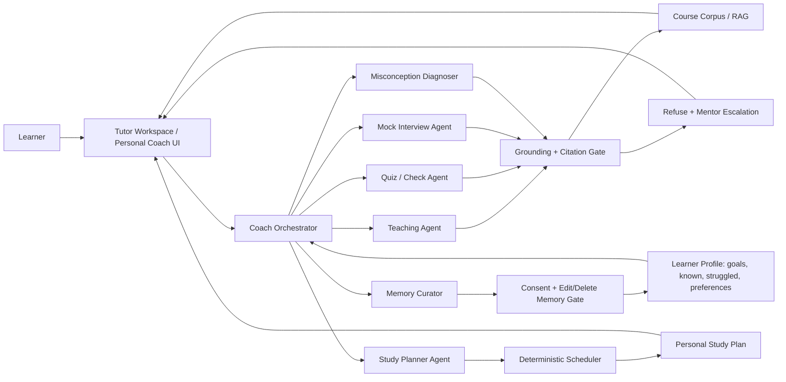
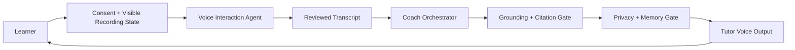

# GenAcademy Coach — Agent Orchestration Flow

**Purpose:** reviewer-readable architecture flow for the July 11 pitch package. This complements the
visual one-pager and storyboard by showing the actual control topology: learner surface →
orchestrator → specialist agents → deterministic trust gates → learner-facing result.

**Status labels for the pitch:** grounded tutor, quiz/check, skill-gap diagnosis, refusal, citations,
and eval traces are the proven pattern. Personal Coach, memory profile, mock interview, study planner,
and voice are target lanes to build incrementally behind the same gates.

## Core Orchestration Diagram

## Voice Extension

Voice is an interaction lane, not a new answer brain. Speech is converted into a normal grounded
tutor turn; the spoken response is generated only after retrieval, citation, refusal, and privacy gates
approve the text answer.

## Pitch Line

GenAcademy Coach is not a single chatbot. It is a grounded learning orchestrator: specialist agents
teach, interview, diagnose gaps, plan study, curate memory, and support voice interaction, while
deterministic services control retrieval, citations, refusal, grading, scheduling, privacy, and
evaluation.

## What This Addresses

- **Limited agent specialization:** each specialist owns a distinct cognition rather than being a
  renamed copy of the same prompt.
- **Trust boundary:** the model can choose teaching and coaching moves, but cannot bypass evidence,
  citation, refusal, privacy, or scheduling gates.
- **Incremental build path:** every future lane plugs into the same orchestrator and gate pattern, so
  Personal Coach, memory, mock interview, study planner, and voice can ship one slice at a time.
