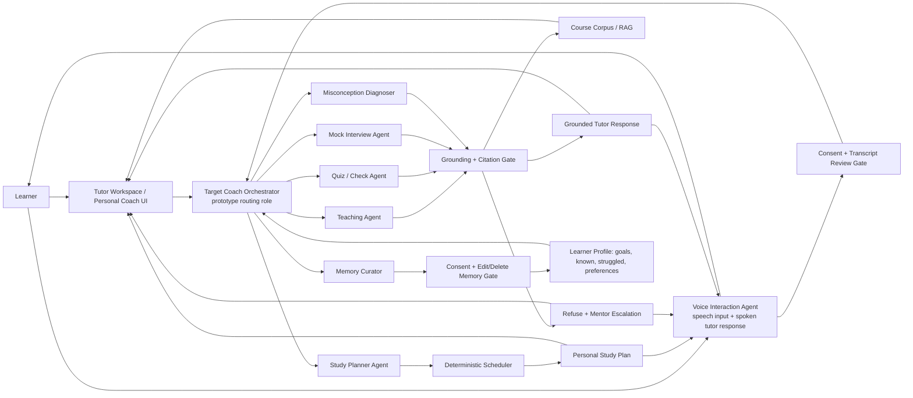
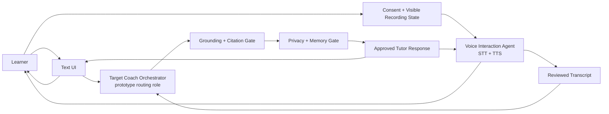

# GenAcademy Coach — Agent Orchestration Flow

**Purpose:** reviewer-readable architecture flow for the July 11 pitch package. This complements the
visual one-pager and storyboard by showing the target control topology: learner surface →
orchestration role → specialist agents → deterministic trust gates → learner-facing result.

**Status labels for the pitch:** the grounded teach loop, refusal, citations, and eval traces are the
evaluated pattern; quiz/check and skill-gap are shipped support surfaces. The Personal Coach,
memory-profile UI, mock interview, study planner, and voice I/O are target lanes to build
incrementally behind the same gates.

**July 11 ADLC cut:** this pitch is intentionally about **Scope**, **Prototype**, and **Evaluate**.
Build, Deploy, and Monitor remain the post-demo lifecycle once each lane earns implementation.

## Core Orchestration Diagram

## Voice I/O In The Core Loop

Voice is a first-class input/output mode for the same tutor loop. The learner can speak instead of
typing, and the coach can return the answer as text plus spoken audio at the same time. The voice
agent still does not answer directly: it captures speech, manages consent/transcript review, and speaks
only the grounded response that already passed retrieval, citation, refusal, privacy, and trace gates.

## Week 3 Pattern Alignment

The target architecture maps to the Agentic AI Leap design patterns without pretending every layer is
already built:

- **ADLC focus:** define the learner problem and success criteria, prototype the cross-lane workflow,
  and specify eval gates before building every lane.

- **Router pattern:** the target Coach Orchestrator is the routing/control role that selects tutor,
  quiz/check, mock interview, memory, planner, voice, or escalation paths.
- **Planner-executor pattern:** the Study Planner proposes a plan; deterministic scheduler validation
  checks feasibility before anything is shown as a plan.
- **Reflection / supervisor pattern:** the mock-interview loop separates interviewer, rubric
  evaluator, misconception diagnoser, and feedback coach so one prompt is not grading itself.
- **Human-in-the-loop pattern:** refusal and low-confidence cases route to mentor review instead of
  forcing the agent to answer.
- **MCP / A2A boundary:** external tool and agent-to-agent integrations stay deferred. If they are
  added later, they plug in behind the same retrieval, citation, permission, privacy, and trace gates.
- **Failure-mode controls:** loop caps, grounded citations, tool/route gating, cost/latency tracing,
  and mentor escalation address common agent failures such as loops, unsupported tool use, token waste,
  bad decisions, and wrong-tool routing.

## Week 4 Evaluation Alignment

The July 11 pitch treats evaluation as a system design requirement, not an afterthought:

- **Custom system evals over leaderboard claims:** measure the learner workflow and trust gates, not
  just the model.
- **Golden scenarios plus rubrics:** define expected behavior, allowed evidence, refusal cases, and
  grading criteria before tuning prompts or adding new lanes.
- **Trajectory evals for agents:** score route choice, retrieved evidence, tool/gate behavior,
  refusal/escalation, and final learner-facing response.
- **Hybrid review:** use deterministic checks where possible, human review for ambiguous pedagogy and
  safety, and calibrated LLM judges only for bounded rubric-backed judgments.
- **Regression buckets:** protect happy paths, edge cases, adversarial/refusal cases, privacy/memory
  cases, and future voice/mock-interview lanes.
- **Observability loop:** traces and logs become new eval cases after review; production monitoring
  tracks latency, cost, failures, drift, and feedback once a lane ships.

## Pitch Line

GenAcademy Coach is not a single chatbot. It is a grounded learning orchestrator: specialist agents
teach, interview, diagnose gaps, plan study, curate memory, and support simultaneous text/voice
interaction, while
deterministic services control retrieval, citations, refusal, grading, scheduling, privacy, and
evaluation.

## What This Addresses

- **Limited agent specialization:** each specialist owns a distinct cognition rather than being a
  renamed copy of the same prompt.
- **Trust boundary:** the model can choose teaching and coaching moves, but cannot bypass evidence,
  citation, refusal, privacy, or scheduling gates.
- **Incremental build path:** every future lane plugs into the same orchestration and gate pattern, so
  Personal Coach, memory, mock interview, study planner, and voice can ship one slice at a time.
