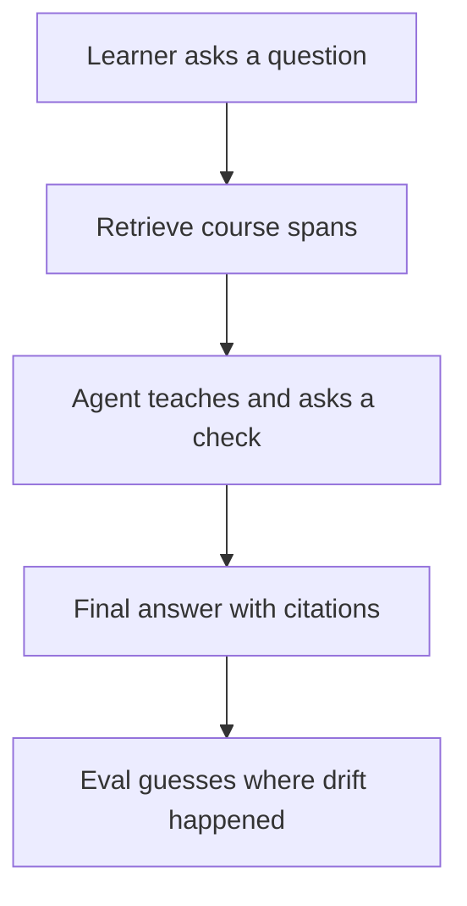
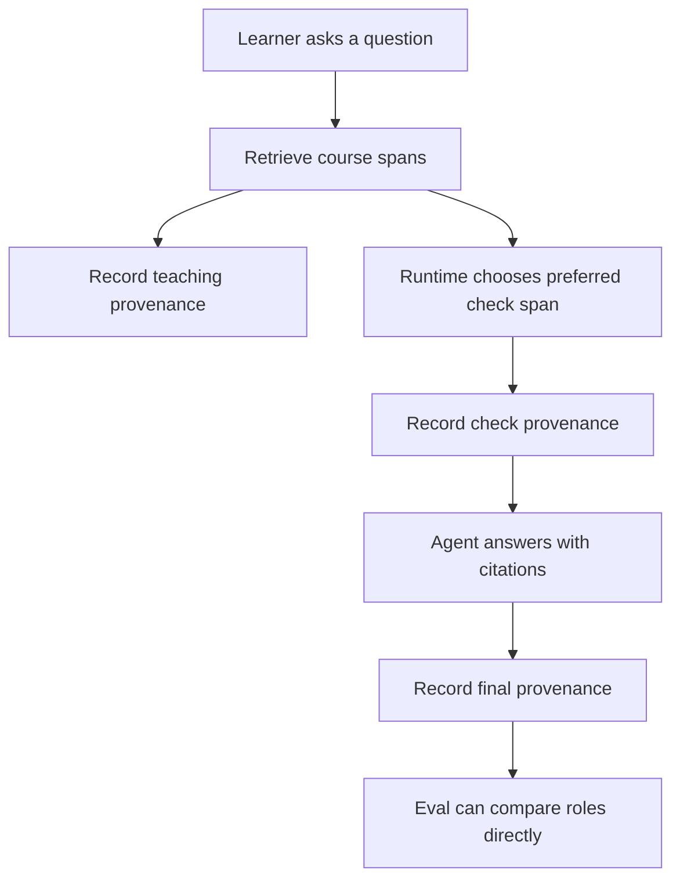

# Post-v1 Eval Learning: Provenance And Evidence Flow

This note explains the changes made after the v1 eval in beginner-friendly terms. It focuses on
the role-keyed citation provenance work in PR #53 and the review feedback that came after it.

## Short Version

The tutor already had the right product rule:

> Teach only from course material the system can cite.

The v1 eval showed that retrieval was mostly healthy, but the agent did not always keep a clean
record of which retrieved course span was used for each part of the teaching turn.

PR #53 made that evidence trail explicit. The system now records safe metadata for:

- `teaching`: the span used to teach.
- `check`: the span used to generate the understanding check.
- `final`: the span used in the final answer.
- `recovery`: reserved for a future repair/re-explanation path.

The main measured result was:

| Metric | Before | After |
|---|---:|---:|
| Citation F1 | `0.45` | `0.6333` |
| Task completion pass rate | `0.90` | `0.90` |
| Refusal precision | `0.7143` | `0.7143` |
| Refusal recall | `1.0` | `1.0` |
| Retrieval recall@5 | `0.9667` | `0.9667` |

Plain English: the tutor became better at citing the right evidence without hurting task
completion, refusal safety, or retrieval.

## The Mental Model

Think of the tutor as a careful teacher with a small stack of course pages.

On each turn, it needs to answer four questions:

1. What course material did I find?
2. What material did I teach from?
3. What material did I use for the check question?
4. What material did I cite in the final answer?

Before this change, the system had some of those signals, but eval had to infer too much from
scattered fields. That made debugging harder. A citation miss could mean several different things:

- The retriever did not find the right span.
- The retriever found it, but the model picked a weaker span.
- The check question was generated from a less suitable source.
- The final answer cited something different from the check.

Those are different bugs. They need different fixes.

## What Changed

### 1. Provenance Became A First-Class Record

Provenance means "where did this come from?"

The project now has a typed provenance record with safe metadata only:

```text
role
span_id
source_type
selected_at
selection_reason
```

It does not store raw learner text, generated tutor prose, or retrieved span text. That matters
because traces and eval artifacts must stay public-safe.

### 2. Evidence Is Separated By Role

The system now records evidence by purpose:

```text
teaching -> evidence used to teach
check    -> evidence used to create the question
final    -> evidence cited in the final answer
recovery -> future evidence for repair/re-explanation
```

This is easier to reason about than a single flat list of citations.

### 3. Python Enforces The Check-Span Choice

The model still chooses the flow of the teaching turn, but deterministic code now enforces the
preferred source for check generation:

```text
1. slide
2. handout
3. first citeable span
```

This is an important AI engineering pattern:

> Let the model handle flexible reasoning, but let code enforce critical rules.

Slides and handouts are usually cleaner teaching sources than notes or transcripts. The model can
still call the check-generation tool with a retrieved citation ID, but the runtime chooses the best
available check span using the fixed order above.

### 4. Eval Rows Now Expose Provenance

The eval output now includes fields such as:

```text
provenance_by_role
teaching_provenance_span_id
check_provenance_span_id
final_provenance_span_id
```

Existing fields were preserved, including:

```text
answered_check_id
post_final_check_id
boundary_grade_citation_id
predicted_citation_ids
```

That means old dashboards and audits keep working, while new analysis can inspect the evidence flow.

### 5. The Audit Tool Stayed Backward Compatible

The citation audit can now read optional provenance IDs when they exist. It does not change scoring,
labels, or miss categories.

That distinction matters. PR #53 was not a scorer rewrite. It made the evidence path easier to see and
made check-span selection deterministic.

## Before And After

Before:



After:



## What The PR #53 Review Said

Claude reviewed PR #53 and found no blocking issues.

The review confirmed:

- Provenance is recorded at selection time, not reconstructed from generated prose.
- The check-span order is really enforced: slide, then handout, then first citeable span.
- Trace and eval rows remain redacted.
- Legacy eval fields remain backward compatible.
- Audit changes are read-only projections.
- Project guardrails hold: no frozen test split use, no direct `langgraph.*` imports.
- Tests cover the risky behavior well.

The review also raised two non-blocking follow-ups.

### Follow-Up 1: Per-Turn Versus Best-Known Provenance

`TeachRuntime.provenance` currently behaves like "best-known provenance for the current session or
case." A trace row snapshots whatever the runtime knows at that moment.

That means a later turn that does not retrieve again may still show teaching/check provenance from an
earlier turn. This is not a privacy issue and does not change scoring, but it can be confusing if a
reader assumes every trace field means "selected during this exact turn."

For PR #53, treat these fields as case-level best-known provenance snapshots. A future cleanup can make
the trace stricter by resetting provenance at turn start if exact per-turn fidelity becomes important.

### Follow-Up 2: One Defensive Branch Is Probably Unreachable

The check-generation tool has a defensive `selected_span is None` branch. The reviewer noted that it is
probably unreachable because the unknown-ID validation returns first when there are no spans.

This is harmless. It can be removed later or left as defensive code.

## Why This Is Good AI Engineering

The important lesson is that the first eval did not simply say "make the model smarter."

It separated the problem into parts:

- Retrieval quality: can the system find useful course material?
- Orchestration quality: does the system pass the right evidence between steps?
- Grounding quality: does the final answer cite the evidence it actually used?
- Privacy quality: can we inspect behavior without exposing private text?

PR #53 improved orchestration quality. It made the agent's evidence handoffs observable and made one
critical handoff deterministic.

## Reusable Principle

When an AI system has multiple steps, do not only evaluate the final answer.

Record the evidence handoff at each important step:

```text
retrieved -> selected for teaching -> selected for check -> cited in final answer
```

If those links are visible, eval failures become diagnosable. If they are hidden, every failure looks
like "the model was wrong," which is too vague to fix.

## Next Sensible Follow-Ups

1. Decide whether provenance should remain best-known per case or become strict per-turn trace state.
2. If strict per-turn trace state is chosen, reset provenance at turn start and keep eval projection
   behavior explicit.
3. Remove or comment the unreachable defensive branch in check generation.
4. Use the new provenance fields to target the next behavior fix: turn-2 recovery and false-refusal
   precision.

