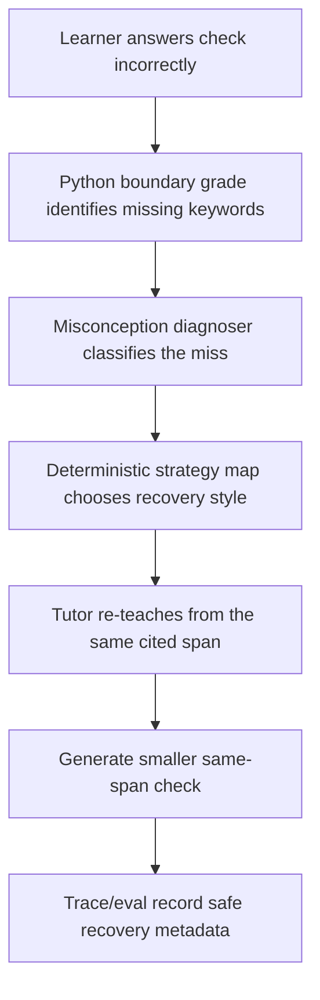

# PR #54 Learning: Bounded Turn-2 Recovery Orchestration

This note explains PR #54 for someone new to AI engineering. PR #54 is a planning PR, not a product
implementation PR. It prepares the next agentic behavior slice without changing runtime code yet.

## Short Version

PR #54 plans how the tutor should respond when a learner gets the first understanding check wrong.

The planned flow is:

```text
learner misses check
-> grade says what concept was missing
-> small diagnoser classifies the mistake
-> deterministic strategy map chooses a recovery style
-> tutor re-teaches from the same cited span
-> tutor asks a smaller same-span check
```

The important design choice is restraint. The project does not add six agents or direct LangGraph just
to look more agentic. It adds one bounded specialist role: a misconception diagnoser.

## Why This PR Exists

The Week-3 feedback said the project had limited agent specialization.

That could tempt a builder to add many named agents:

- evidence agent
- diagnosis agent
- strategy agent
- tutor agent
- critic agent
- router agent

PR #54 takes a narrower approach. Most of those jobs already exist as deterministic code:

- retrieval already finds evidence
- Python already grades checks
- grounding checks already protect claims
- escalation already routes unsafe cases
- provenance already records which span was used

The only part that clearly needs more "thinking" is this question:

> Why did the learner miss the check?

That is the new specialist: the misconception diagnoser.

## The Mental Model

Imagine a human tutor.

The tutor first explains a concept and asks a quick check question. The learner answers incorrectly.
A good tutor does not just repeat the same explanation louder. They ask:

1. Did the learner miss a concept?
2. Did they confuse two terms?
3. Was the answer too vague?
4. Did they add unsupported information?
5. Did they go off topic?

Then the tutor re-explains in a better way and asks a smaller question focused on the missing idea.

That is what PR #54 plans.

## The Planned Recovery Loop



The recovery loop is intentionally one cycle only. If the learner still struggles, the normal teach
loop can drill, stop, or escalate. The system does not enter an unbounded retry loop.

## What "Same-Span" Means

"Same-span" means the recovery explanation and smaller check must use the same cited course passage as
the original check.

That matters because recovery is where models are tempted to improvise. A model might try to create a
new analogy or example from prior knowledge. This project does not allow that unless the course corpus
supports it.

Same-span recovery keeps the tutor grounded:

```text
original check span -> recovery explanation -> smaller check
```

All three stay tied to the same cited evidence.

## What Changed In The Repo

PR #54 added a detailed plan:

- `docs/superpowers/plans/2026-06-27-bounded-turn2-recovery-orchestration.md`

It also updated routing docs:

- `specs/roadmap.md`
- `docs/INDEX.md`

The roadmap now says:

1. Citation audit is done.
2. Role-keyed provenance is done.
3. CONFIRM-band false-refusal precision is next.
4. Cheap concept-aware grading should happen before recovery implementation.
5. Bounded Turn-2 recovery is planned and reviewable.

The design review found no blocking issues. It did ask the plan to prove recovery helped, not merely
that recovery avoided regressions. The plan now requires recovery-scoped metrics:

```text
recovery triggered count
recovery success count
recovery success rate
```

It also sets explicit latency and cost tripwires, because recovery adds model calls.

## Why False Refusal And Grading Are Gates

The plan says recovery implementation should wait until two risks are handled or explicitly accepted.

### Gate 1: False-Refusal Precision

The tutor should refuse when evidence is weak or out of corpus. But it currently over-refuses some
teachable borderline cases.

If that is not fixed first, recovery metrics may be muddy. A case might look like a recovery failure
when the real problem was an unnecessary refusal.

### Gate 2: Cheap Semantic Grading

Current grading is mostly literal keyword matching. That is safe, but it can mark a correct answer wrong
if the learner uses different wording.

If recovery fires because the grader was too literal, recovery metrics become noisy. The system would
be "recovering" from a false mistake.

## Why This Is Not LangGraph Yet

LangGraph is useful when the system needs durable state, pause/resume, human-in-the-loop interrupts, or
complex long-running routing.

This recovery plan is:

- synchronous
- one session
- one recovery cycle
- no durable resume
- no human interrupt/resume
- no persisted multi-mode graph

So direct LangGraph would be architecture theater here. The current `create_agent` boundary plus typed
Python state is enough.

## Privacy And Safety

The plan keeps raw private data out of committed traces and eval artifacts.

The recovery diagnoser may receive the learner answer inside the live provider call, but committed
trace/eval rows should only keep safe metadata:

```text
recovery_used
recovery_error_type
recovery_provenance_span_id
recovery_check_citation_id
```

They should not store:

- raw learner answer
- generated tutor prose
- retrieved span text
- private LangSmith URLs
- frozen test split content

## Reusable Principle

Do not answer "limited agent specialization" by adding lots of agents.

First ask:

> Which step actually needs a new cognitive skill?

For this project, the answer is not retrieval, grounding, or escalation. Those are already deterministic
or already implemented. The new cognitive skill is diagnosing the learner's misconception after a wrong
answer.

Small, bounded specialization is stronger than a large multi-agent diagram when the eval only supports
one new specialist.
