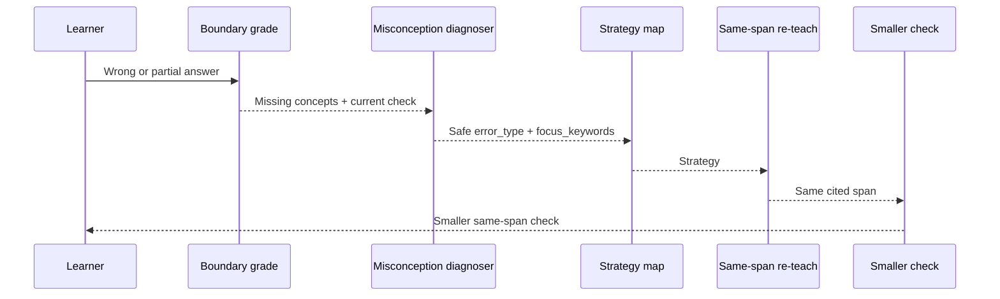

# Bounded Turn-2 Recovery Orchestration Implementation Plan

> **For agentic workers:** REQUIRED SUB-SKILL: Use superpowers:subagent-driven-development
> (recommended) or superpowers:executing-plans to implement this plan task-by-task. Steps use checkbox
> (`- [ ]`) syntax for tracking.

**Goal:** Add one bounded, grounded recovery cycle after a learner stumbles, without adding a broad
multi-agent framework or direct LangGraph imports.

**Architecture:** Keep LangChain `create_agent` as the outer teach-loop runtime. Add one pure-core
misconception diagnoser plus deterministic strategy mapping, then re-teach from the same cited span and
ask a smaller same-span check. Python remains responsible for grounding, one-cycle limits, provenance,
and trace/eval redaction.

**Tech Stack:** Python 3.12, Pydantic models, existing `CoachSession`, existing `TeachRuntime`,
existing provider boundary, pytest, ruff. No direct `langgraph.*` imports. No frozen `test` split use.

---

## Context

PR #53 merged role-keyed provenance and deterministic check-span selection. The measured result was:

| Metric | Before PR #53 | After PR #53 |
|---|---:|---:|
| Citation F1 | `0.45` | `0.6333` |
| Task completion pass rate | `0.90` | `0.90` |
| Refusal precision | `0.7143` | `0.7143` |
| Refusal recall | `1.0` | `1.0` |
| Retrieval recall@5 | `0.9667` | `0.9667` |

That makes the next orchestration question sharper. Retrieval is usually finding evidence, and
provenance now shows which role used which span. The recovery loop should therefore specialize only the
part that still needs cognition: diagnosing why the learner missed the check.

The current roadmap still places two gates before broad Turn-2 claims:

1. Narrow CONFIRM-band false-refusal precision.
2. Cheap synonym/concept coverage for grading.

This plan can be reviewed now, but implementation should start only after those gates are either
completed or explicitly accepted as risks by the project owner.

## Scope

### In Scope

- Add a safe `RecoveryDiagnosis` model and `MisconceptionType` literal.
- Add a pure-core `teach_recovery.py` module.
- Diagnose an incorrect learner answer using the current check, boundary grade, learner answer, and
  selected cited span.
- Map the diagnosis to a recovery strategy deterministically.
- Re-teach from the same cited span.
- Generate a smaller check using the same span and the missing concepts.
- Record `recovery` provenance with safe metadata only.
- Add redacted trace/eval fields showing whether recovery ran and which safe error type was diagnosed.
- Enforce one recovery cycle per session.

### Out Of Scope

- Direct `langgraph.*` imports.
- More than one recovery cycle.
- Memory-personalized recovery.
- Mock interview.
- New retrieval tools.
- Golden label changes.
- Scorer-definition changes outside additive recovery diagnostics.
- Frozen `test` split use.
- Raw learner answer, generated tutor prose, retrieved span text, or private URLs in committed traces,
  docs, dashboards, or eval artifacts.

## Planned Files

- Create `src/genacademy_coach/teach_recovery.py`
  - Diagnosis prompt, strategy map, same-span recovery check generation.
- Modify `src/genacademy_coach/teach_types.py`
  - Add `MisconceptionType`, `RecoveryDiagnosis`, and redacted trace fields.
- Modify `src/genacademy_coach/teach_tools.py`
  - Add recovery runtime state to `TeachRuntime`.
- Modify `src/genacademy_coach/teach_session.py`
  - Trigger bounded recovery after an incorrect boundary grade.
  - Record recovery provenance.
  - Keep raw learner answer out of trace rows.
- Modify `src/genacademy_coach/eval_runner.py`
  - Add redacted recovery fields to eval rows.
- Create `tests/test_teach_recovery.py`
  - Unit tests for diagnosis validation, strategy mapping, and same-span smaller check generation.
- Modify `tests/test_teach_types.py`
  - Model/default tests for recovery fields.
- Modify `tests/test_teach_session.py`
  - Session behavior, one-cycle, same-span, trace redaction tests.
- Modify `tests/test_eval_runner.py`
  - Eval row projection tests.

## Design

The recovery path is a small specialist routine, not a six-agent split.



Only the diagnoser is a new cognitive role. Retrieval, grounding, provenance, strategy constraints, and
escalation remain deterministic code.

## Task 0: Gate The Plan Before Implementation

**Files:**
- No source changes.

- [ ] **Step 1: Confirm prerequisite status**

Read:

```bash
sed -n '1,180p' specs/roadmap.md
sed -n '1,260p' docs/agentic-orchestration-improvement-review.md
```

Expected:

- Role-keyed provenance is complete.
- The owner has either completed or explicitly accepted the risk of deferring:
  - narrow CONFIRM-band false-refusal precision
  - cheap synonym/concept grading

If either prerequisite is neither complete nor owner-accepted, stop before code changes and ask whether
to implement the prerequisite slice first.

- [ ] **Step 2: Capture a pre-change golden baseline**

Run:

```bash
uv run python scripts/run_golden_eval.py \
  --tag turn2-recovery-before \
  --run-id turn2-recovery-before
```

Expected:

- A local ignored file appears under `eval/runs/`.
- No frozen `test` split rows are used.
- Record `metrics.citation_f1`, `metrics.task_completion.pass_rate`,
  `metrics.refusal.precision`, `metrics.refusal.recall`, `metrics.retrieval_recall_at_5`,
  `metrics.latency_p95_ms`, `metrics.case_latency_p95_ms`, and `metrics.cost_usd`.
- Record the acceptance bars for the after-run:
  - `metrics.refusal.recall` must not decrease.
  - `metrics.citation_f1` must not decrease.
  - `metrics.case_latency_p95_ms` should stay within `1.25x` the Task 0 baseline unless the owner
    explicitly accepts the latency tradeoff.
  - `metrics.cost_usd` should stay within `1.35x` the Task 0 baseline unless the owner explicitly
    accepts the cost tradeoff.
  - Each recovery-triggered case should add no more than the planned two provider calls: one diagnosis
    call and one smaller-check generation call.

If provider credentials or the local index are unavailable, stop and record the blocker. Do not replace
this with the frozen `test` split.

## Task 1: Add Recovery Types And Runtime State

**Files:**
- Modify `src/genacademy_coach/teach_types.py`
- Modify `src/genacademy_coach/teach_tools.py`
- Modify `tests/test_teach_types.py`

- [ ] **Step 1: Write failing type tests**

Add to `tests/test_teach_types.py`:

```python
from genacademy_coach.teach_types import RecoveryDiagnosis


def test_recovery_diagnosis_serializes_safe_metadata_only():
    diagnosis = RecoveryDiagnosis(
        error_type="missing_concept",
        focus_keywords=["context", "attention"],
    )

    assert diagnosis.model_dump() == {
        "error_type": "missing_concept",
        "focus_keywords": ["context", "attention"],
    }


def test_trace_turn_recovery_defaults_are_safe():
    turn = TraceTurn(
        session_id="s",
        turn=1,
        topic_hash="topic-hash",
        learner_input_hash="input-hash",
        next_action="drill",
        strategy="analogy",
        evidence_score=0.91,
        evidence_band="proceed",
        retrieved_citation_ids=["note/attention::0"],
        tool_calls=[],
    )

    assert turn.recovery_triggered is False
    assert turn.recovery_error_type is None
    assert turn.recovery_check_citation_id is None
```

- [ ] **Step 2: Run tests to verify failure**

Run:

```bash
uv run pytest -q \
  tests/test_teach_types.py::test_recovery_diagnosis_serializes_safe_metadata_only \
  tests/test_teach_types.py::test_trace_turn_recovery_defaults_are_safe
```

Expected: fail because `RecoveryDiagnosis` and the trace fields do not exist.

- [ ] **Step 3: Add recovery models and trace fields**

In `src/genacademy_coach/teach_types.py`, add near the other literals:

```python
MisconceptionType = Literal[
    "missing_concept",
    "confused_terms",
    "too_vague",
    "unsupported_extra",
    "off_topic",
]
```

Add after `ProvenanceRecord`:

```python
class RecoveryDiagnosis(BaseModel):
    error_type: MisconceptionType
    focus_keywords: list[str] = Field(default_factory=list)
```

Add to `TraceTurn`:

```python
    recovery_triggered: bool = False
    recovery_error_type: MisconceptionType | None = None
    recovery_check_citation_id: str | None = None
```

- [ ] **Step 4: Add runtime state**

In `src/genacademy_coach/teach_tools.py`, import `RecoveryDiagnosis` and add to `TeachRuntime`:

```python
    recovery_used: bool = False
    last_recovery_diagnosis: RecoveryDiagnosis | None = None
    recovery_triggered_this_turn: bool = False
```

Add this line to `reset_turn_observability`:

```python
        self.recovery_triggered_this_turn = False
```

Do not clear `recovery_used` in `reset_turn_observability`; it is the one-cycle guard for the whole
session.

- [ ] **Step 5: Run type tests**

Run:

```bash
uv run pytest -q tests/test_teach_types.py
```

Expected: pass.

## Task 2: Add The Pure-Core Recovery Module

**Files:**
- Create `src/genacademy_coach/teach_recovery.py`
- Create `tests/test_teach_recovery.py`

- [ ] **Step 1: Write failing recovery tests**

Create `tests/test_teach_recovery.py`:

```python
import json

from genacademy_coach.teach_recovery import (
    choose_recovery_strategy,
    diagnose_misconception,
    generate_smaller_recovery_check,
)
from genacademy_coach.teach_types import (
    CheckItem,
    RetrievedSpan,
    UnderstandingGrade,
)


class FakeProvider:
    def __init__(self, *responses: dict):
        self.responses = list(responses)
        self.calls = []

    def generate(self, messages, *, json_mode, max_tokens, temperature):
        self.calls.append(
            {
                "messages": messages,
                "json_mode": json_mode,
                "max_tokens": max_tokens,
                "temperature": temperature,
            }
        )
        return json.dumps(self.responses.pop(0))


def span():
    return RetrievedSpan(
        chunk_id="slide/attention::1",
        doc_id="slide/attention",
        text="Attention helps a model focus on relevant context instead of every token equally.",
        score=0.91,
        title="attention.pdf",
        source_type="slide",
        page_or_section="1",
    )


def check():
    return CheckItem(
        question="What does attention help with?",
        expected_answer="It helps focus on relevant context.",
        expected_keywords=["focus", "context"],
        citation_id="slide/attention::1",
    )


def grade():
    return UnderstandingGrade(
        correct=False,
        matched_keywords=["focus"],
        missing_keywords=["context"],
        citation_id="slide/attention::1",
    )


def test_diagnose_misconception_returns_safe_error_type_and_focus_keywords():
    provider = FakeProvider(
        {"error_type": "missing_concept", "focus_keywords": ["context", "private guess"]}
    )

    diagnosis = diagnose_misconception(
        provider,
        check_item=check(),
        grade_result=grade(),
        learner_answer="it focuses",
        span=span(),
    )

    assert diagnosis.error_type == "missing_concept"
    assert diagnosis.focus_keywords == ["context"]
    assert provider.calls[0]["json_mode"] is True
    assert "private guess" not in diagnosis.model_dump_json()


def test_choose_recovery_strategy_avoids_previous_strategy():
    assert choose_recovery_strategy("missing_concept", previous_strategy="step_by_step") == (
        "contrastive_example"
    )
    assert choose_recovery_strategy("confused_terms", previous_strategy="analogy") == (
        "contrastive_example"
    )


def test_generate_smaller_recovery_check_uses_same_span_and_focus_keyword():
    provider = FakeProvider(
        {
            "question": "What should attention focus on?",
            "expected_answer": "It should focus on relevant context.",
            "expected_keywords": ["context"],
        }
    )

    item = generate_smaller_recovery_check(
        provider,
        span=span(),
        focus_keywords=["context"],
    )

    assert item.citation_id == "slide/attention::1"
    assert item.expected_keywords == ["context"]
    assert "context" in item.expected_answer.lower()
```

- [ ] **Step 2: Run tests to verify failure**

Run:

```bash
uv run pytest -q tests/test_teach_recovery.py
```

Expected: fail because `teach_recovery.py` does not exist.

- [ ] **Step 3: Create `teach_recovery.py`**

Create `src/genacademy_coach/teach_recovery.py`:

```python
from __future__ import annotations

import json
from typing import Any

from genacademy_coach.check_items import RawCheckItem, keywords_for_expected_answer
from genacademy_coach.grounding import keyword_present
from genacademy_coach.teach_types import (
    CheckItem,
    MisconceptionType,
    RecoveryDiagnosis,
    RetrievedSpan,
    Strategy,
    UnderstandingGrade,
)

DIAGNOSIS_SYSTEM_PROMPT = (
    "You classify why a learner answer missed a grounded check. "
    "Reply only with JSON. Do not quote the learner answer."
)

DIAGNOSIS_TEMPLATE = """Use only this check, grade, and cited course span.

Question: {question}
Expected keywords: {expected_keywords}
Matched keywords: {matched_keywords}
Missing keywords: {missing_keywords}
Learner answer: {learner_answer}
Citation ID: {citation_id}
Span:
{span_text}

Return exactly this JSON object:
{{
  "error_type": "missing_concept",
  "focus_keywords": ["context"]
}}

Allowed error_type values:
- missing_concept
- confused_terms
- too_vague
- unsupported_extra
- off_topic

Rules:
- focus_keywords must come from the missing keywords or the cited span.
- Do not include raw learner wording in the JSON.
"""

SMALLER_CHECK_SYSTEM_PROMPT = (
    "You write one smaller grounded recovery check. Reply only with JSON."
)

SMALLER_CHECK_TEMPLATE = """Use only the cited course span below.

Citation ID: {citation_id}
Focus keywords: {focus_keywords}
Span:
{span_text}

Create one short free-answer check question focused on the focus keywords.
Return exactly this JSON object:
{{
  "question": "What does attention help the model focus on?",
  "expected_answer": "It helps the model focus on relevant context.",
  "expected_keywords": ["context"]
}}
"""

STRATEGY_BY_ERROR: dict[MisconceptionType, Strategy] = {
    "missing_concept": "step_by_step",
    "confused_terms": "contrastive_example",
    "too_vague": "short_drill",
    "unsupported_extra": "contrastive_example",
    "off_topic": "short_drill",
}

RECOVERY_FALLBACK_STRATEGIES: tuple[Strategy, ...] = (
    "contrastive_example",
    "step_by_step",
    "short_drill",
    "summary",
)


def choose_recovery_strategy(
    error_type: MisconceptionType,
    *,
    previous_strategy: str | None,
) -> Strategy:
    candidates = (STRATEGY_BY_ERROR[error_type], *RECOVERY_FALLBACK_STRATEGIES)
    for strategy in candidates:
        if strategy != previous_strategy:
            return strategy
    return "summary"


def _safe_focus_keywords(
    *,
    requested: list[str],
    grade_result: UnderstandingGrade,
    span: RetrievedSpan,
) -> list[str]:
    allowed = []
    for keyword in [*grade_result.missing_keywords, *requested]:
        if keyword in allowed:
            continue
        if keyword in grade_result.missing_keywords or keyword_present(span.text, keyword):
            allowed.append(keyword)
    return allowed[:3]


def diagnose_misconception(
    provider: Any,
    *,
    check_item: CheckItem,
    grade_result: UnderstandingGrade,
    learner_answer: str,
    span: RetrievedSpan,
) -> RecoveryDiagnosis:
    raw = provider.generate(
        [
            {"role": "system", "content": DIAGNOSIS_SYSTEM_PROMPT},
            {
                "role": "user",
                "content": DIAGNOSIS_TEMPLATE.format(
                    question=check_item.question,
                    expected_keywords=", ".join(check_item.expected_keywords),
                    matched_keywords=", ".join(grade_result.matched_keywords),
                    missing_keywords=", ".join(grade_result.missing_keywords),
                    learner_answer=learner_answer,
                    citation_id=span.citation_id,
                    span_text=span.text,
                ),
            },
        ],
        json_mode=True,
        max_tokens=160,
        temperature=0.0,
    )
    diagnosis = RecoveryDiagnosis.model_validate(json.loads(raw))
    focus_keywords = _safe_focus_keywords(
        requested=diagnosis.focus_keywords,
        grade_result=grade_result,
        span=span,
    )
    if not focus_keywords:
        focus_keywords = grade_result.missing_keywords[:1]
    return RecoveryDiagnosis(
        error_type=diagnosis.error_type,
        focus_keywords=focus_keywords,
    )


def generate_smaller_recovery_check(
    provider: Any,
    *,
    span: RetrievedSpan,
    focus_keywords: list[str],
) -> CheckItem:
    raw = provider.generate(
        [
            {"role": "system", "content": SMALLER_CHECK_SYSTEM_PROMPT},
            {
                "role": "user",
                "content": SMALLER_CHECK_TEMPLATE.format(
                    citation_id=span.citation_id,
                    focus_keywords=", ".join(focus_keywords),
                    span_text=span.text,
                ),
            },
        ],
        json_mode=True,
        max_tokens=180,
        temperature=0.0,
    )
    parsed = RawCheckItem.model_validate(json.loads(raw))
    expected_keywords = keywords_for_expected_answer(
        expected_answer=parsed.expected_answer,
        expected_keywords=parsed.expected_keywords,
        span_text=span.text,
    )
    filtered = [
        keyword
        for keyword in expected_keywords
        if not focus_keywords or keyword in focus_keywords or keyword_present(span.text, keyword)
    ]
    return CheckItem(
        question=parsed.question,
        expected_answer=parsed.expected_answer,
        expected_keywords=filtered or expected_keywords,
        citation_id=span.citation_id,
    )
```

- [ ] **Step 4: Run recovery tests**

Run:

```bash
uv run pytest -q tests/test_teach_recovery.py
```

Expected: pass.

## Task 3: Integrate Bounded Recovery Into The Teach Session

**Files:**
- Modify `src/genacademy_coach/teach_session.py`
- Modify `tests/test_teach_session.py`

- [ ] **Step 1: Write failing same-span recovery test**

Add to `tests/test_teach_session.py`:

```python
def test_incorrect_answer_triggers_one_bounded_recovery_same_span(tmp_path, monkeypatch):
    calls = {"diagnose": 0, "smaller_check": 0}

    def fake_diagnose(provider, *, check_item, grade_result, learner_answer, span):
        calls["diagnose"] += 1
        assert learner_answer == "it memorizes everything"
        assert check_item.citation_id == "note/attention::0"
        assert grade_result.missing_keywords == ["relevant context"]
        assert span.citation_id == "note/attention::0"
        return RecoveryDiagnosis(
            error_type="missing_concept",
            focus_keywords=["relevant context"],
        )

    def fake_smaller_check(provider, *, span, focus_keywords):
        calls["smaller_check"] += 1
        return CheckItem(
            question="What context does attention focus on?",
            expected_answer="It focuses on relevant context.",
            expected_keywords=["relevant context"],
            citation_id=span.citation_id,
        )

    monkeypatch.setattr(
        "genacademy_coach.teach_session.diagnose_misconception",
        fake_diagnose,
    )
    monkeypatch.setattr(
        "genacademy_coach.teach_session.generate_smaller_recovery_check",
        fake_smaller_check,
    )
    agent = StaticAgentPort(
        CoachAgentResponse(
            learner_message="Attention highlights relevant context. [note/attention::0]",
            observation="agent would repeat the same strategy",
            next_action="re_explain_differently",
            strategy="analogy",
            citation_ids=["note/attention::0"],
        )
    )
    session = CoachSession(
        session_id="abc",
        topic="attention",
        settings=FakeSettings(tmp_path),
        foundation=FakeFoundation(),
        profile=LearnerProfile(previous_strategies=["analogy"]),
        agent_port=agent,
    )
    session.runtime.last_spans = [cited_span()]
    session.runtime.current_check = check_item()

    result = session.respond("it memorizes everything")

    assert result.response.next_action == "re_explain_differently"
    assert result.response.strategy == "step_by_step"
    assert result.response.check_question == "What context does attention focus on?"
    assert result.response.citation_ids == ["note/attention::0"]
    assert session.runtime.current_check.citation_id == "note/attention::0"
    assert session.runtime.recovery_used is True
    assert session.runtime.provenance["recovery"].span_id == "note/attention::0"
    assert session.runtime.provenance["recovery"].selection_reason == (
        "same_span_missing_concept"
    )
    assert calls == {"diagnose": 1, "smaller_check": 1}
```

Add this import near the other type imports:

```python
    RecoveryDiagnosis,
```

- [ ] **Step 2: Run test to verify failure**

Run:

```bash
uv run pytest -q tests/test_teach_session.py::test_incorrect_answer_triggers_one_bounded_recovery_same_span
```

Expected: fail because recovery integration does not exist.

- [ ] **Step 3: Import recovery helpers**

In `src/genacademy_coach/teach_session.py`, add:

```python
from genacademy_coach.teach_recovery import (
    choose_recovery_strategy,
    diagnose_misconception,
    generate_smaller_recovery_check,
)
```

Also import `RetrievedSpan` from `teach_types`.

- [ ] **Step 4: Preserve the raw learner answer only in call scope**

`answer_grade` already threads through `respond`, `_invoke_agent`, and `_enforce_grounding`. This step
only adds `learner_answer_for_recovery` alongside that existing grade path; do not add a second
`answer_grade` flow.

Change `respond`:

```python
    def respond(self, learner_answer: str) -> TeachSessionResult:
        self._grade_current_check_answer(learner_answer)
        answer_grade = self.runtime.last_grade if self.runtime.grade_locked else None
        return self._invoke_agent(
            f"Learner answer to current check: {learner_answer}",
            answer_grade=answer_grade,
            learner_answer_for_recovery=learner_answer,
        )
```

Change `_invoke_agent` signature:

```python
    def _invoke_agent(
        self,
        learner_input: str,
        *,
        answer_grade: UnderstandingGrade | None = None,
        learner_answer_for_recovery: str | None = None,
    ) -> TeachSessionResult:
```

Change the `_enforce_grounding` call:

```python
        response = self._enforce_grounding(
            response,
            previous_strategy=previous_strategy,
            answer_grade=answer_grade,
            learner_answer_for_recovery=learner_answer_for_recovery,
        )
```

Change `_enforce_grounding` signature:

```python
    def _enforce_grounding(
        self,
        response: CoachAgentResponse,
        *,
        previous_strategy: str | None,
        answer_grade: UnderstandingGrade | None = None,
        learner_answer_for_recovery: str | None = None,
    ) -> CoachAgentResponse:
```

- [ ] **Step 5: Add recovery helper methods**

Add these methods to `CoachSession` before `_enforce_grounding`:

```python
    def _span_for_current_check(self) -> RetrievedSpan | None:
        if self.runtime.current_check is None:
            return None
        for span in self.runtime.last_spans:
            if span.citation_id == self.runtime.current_check.citation_id:
                return span
        return None

    def _try_bounded_recovery(
        self,
        *,
        previous_strategy: str | None,
        answer_grade: UnderstandingGrade | None,
        learner_answer: str | None,
    ) -> CoachAgentResponse | None:
        if answer_grade is None or answer_grade.correct:
            return None
        if learner_answer is None:
            return None
        if self.runtime.recovery_used:
            return None
        if self.runtime.current_check is None:
            return None
        span = self._span_for_current_check()
        if span is None:
            return None
        diagnosis = diagnose_misconception(
            self.foundation.provider,
            check_item=self.runtime.current_check,
            grade_result=answer_grade,
            learner_answer=learner_answer,
            span=span,
        )
        strategy = choose_recovery_strategy(
            diagnosis.error_type,
            previous_strategy=previous_strategy,
        )
        self.runtime.current_check = generate_smaller_recovery_check(
            self.foundation.provider,
            span=span,
            focus_keywords=diagnosis.focus_keywords,
        )
        self.runtime.last_recovery_diagnosis = diagnosis
        self.runtime.recovery_used = True
        self.runtime.recovery_triggered_this_turn = True
        self.runtime.grade_locked = False
        self.runtime.record_provenance(
            role="recovery",
            span=span,
            selected_at="turn2_recovery",
            selection_reason=f"same_span_{diagnosis.error_type}",
        )
        excerpt = _grounded_excerpt(span)
        return _with_decision_source(
            CoachAgentResponse(
                learner_message=f"{excerpt} [{span.citation_id}]",
                observation=f"bounded_recovery:{diagnosis.error_type}",
                next_action="re_explain_differently",
                strategy=strategy,
                citation_ids=[span.citation_id],
                check_question=self.runtime.current_check.question,
            ),
            PYTHON_SAFETY_GATE_SOURCE,
        )
```

- [ ] **Step 6: Call recovery before generic wrong-answer fallback**

At the start of `_enforce_grounding`, before the existing block that begins with this comment:

```python
        # A wrong answer with citeable evidence must re-explain, even if the model tries to stop.
```

add:

```python
        recovery_response = self._try_bounded_recovery(
            previous_strategy=previous_strategy,
            answer_grade=answer_grade,
            learner_answer=learner_answer_for_recovery,
        )
        if recovery_response is not None:
            return recovery_response
```

- [ ] **Step 7: Run focused session test**

Run:

```bash
uv run pytest -q tests/test_teach_session.py::test_incorrect_answer_triggers_one_bounded_recovery_same_span
```

Expected: pass.

- [ ] **Step 8: Add one-cycle guard test**

Add to `tests/test_teach_session.py`:

```python
def test_bounded_recovery_runs_only_once_per_session(tmp_path, monkeypatch):
    calls = {"diagnose": 0}

    def fake_diagnose(provider, *, check_item, grade_result, learner_answer, span):
        calls["diagnose"] += 1
        return RecoveryDiagnosis(
            error_type="missing_concept",
            focus_keywords=["relevant context"],
        )

    def fake_smaller_check(provider, *, span, focus_keywords):
        return CheckItem(
            question="What context does attention focus on?",
            expected_answer="It focuses on relevant context.",
            expected_keywords=["relevant context"],
            citation_id=span.citation_id,
        )

    monkeypatch.setattr(
        "genacademy_coach.teach_session.diagnose_misconception",
        fake_diagnose,
    )
    monkeypatch.setattr(
        "genacademy_coach.teach_session.generate_smaller_recovery_check",
        fake_smaller_check,
    )
    agent = StaticAgentPort(
        CoachAgentResponse(
            learner_message="Attention highlights relevant context. [note/attention::0]",
            observation="first wrong answer",
            next_action="re_explain_differently",
            strategy="analogy",
            citation_ids=["note/attention::0"],
        ),
        CoachAgentResponse(
            learner_message="Attention highlights relevant context. [note/attention::0]",
            observation="second wrong answer",
            next_action="re_explain_differently",
            strategy="analogy",
            citation_ids=["note/attention::0"],
        ),
    )
    session = CoachSession(
        session_id="abc",
        topic="attention",
        settings=FakeSettings(tmp_path),
        foundation=FakeFoundation(),
        profile=LearnerProfile(previous_strategies=["analogy"]),
        agent_port=agent,
    )
    session.runtime.last_spans = [cited_span()]
    session.runtime.current_check = check_item()

    first = session.respond("wrong once")
    second = session.respond("wrong twice")

    assert first.response.observation == "bounded_recovery:missing_concept"
    assert second.response.observation != "bounded_recovery:missing_concept"
    assert calls["diagnose"] == 1
```

Run:

```bash
uv run pytest -q tests/test_teach_session.py::test_bounded_recovery_runs_only_once_per_session
```

Expected: pass.

## Task 4: Add Recovery Trace And Eval Fields

**Files:**
- Modify `src/genacademy_coach/teach_session.py`
- Modify `src/genacademy_coach/eval_runner.py`
- Modify `tests/test_teach_session.py`
- Modify `tests/test_eval_runner.py`

- [ ] **Step 1: Write failing trace redaction assertions**

Extend `test_incorrect_answer_triggers_one_bounded_recovery_same_span`:

```python
    rows = load_trace(Path(result.trace_path))
    assert rows[-1].recovery_triggered is True
    assert rows[-1].recovery_error_type == "missing_concept"
    assert rows[-1].recovery_check_citation_id == "note/attention::0"
    serialized = Path(result.trace_path).read_text(encoding="utf-8")
    assert "it memorizes everything" not in serialized
    assert "learner_answer" not in serialized
```

Run:

```bash
uv run pytest -q tests/test_teach_session.py::test_incorrect_answer_triggers_one_bounded_recovery_same_span
```

Expected: fail because trace fields are not written.

- [ ] **Step 2: Write recovery trace fields**

In `_write_result`, add these `TraceTurn(...)` fields:

```python
                recovery_triggered=self.runtime.recovery_triggered_this_turn,
                recovery_error_type=(
                    self.runtime.last_recovery_diagnosis.error_type
                    if self.runtime.recovery_triggered_this_turn
                    and self.runtime.last_recovery_diagnosis is not None
                    else None
                ),
                recovery_check_citation_id=(
                    self.runtime.current_check.citation_id
                    if self.runtime.recovery_triggered_this_turn
                    and self.runtime.current_check is not None
                    else None
                ),
```

- [ ] **Step 3: Run trace test**

Run:

```bash
uv run pytest -q tests/test_teach_session.py::test_incorrect_answer_triggers_one_bounded_recovery_same_span
```

Expected: pass.

- [ ] **Step 4: Add eval-row recovery assertions**

In `tests/test_eval_runner.py`, update `FakeSession.runtime` to include:

```python
            recovery_used=True,
            last_recovery_diagnosis=RecoveryDiagnosis(
                error_type="missing_concept",
                focus_keywords=["generated keyword"],
            ),
```

Add `RecoveryDiagnosis` to imports.

Extend `test_score_golden_case_emits_redacted_metric_row`:

```python
    assert row["recovery_used"] is True
    assert row["recovery_error_type"] == "missing_concept"
    assert row["recovery_provenance_span_id"] is None
    assert row["recovery_success"] is True
```

Run:

```bash
uv run pytest -q tests/test_eval_runner.py::test_score_golden_case_emits_redacted_metric_row
```

Expected: fail because eval rows do not include recovery fields.

- [ ] **Step 5: Add eval-row recovery projection**

In `score_golden_case`, after `provenance_by_role`, add:

```python
    recovery_diagnosis = getattr(session.runtime, "last_recovery_diagnosis", None)
```

Add to the row:

```python
        "recovery_used": bool(getattr(session.runtime, "recovery_used", False)),
        "recovery_error_type": (
            recovery_diagnosis.error_type if recovery_diagnosis is not None else None
        ),
        "recovery_provenance_span_id": provenance_by_role.get("recovery", {}).get("span_id"),
        "recovery_success": (
            bool(getattr(session.runtime, "recovery_used", False))
            and grade_correct
            and final_action == case.expected_next_action
        ),
```

- [ ] **Step 6: Run eval-runner tests**

Run:

```bash
uv run pytest -q tests/test_eval_runner.py
```

Expected: pass.

- [ ] **Step 7: Add recovery-scoped aggregate metrics**

In `src/genacademy_coach/eval_runner.py`, add this helper near `_sum_int_dicts`:

```python
def _percentile(values: list[float], q: float) -> float | None:
    if not values:
        return None
    sorted_values = sorted(values)
    if len(sorted_values) == 1:
        return sorted_values[0]
    index = max(0, min(len(sorted_values) - 1, math.ceil(q * len(sorted_values)) - 1))
    return sorted_values[index]
```

Add this import:

```python
import math
```

Then in `run_golden_eval`, after `metrics = aggregate(rows, price_table=price_table)`, add:

```python
    recovery_rows = [row for row in rows if row.get("recovery_used")]
    recovery_success_n = sum(1 for row in recovery_rows if row.get("recovery_success"))
    metrics["recovery"] = {
        "triggered_n": len(recovery_rows),
        "success_n": recovery_success_n,
        "success_rate": (
            recovery_success_n / len(recovery_rows) if recovery_rows else None
        ),
        "case_latency_p95_ms_when_triggered": _percentile(
            [float(row.get("case_latency_ms") or 0.0) for row in recovery_rows],
            0.95,
        ),
    }
```

Do not pull in a new dependency for this.

Extend `tests/test_eval_runner.py::test_run_golden_eval_writes_payload_with_metrics` or the nearest
existing run-level test to assert:

```python
    assert payload["metrics"]["recovery"]["triggered_n"] >= 0
    assert "success_rate" in payload["metrics"]["recovery"]
```

Expected: pass.

## Task 5: Recovery Eval And Guardrail Verification

**Files:**
- No new source files.

- [ ] **Step 1: Run focused tests**

Run:

```bash
uv run pytest -q \
  tests/test_teach_types.py \
  tests/test_teach_recovery.py \
  tests/test_teach_session.py \
  tests/test_eval_runner.py
```

Expected: all pass.

- [ ] **Step 2: Run full static and test gates**

Run:

```bash
uv run ruff check .
uv run pytest -q
uv run python scripts/check_eval_leak.py
uv run python scripts/check_memory_leak.py
```

Expected:

- Ruff passes.
- Pytest passes.
- Eval leak checker reports no eval test IDs/checksums and no eval n-grams found where private eval
  sources are available.
- Memory leak checker reports no raw memory leaks.

- [ ] **Step 3: Run post-change local golden eval**

Run:

```bash
uv run python scripts/run_golden_eval.py \
  --tag turn2-recovery-after \
  --run-id turn2-recovery-after
```

Expected:

- A local ignored file appears under `eval/runs/`.
- Rows include `recovery_used`, `recovery_error_type`, and `recovery_provenance_span_id`.
- `metrics.recovery.triggered_n`, `metrics.recovery.success_n`, and
  `metrics.recovery.success_rate` are present. `success_rate` may be `null` when no golden case
  triggers recovery.
- No frozen `test` split rows are used.

Compare against Task 0:

- `metrics.task_completion.pass_rate`
- `metrics.citation_f1`
- `metrics.refusal.precision`
- `metrics.refusal.recall`
- `metrics.retrieval_recall_at_5`
- `metrics.case_latency_p95_ms`
- `metrics.cost_usd`
- `metrics.recovery.triggered_n`
- `metrics.recovery.success_rate`

Stop and report if refusal recall regresses or citation F1 regresses. Also stop and report if
`metrics.case_latency_p95_ms` exceeds `1.25x` the Task 0 baseline or `metrics.cost_usd` exceeds `1.35x`
the Task 0 baseline unless the owner explicitly accepts the tradeoff. Do not hide a latency/cost jump;
recovery adds model calls, so the measured cost is part of the result.

- [ ] **Step 4: Run guardrail scan**

Run:

```bash
rg -n \
  -e "from langgraph" \
  -e "import langgraph" \
  -e "learner_answer" \
  -e "retrieved_span_text" \
  -e "smith\\.langchain\\.com" \
  src/genacademy_coach scripts tests docs/superpowers/plans/2026-06-27-bounded-turn2-recovery-orchestration.md
```

Expected:

- No direct `langgraph.*` imports.
- `learner_answer` hits are function parameters, tests, or leak assertions, not committed trace payloads.
- No private LangSmith URLs.

## Success Criteria

- Incorrect boundary-grade answers can trigger exactly one bounded recovery cycle.
- Recovery diagnoses a safe `error_type` and safe `focus_keywords`.
- Recovery strategy differs from the previous failed strategy when possible.
- Recovery re-teaches from the same cited span as the failed check.
- The smaller recovery check uses the same citation ID as the recovery span.
- `TeachRuntime.provenance["recovery"]` records safe metadata only.
- Trace and eval rows expose recovery metadata without raw learner answer, tutor prose, or span text.
- Recovery eval output includes a recovery-scoped efficacy signal: trigger count, success count, and
  success rate. A no-regression run is not enough to claim the recovery path helped.
- Existing task completion, citation F1, refusal recall, and retrieval recall do not regress in the
  golden before/after.
- Golden after-run case latency p95 stays within `1.25x` baseline and total cost stays within `1.35x`
  baseline unless the owner explicitly accepts the tradeoff.
- No frozen `test` split use.
- No direct `langgraph.*` imports.

## Reviewer Notes

- This is the smallest credible answer to "limited agent specialization": one diagnoser specialist plus
  deterministic recovery orchestration.
- Do not split this into six agents. Retrieval, grounding, strategy limits, provenance, and escalation
  already have deterministic owners.
- Do not add memory to recovery in this slice. Memory would make recovery evals path-dependent.
- Do not use direct LangGraph for this slice. The workflow remains synchronous and bounded.
- The diagnoser receives the raw learner answer inside the live provider call because that is the
  current teach-loop norm and improves diagnosis precision. If privacy minimization becomes stricter,
  a follow-up can diagnose from `matched_keywords`, `missing_keywords`, and the cited span only, trading
  some error-type precision for less raw-text egress.
- If cheap semantic grading has not landed, recovery may fire on literal-keyword false negatives.
  Treat that as a known dependency risk, not proof the recovery loop is bad.
