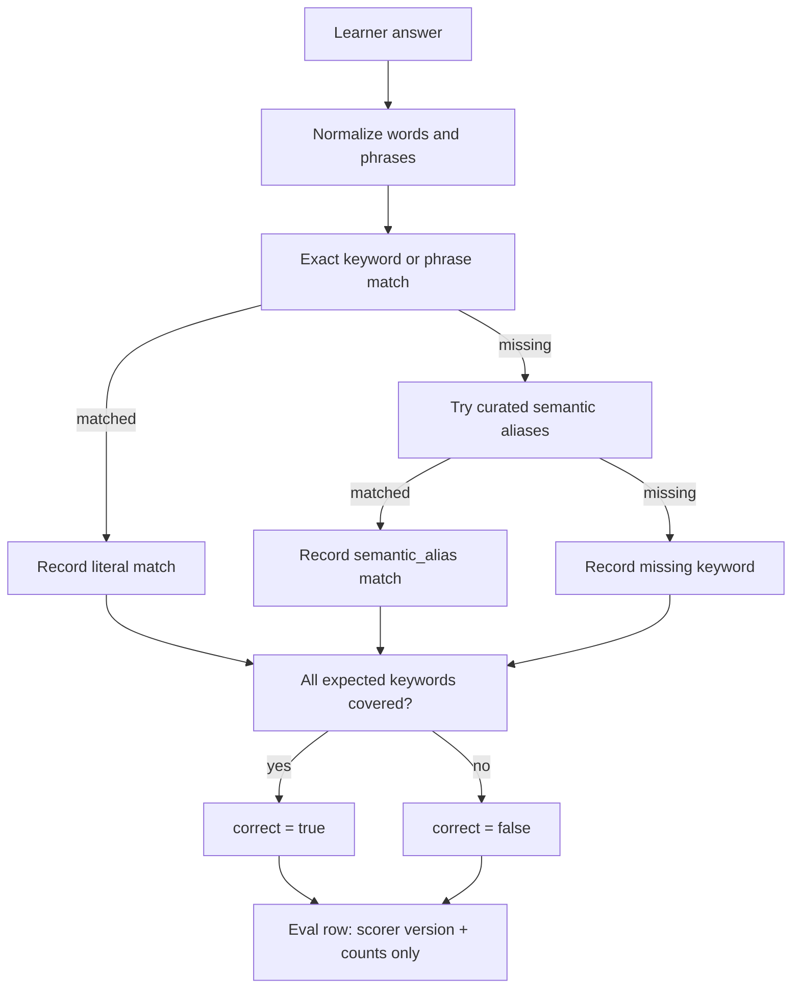

# Semantic Check-Answer Grading Implementation Plan

> **For agentic workers:** REQUIRED SUB-SKILL: Use superpowers:subagent-driven-development
> (recommended) or superpowers:executing-plans to implement this plan task-by-task. Steps use
> checkbox (`- [ ]`) syntax for tracking.

**Goal:** Reduce literal keyword false negatives in open-answer check grading before Turn-2 recovery
uses the grade as its trigger.

**Architecture:** Keep Python as the pass/fail gate. Extend the existing deterministic
`grade_understanding` path with a small scorer-versioned semantic alias layer for expected check
keywords; do not add an LLM judge, embedding scorer, direct LangGraph graph, or new agent role. Eval
rows expose only redacted scorer metadata and counts, not learner text, generated tutor prose, or
retrieved span text.

**Tech Stack:** Python 3.12, Pydantic models, existing `CheckItem`, existing `UnderstandingGrade`,
existing teach-loop eval harness, pytest, ruff. No frozen `test` split use.

---

## Context

PR #54 planned bounded Turn-2 recovery, but it intentionally gated recovery behind two prerequisite
risks:

1. Narrow false-refusal precision for teachable CONFIRM-band cases.
2. Cheap concept-aware grading so literal keyword misses do not trigger fake recovery failures.

This plan starts with grading because recovery depends on the grade. If the deterministic boundary
grader marks a reasonable answer wrong because the learner used a synonym, the recovery loop will look
busy while repairing a mistake the system created. That would pollute recovery metrics and exaggerate
agentic orchestration value.

The current grading seam is deliberately small:

- `src/genacademy_coach/check_items.py` generates a `CheckItem`.
- `src/genacademy_coach/grounding.py::grade_understanding` matches
  `CheckItem.expected_keywords`.
- `src/genacademy_coach/teach_session.py` calls the grader before the next agent turn.
- `src/genacademy_coach/eval_runner.py` records `grade_correct` without raw grade detail.

The cheap slice should keep that shape. The improvement is a deterministic scorer upgrade, not a new
agent.

## Scope

### In Scope

- Add scorer-version metadata to `UnderstandingGrade`.
- Add deterministic semantic alias matching for a small curated concept map.
- Preserve exact keyword and phrase matching as the first match mode.
- Add redacted eval fields for scorer version and match counts.
- Add aggregate eval metadata that makes scorer changes visible in run output.
- Add tests proving reasonable synonyms pass while unrelated answers still fail.
- Update docs and roadmap to show this as the active prerequisite slice before recovery.

### Out Of Scope

- LLM-judge grading.
- Embedding-similarity grading.
- Rewriting golden labels or moving scorer goalposts on old Week-4 results.
- Direct `langgraph.*` imports.
- New retrieval tools.
- Memory-personalized grading.
- Frozen `test` split use.
- Committed raw learner answers, generated tutor prose, retrieved span text, private URLs, or raw grade
  keyword payloads in eval artifacts.

## Planned Files

- Modify `src/genacademy_coach/teach_types.py`
  - Add scorer metadata to `UnderstandingGrade`.
- Modify `src/genacademy_coach/grounding.py`
  - Add deterministic alias matching and return scorer metadata.
- Modify `src/genacademy_coach/eval_runner.py`
  - Project redacted grade metadata into golden eval rows.
- Modify `src/genacademy_coach/eval_metrics.py`
  - Aggregate scorer versions and grade match counts.
- Modify `tests/test_grounding.py`
  - Unit coverage for literal, semantic, and still-wrong answers.
- Modify `tests/test_teach_session.py`
  - Session behavior test showing a synonym answer advances instead of re-explaining.
- Modify `tests/test_eval_runner.py`
  - Redacted row projection test.
- Modify `tests/test_eval_metrics.py`
  - Aggregate metadata test.
- Update `specs/roadmap.md`
  - Mark semantic grading as the active next item before recovery.
- Update `docs/INDEX.md`
  - Link this plan in the current priority section.

## Design



The scorer remains deterministic. It answers one question: did the learner cover each expected concept
well enough for the current grounded check?

This plan intentionally uses a curated alias map instead of an LLM grader. The alias map is limited,
reviewable, and testable. It can improve common wording differences such as "focus" versus "pay
attention to" without giving the model authority to decide correctness from priors.

## Acceptance Bars

- Existing literal grading tests still pass.
- New semantic tests pass:
  - "pays attention to important context" covers expected keywords `focus` and `relevant context`.
  - "stores context in memory" does not cover `focus`.
  - A partial answer still fails when one expected keyword remains missing.
- `UnderstandingGrade.scorer_version` is present and stable.
- Eval rows include grade scorer metadata and counts only:
  - `grade_scorer_version`
  - `grade_literal_match_count`
  - `grade_semantic_match_count`
  - `grade_missing_keyword_count`
- Eval rows do not include raw learner answer, generated tutor prose, retrieved span text, or raw
  matched alias text.
- Golden/dev eval is reported as a new scorer run, not as a replacement for prior v1 metrics.
- Refusal recall and citation F1 must not regress in the post-change dev/golden run.
- Held-out `test` split remains unused.

## Task 0: Gate The Slice Before Code

**Files:**
- No source changes.

- [ ] **Step 1: Confirm the active prerequisite decision**

Run:

```bash
sed -n '1,120p' specs/roadmap.md
sed -n '1,180p' docs/pr54-bounded-turn2-recovery-learning.md
```

Expected:

- The roadmap says post-eval behavior correctness is the active priority.
- Bounded Turn-2 recovery remains planned but not implemented.
- This grading slice is allowed to proceed before recovery because recovery depends on a trustworthy
  wrong-answer signal.

- [ ] **Step 2: Capture the pre-change baseline when provider/index are available**

Run:

```bash
uv run python scripts/run_golden_eval.py \
  --tag semantic-grading-before \
  --run-id semantic-grading-before
```

Expected:

- A local ignored file appears under `eval/runs/`.
- No frozen `test` split rows are used.
- Record these fields from the output:
  - `metrics.task_completion.pass_rate`
  - `metrics.citation_f1`
  - `metrics.refusal.precision`
  - `metrics.refusal.recall`
  - `metrics.retrieval_recall_at_5`
  - `metrics.case_latency_p95_ms`
  - `metrics.cost_usd`

If provider credentials or the local vector index are unavailable, record the blocker in the PR
description. Do not substitute the frozen `test` split.

## Task 1: Version The Grade Model

**Files:**
- Modify `src/genacademy_coach/teach_types.py`
- Modify `tests/test_grounding.py`

- [ ] **Step 1: Write failing model metadata assertions**

Add to `tests/test_grounding.py`:

```python
def test_grade_understanding_reports_scorer_version_and_match_modes():
    item = CheckItem(
        question="What does attention do?",
        expected_answer="It focuses relevant context.",
        expected_keywords=["focus", "context"],
        citation_id="note/attention::0",
    )

    grade = grade_understanding("It can focus on context.", item)

    assert grade.scorer_version == "concept-v1"
    assert grade.matched_keyword_modes == {
        "focus": "literal",
        "context": "literal",
    }
    assert grade.missing_keyword_count == 0
```

- [ ] **Step 2: Run the focused test and verify it fails**

Run:

```bash
uv run pytest -q \
  tests/test_grounding.py::test_grade_understanding_reports_scorer_version_and_match_modes
```

Expected: fail because `UnderstandingGrade` does not yet expose the scorer metadata.

- [ ] **Step 3: Add safe grade metadata**

In `src/genacademy_coach/teach_types.py`, add near the other literals:

```python
KeywordMatchMode = Literal["literal", "semantic_alias"]
```

Replace `UnderstandingGrade` with:

```python
class UnderstandingGrade(BaseModel):
    correct: bool
    matched_keywords: list[str]
    missing_keywords: list[str]
    citation_id: str
    scorer_version: str = "concept-v1"
    matched_keyword_modes: dict[str, KeywordMatchMode] = Field(default_factory=dict)

    @property
    def missing_keyword_count(self) -> int:
        return len(self.missing_keywords)
```

Why this shape:

- Existing construction sites remain compatible because new fields have defaults.
- `matched_keyword_modes` contains expected keyword labels, not learner answer text.
- The property avoids duplicating count storage in runtime models.

- [ ] **Step 4: Run the focused test and verify it still fails for mode population**

Run:

```bash
uv run pytest -q \
  tests/test_grounding.py::test_grade_understanding_reports_scorer_version_and_match_modes
```

Expected: fail until `grade_understanding` populates `matched_keyword_modes`.

## Task 2: Add Deterministic Semantic Alias Matching

**Files:**
- Modify `src/genacademy_coach/grounding.py`
- Modify `tests/test_grounding.py`

- [ ] **Step 1: Add failing semantic behavior tests**

Add to `tests/test_grounding.py`:

```python
def test_grade_understanding_accepts_curated_semantic_aliases():
    item = CheckItem(
        question="What does attention help the model do?",
        expected_answer="It helps focus on relevant context.",
        expected_keywords=["focus", "relevant context"],
        citation_id="note/attention::0",
    )

    grade = grade_understanding(
        "It helps the model pay attention to the important context.",
        item,
    )

    assert grade.correct is True
    assert grade.matched_keywords == ["focus", "relevant context"]
    assert grade.missing_keywords == []
    assert grade.matched_keyword_modes == {
        "focus": "semantic_alias",
        "relevant context": "semantic_alias",
    }


def test_grade_understanding_keeps_partial_semantic_answers_incorrect():
    item = CheckItem(
        question="What does attention help the model do?",
        expected_answer="It helps focus on relevant context.",
        expected_keywords=["focus", "relevant context"],
        citation_id="note/attention::0",
    )

    grade = grade_understanding("It stores context in memory.", item)

    assert grade.correct is False
    assert grade.matched_keywords == []
    assert grade.missing_keywords == ["focus", "relevant context"]
    assert grade.matched_keyword_modes == {}


def test_grade_understanding_allows_literal_and_semantic_mix():
    item = CheckItem(
        question="What does an agent harness control?",
        expected_answer="It controls tools and guardrails around the model.",
        expected_keywords=["tools", "guardrails"],
        citation_id="slide/harness::37",
    )

    grade = grade_understanding(
        "It controls external tools and safety boundaries.",
        item,
    )

    assert grade.correct is True
    assert grade.matched_keyword_modes == {
        "tools": "literal",
        "guardrails": "semantic_alias",
    }
```

- [ ] **Step 2: Run the focused tests and verify failure**

Run:

```bash
uv run pytest -q \
  tests/test_grounding.py::test_grade_understanding_accepts_curated_semantic_aliases \
  tests/test_grounding.py::test_grade_understanding_keeps_partial_semantic_answers_incorrect \
  tests/test_grounding.py::test_grade_understanding_allows_literal_and_semantic_mix
```

Expected: semantic-alias tests fail with the current keyword-only grader.

- [ ] **Step 3: Add the deterministic alias map and match helper**

In `src/genacademy_coach/grounding.py`, add after `CITATION_MARKER_RE`:

```python
SCORER_VERSION = "concept-v1"

SEMANTIC_KEYWORD_ALIASES: dict[str, tuple[str, ...]] = {
    "focus": (
        "focus",
        "pay attention to",
        "pays attention to",
        "prioritize",
        "prioritizes",
        "highlight",
        "highlights",
    ),
    "relevant context": (
        "relevant context",
        "important context",
        "context that matters",
        "useful context",
        "related information",
    ),
    "context": (
        "context",
        "surrounding information",
        "related information",
        "information around it",
    ),
    "tools": (
        "tools",
        "external tools",
        "tool calls",
        "act outside the model",
        "actions outside the model",
    ),
    "guardrails": (
        "guardrails",
        "safety boundaries",
        "safety rules",
        "constraints",
        "boundaries",
    ),
    "verification": (
        "verification",
        "verify",
        "checks",
        "tests",
        "validation",
        "validate",
    ),
    "recovery": (
        "recovery",
        "recover",
        "fallback",
        "repair",
        "retry",
    ),
}
```

Add after `keyword_present`:

```python
def keyword_match_mode(answer: str, keyword: str) -> str | None:
    if keyword_present(answer, keyword):
        return "literal"

    normalized_keyword = normalized_phrase(keyword)
    for alias in SEMANTIC_KEYWORD_ALIASES.get(normalized_keyword, ()):
        if alias != normalized_keyword and keyword_present(answer, alias):
            return "semantic_alias"
    return None
```

Implementation note: keep the map small. Add aliases only when a unit test proves a real false negative
and a reviewer can understand why the alias does not make unrelated answers correct.

- [ ] **Step 4: Update `grade_understanding` to use the helper**

Replace `grade_understanding` in `src/genacademy_coach/grounding.py` with:

```python
def grade_understanding(answer: str, item: CheckItem) -> UnderstandingGrade:
    matched: list[str] = []
    missing: list[str] = []
    modes: dict[str, str] = {}

    for keyword in item.expected_keywords:
        mode = keyword_match_mode(answer, keyword)
        if mode is None:
            missing.append(keyword)
        else:
            matched.append(keyword)
            modes[keyword] = mode

    return UnderstandingGrade(
        correct=not missing,
        matched_keywords=matched,
        missing_keywords=missing,
        citation_id=item.citation_id,
        scorer_version=SCORER_VERSION,
        matched_keyword_modes=modes,
    )
```

- [ ] **Step 5: Run the grounding tests**

Run:

```bash
uv run pytest -q tests/test_grounding.py tests/test_check_items.py
```

Expected: all selected tests pass.

## Task 3: Prove Session Behavior Uses The New Grade

**Files:**
- Modify `tests/test_teach_session.py`

- [ ] **Step 1: Add a session-level synonym test**

Add to `tests/test_teach_session.py` near the existing correct-answer fallback tests:

```python
def test_session_treats_semantic_synonym_answer_as_correct(tmp_path):
    agent = StaticAgentPort(
        CoachAgentResponse(
            learner_message="Attention highlights relevant context. [note/attention::0]",
            observation="learner answered correctly using equivalent wording",
            next_action="advance",
            strategy="summary",
            citation_ids=["note/attention::0"],
        )
    )
    session = CoachSession(
        session_id="abc",
        topic="attention",
        settings=FakeSettings(tmp_path),
        foundation=FakeFoundation(),
        profile=LearnerProfile(previous_strategies=["analogy"]),
        agent_port=agent,
    )
    session.runtime.last_spans = [cited_span()]
    session.runtime.current_check = CheckItem(
        question="What does attention help with?",
        expected_answer="It helps focus on relevant context.",
        expected_keywords=["focus", "relevant context"],
        citation_id="note/attention::0",
    )

    result = session.respond("It helps pay attention to important context.")

    assert result.profile.last_grade_correct is True
    assert session.runtime.last_grade is not None
    assert session.runtime.last_grade.scorer_version == "concept-v1"
    assert session.runtime.last_grade.matched_keyword_modes == {
        "focus": "semantic_alias",
        "relevant context": "semantic_alias",
    }
    assert result.response.next_action == "advance"
```

- [ ] **Step 2: Run the session test**

Run:

```bash
uv run pytest -q \
  tests/test_teach_session.py::test_session_treats_semantic_synonym_answer_as_correct
```

Expected: pass after Task 2.

## Task 4: Add Redacted Eval Row Fields

**Files:**
- Modify `src/genacademy_coach/eval_runner.py`
- Modify `tests/test_eval_runner.py`

- [ ] **Step 1: Add failing row assertions**

In `tests/test_eval_runner.py`, extend
`test_score_golden_case_emits_redacted_metric_row` with:

```python
    assert row["grade_scorer_version"] == "concept-v1"
    assert row["grade_literal_match_count"] == 1
    assert row["grade_semantic_match_count"] == 0
    assert row["grade_missing_keyword_count"] == 0
    assert "matched_keywords" not in row
    assert "missing_keywords" not in row
```

Also update `FakeSession.respond` so its grade includes match modes:

```python
        self.runtime.last_grade = UnderstandingGrade(
            correct=correct,
            matched_keywords=["generated keyword"] if correct else [],
            missing_keywords=[] if correct else ["generated keyword"],
            citation_id="note::0",
            matched_keyword_modes={"generated keyword": "literal"} if correct else {},
        )
```

- [ ] **Step 2: Run the focused eval-runner test and verify failure**

Run:

```bash
uv run pytest -q \
  tests/test_eval_runner.py::test_score_golden_case_emits_redacted_metric_row
```

Expected: fail until `eval_runner.py` emits the new redacted fields.

- [ ] **Step 3: Add a redacted grade summary helper**

In `src/genacademy_coach/eval_runner.py`, add after `_refusal_reason_code`:

```python
def _grade_summary(runtime: Any) -> dict[str, Any]:
    grade = getattr(runtime, "last_grade", None)
    if grade is None:
        return {
            "grade_scorer_version": None,
            "grade_literal_match_count": 0,
            "grade_semantic_match_count": 0,
            "grade_missing_keyword_count": 0,
        }
    modes = dict(getattr(grade, "matched_keyword_modes", {}) or {})
    return {
        "grade_scorer_version": getattr(grade, "scorer_version", None),
        "grade_literal_match_count": sum(
            1 for mode in modes.values() if mode == "literal"
        ),
        "grade_semantic_match_count": sum(
            1 for mode in modes.values() if mode == "semantic_alias"
        ),
        "grade_missing_keyword_count": len(getattr(grade, "missing_keywords", []) or []),
    }
```

- [ ] **Step 4: Include the summary in each eval row**

In `score_golden_case`, set:

```python
    grade_summary = _grade_summary(session.runtime)
```

Add this inside the `row` dict:

```python
        **grade_summary,
```

Place it near `grade_correct` so review can find all grading fields together.

- [ ] **Step 5: Run eval-runner tests**

Run:

```bash
uv run pytest -q tests/test_eval_runner.py
```

Expected: all tests pass.

## Task 5: Aggregate Scorer Metadata

**Files:**
- Modify `src/genacademy_coach/eval_metrics.py`
- Modify `tests/test_eval_metrics.py`

- [ ] **Step 1: Add failing aggregate assertions**

Add to `tests/test_eval_metrics.py`:

```python
def test_aggregate_reports_grade_scorer_metadata():
    out = aggregate(
        [
            {
                "case_id": "a",
                "query_type": "happy",
                "refusal_expected": False,
                "task_completion_pass": True,
                "citation_f1": 1.0,
                "tool_f1": 1.0,
                "turn_latencies_ms": [],
                "grade_scorer_version": "concept-v1",
                "grade_literal_match_count": 1,
                "grade_semantic_match_count": 1,
                "grade_missing_keyword_count": 0,
            },
            {
                "case_id": "b",
                "query_type": "happy",
                "refusal_expected": False,
                "task_completion_pass": False,
                "citation_f1": 0.0,
                "tool_f1": 1.0,
                "turn_latencies_ms": [],
                "grade_scorer_version": "concept-v1",
                "grade_literal_match_count": 0,
                "grade_semantic_match_count": 0,
                "grade_missing_keyword_count": 2,
            },
        ],
        price_table=PriceTable(prices={}),
    )

    assert out["grade_scorer_versions"] == {"concept-v1": 2}
    assert out["grade_literal_match_count"] == 1
    assert out["grade_semantic_match_count"] == 1
    assert out["grade_missing_keyword_count"] == 2
```

- [ ] **Step 2: Run the aggregate test and verify failure**

Run:

```bash
uv run pytest -q tests/test_eval_metrics.py::test_aggregate_reports_grade_scorer_metadata
```

Expected: fail until `aggregate` returns the new fields.

- [ ] **Step 3: Add aggregate fields**

In `src/genacademy_coach/eval_metrics.py::aggregate`, add before the final return:

```python
    grade_scorer_versions = Counter(
        str(row.get("grade_scorer_version"))
        for row in rows
        if row.get("grade_scorer_version")
    )
    grade_literal_match_count = sum(
        int(row.get("grade_literal_match_count") or 0) for row in rows
    )
    grade_semantic_match_count = sum(
        int(row.get("grade_semantic_match_count") or 0) for row in rows
    )
    grade_missing_keyword_count = sum(
        int(row.get("grade_missing_keyword_count") or 0) for row in rows
    )
```

Add these keys to the returned dict near the existing task/citation/tool metrics:

```python
        "grade_scorer_versions": dict(sorted(grade_scorer_versions.items())),
        "grade_literal_match_count": grade_literal_match_count,
        "grade_semantic_match_count": grade_semantic_match_count,
        "grade_missing_keyword_count": grade_missing_keyword_count,
```

- [ ] **Step 4: Run metric tests**

Run:

```bash
uv run pytest -q tests/test_eval_metrics.py
```

Expected: all tests pass.

## Task 6: Verify And Report As A New Scorer Run

**Files:**
- No source changes unless verification exposes a bug.

- [ ] **Step 1: Run focused unit coverage**

Run:

```bash
uv run pytest -q \
  tests/test_grounding.py \
  tests/test_check_items.py \
  tests/test_teach_session.py \
  tests/test_eval_runner.py \
  tests/test_eval_metrics.py
```

Expected: all selected tests pass.

- [ ] **Step 2: Run guardrail checks**

Run:

```bash
uv run ruff check
uv run python scripts/check_eval_leak.py
uv run python scripts/check_memory_leak.py
uv run pytest -q tests/test_guardrails.py
```

Expected:

- Ruff passes.
- Leak checks pass. Existing PDF extraction warnings are acceptable only if the scripts exit 0.
- Guardrail tests pass.

- [ ] **Step 3: Capture the post-change golden run when provider/index are available**

Run:

```bash
uv run python scripts/run_golden_eval.py \
  --tag semantic-grading-after \
  --run-id semantic-grading-after
```

Expected:

- A local ignored file appears under `eval/runs/`.
- The run contains `metrics.grade_scorer_versions` with `concept-v1`.
- Compare against the Task 0 baseline:
  - `metrics.refusal.recall` must not decrease.
  - `metrics.citation_f1` must not decrease.
  - `metrics.task_completion.pass_rate` should improve or stay flat.
  - `metrics.grade_semantic_match_count` should be visible when semantic aliases are used.

If provider credentials or the local index are unavailable, include the exact blocker in the PR
description and rely on unit coverage for the local branch.

- [ ] **Step 4: Document the scorer boundary in the PR description**

Include:

```markdown
This changes the deterministic scorer version from the keyword-only behavior to `concept-v1`.
It does not rewrite prior Week-4 v1 metrics. Any new eval result should be reported as a new scorer
run with the scorer version visible in `metrics.grade_scorer_versions`.
```

## Review Checklist

- [ ] No direct `langgraph.*` imports.
- [ ] No LLM judge or embedding similarity introduced.
- [ ] No frozen `test` split used.
- [ ] No raw learner answer, generated tutor prose, retrieved span text, private URL, or raw matched
  alias text committed.
- [ ] Existing exact-match behavior still works.
- [ ] Semantic aliases are deterministic, small, and unit tested.
- [ ] Eval output exposes scorer version and counts so future comparisons are not ambiguous.
- [ ] Turn-2 recovery remains unimplemented until this plan and the false-refusal slice are reviewed.
