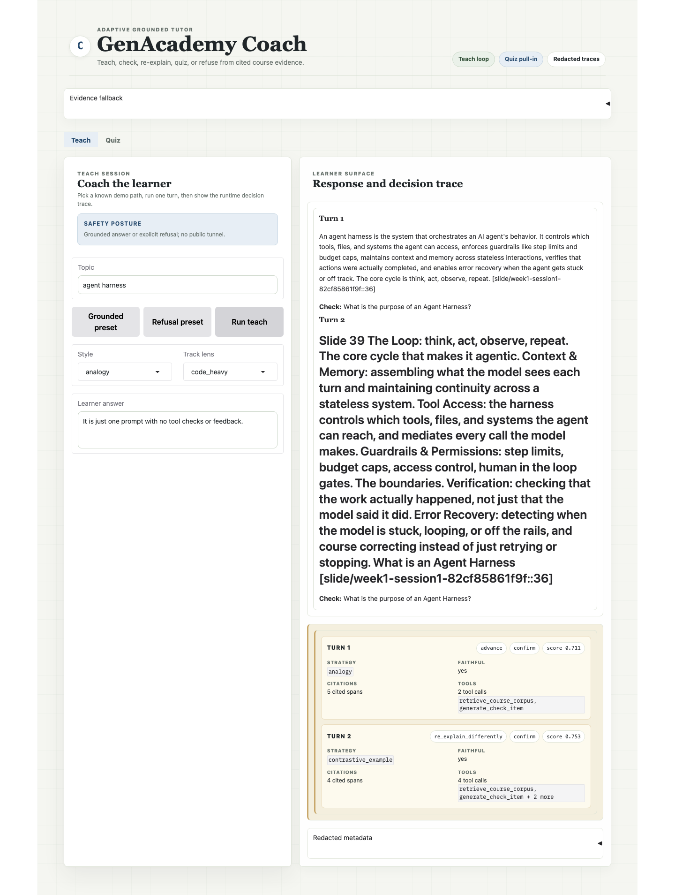
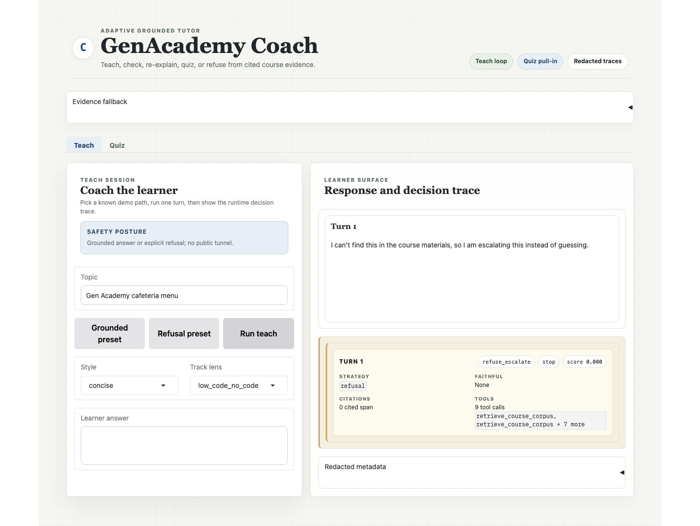
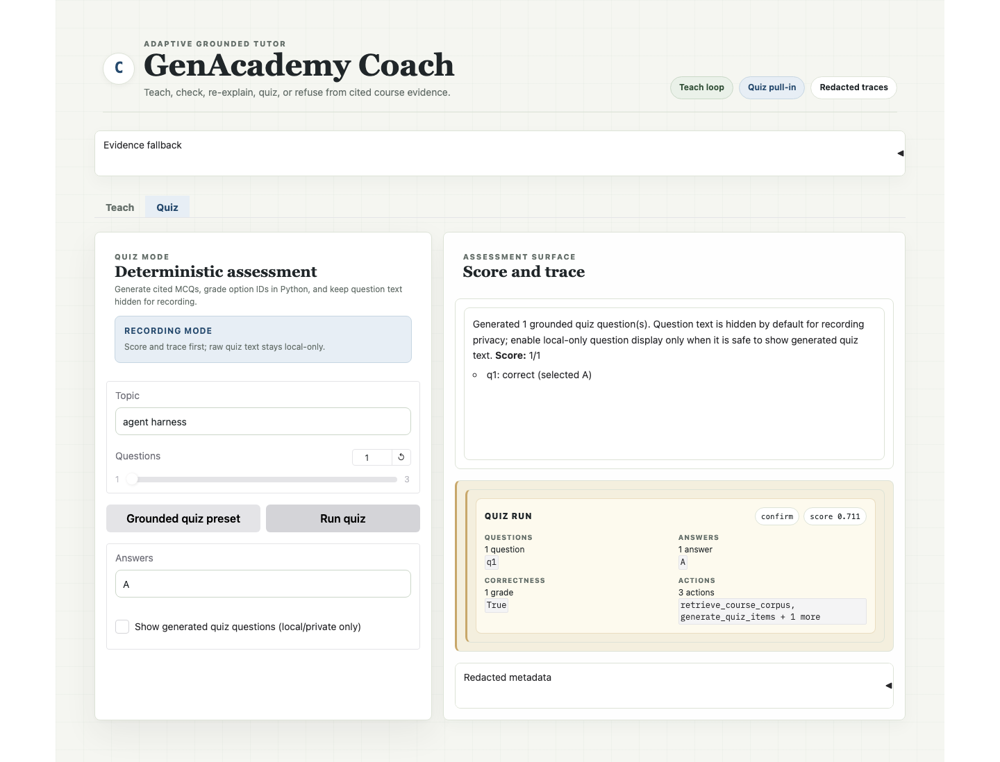
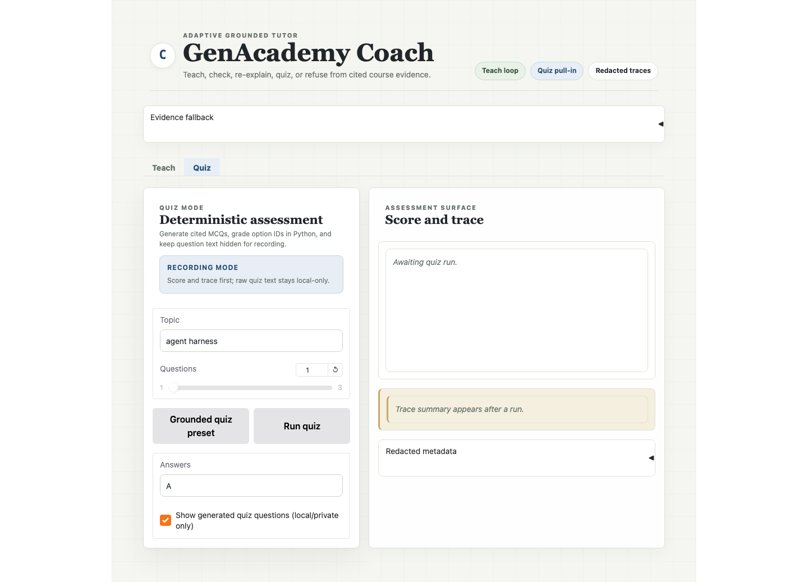

# Week 3 Demo Recording Script

> Target: <=5 minutes. Use this as the spoken script and screen checklist. Do not show raw corpus text,
> private eval questions, `.env`, API keys, or full trace payloads on screen.
>
> Companion prep packet: `docs/demo-walkthrough-with-screenshots.docx` embeds the key screenshots with
> click steps, on-screen callouts, and narration prompts.

## Pre-Recording Setup

1. Open the repo root in the terminal.
2. Stop any stale local app already using port `7861`.
3. Start the local Gradio UI against the local private corpus; do not use `share=True` or a public
   tunnel.
4. Open `http://127.0.0.1:7861` in the browser and hard-refresh before recording.
5. Keep one editor tab open with `docs/demo-and-deliverables.md`.
6. Keep one editor tab open with `README.md` at the Grader's 5-minute path.
7. Keep one editor tab open with `specs/roadmap.md`.
8. Use `docs/ui-screenshot-inventory.md` for baseline and function-state screenshots if you need static
   UI reference.
9. Do not run `--split test`.

Fixed UI check before recording:

- Teach tab shows `Grounded preset`, `Refusal preset`, and `Run teach` in one row.
- Quiz tab defaults to topic `agent harness`, `Questions = 1`, `Answers = A`.
- `Show generated quiz questions (local/private only)` is unchecked.
- Trace display uses decision cards, not a markdown table.
- `Redacted metadata` is collapsed.

If you see orange default tab styling, stacked quiz buttons, or `Questions = 3` by default, the browser
is showing the stale pre-polish UI. Hard-refresh or restart the local app.

Recommended terminal environment:

```bash
export GENACADEMY_PROVIDER=nebius
export GENACADEMY_COACH_STOP_THRESHOLD=0.40
```

Local UI command:

```bash
PORT=7861 uv run python app.py
```

`app.py` loads `.env` when present. If `.env` is not available in the environment, use the explicit
environment variables shown above.

## Shot List

| Time | Screen | Say |
|---|---|---|
| 0:00-0:20 | README title + one-line status | "This is GenAcademy Coach: a grounded adaptive tutor built on my Week 2 RAG system. The core promise is simple: it teaches from cited course evidence, adapts when the learner stumbles, and refuses when it cannot cite." |
| 0:20-0:45 | `specs/roadmap.md` cut list | "The first decision was scope. I cut memory, voice, admin UI, explicit LangGraph, and mock interview until the grounded teach loop worked end-to-end. That kept the demo from becoming a pile of half-features." |
| 0:45-2:05 | Local Gradio Teach tab: click `Grounded preset`, then `Run teach` | "Here the learner asks about a public demo topic. The tutor retrieves course evidence, explains, asks a grounded check, and then reacts to the learner's wrong answer. The key evidence is the runtime trace card: the model chooses a teaching action and strategy at runtime; Python only enforces grounding and safety." |
| 2:05-2:45 | Local Gradio Teach tab: click `Refusal preset`, then `Run teach`; show refusal output and safe trace only | "The failure path is load-bearing. For an out-of-corpus topic, the system does not invent an answer. Retrieval evidence is insufficient, the tutor refuses, and it queues mentor review." |
| 2:45-3:25 | Dev eval status doc | "I did not use the held-out test split for tuning or demo prep. The redacted dev eval is `7/10` overall and `7/8` teachable. Two failures are safe refusals. The remaining teachable variance is a conservative escalation case, not a hallucination." |
| 3:25-4:10 | Same-topic lens-switch metadata | "To show personalization without risky memory, I used controlled contrast: same topic, same learner answer, different teaching lens. The grounding metadata stays stable; the explanation shown live changes by lens." |
| 4:10-4:45 | Local Gradio Quiz tab: click `Grounded quiz preset`, then `Run quiz` with question text hidden | "Quiz Mode is the first pull-in, not the agenticity proof. The model generates a cited MCQ from retrieved spans, but Python owns the answer key and deterministic grading. For the recording, generated quiz text stays hidden; the trace stores only safe metadata." |
| 4:45-5:00 | README Grader's 5-minute path or `docs/submission-google-doc-draft.md` | "The proof path is now explicit: shipped surfaces, honest dev eval, local UI walkthrough, and the live Space limitation. The next reviewed standout workflow is Skill-Gap Diagnosis; memory and mock interview stay on the roadmap." |

## UI Walkthrough: Teach Tab

Use this section as the exact click script during recording.

### A. Grounded Adaptive Teach Path

Reference screenshot:



1. Open `http://127.0.0.1:7861`.
2. Click the `Teach` tab.
3. Click `Grounded preset`.
4. Confirm the visible fields:
   - Topic: `agent harness`
   - Style: `analogy`
   - Track lens: `code_heavy`
   - Learner answer: `It is just one prompt with no tool checks or feedback.`
5. Click `Run teach`.
6. Wait for the live provider call to finish. The first run may be slower; the warmed app should be
   faster.
7. In `Response and decision trace`, show:
   - `Turn 1`
   - a grounded learner explanation
   - `Check: ...`
   - `Turn 2`
   - a different re-explanation after the learner's wrong answer
8. In the trace card, point to:
   - action chip, especially `re_explain_differently` on the second turn
   - evidence band `confirm`
   - evidence score
   - `Faithful: yes`
   - citation counts, for example `5 cited spans`
   - tool-call counts
9. Do not expand `Redacted metadata` during the main recording. It is available as proof, but the trace
   card is the camera-friendly surface.

Suggested narration:

> "The UI is showing the important agentic moment. The model did not just answer once. It saw the
> learner's wrong answer, chose a new next action, and re-explained with a different strategy while the
> grounding gate kept citation evidence attached."

### B. Refusal And Escalation Path

Reference screenshot:



1. Stay on the `Teach` tab.
2. Click `Refusal preset`.
3. Confirm the visible fields:
   - Topic: `Gen Academy cafeteria menu`
   - Style: `concise`
   - Track lens: `low_code_no_code`
   - Learner answer is blank
4. Click `Run teach`.
5. Show the refusal message, not a hallucinated answer.
6. Show the trace card/refusal status:
   - action `refuse_escalate` or refusal status
   - evidence band `stop`
   - score near zero or below the STOP threshold
   - zero cited spans
7. If needed, mention that the local review queue receives a mentor-review row; do not show private
   raw corpus or full queue payloads.

Suggested narration:

> "This is the integrity moment. The tutor knows when the course corpus cannot support an answer, so it
> fails closed and escalates instead of bluffing from model priors."

## UI Walkthrough: Quiz Tab

### A. Grounded Hidden Quiz Path

Reference screenshot:



1. Click the `Quiz` tab.
2. Click `Grounded quiz preset`.
3. Confirm the visible fields:
   - Topic: `agent harness`
   - Questions: `1`
   - Answers: `A`
   - `Show generated quiz questions (local/private only)` is unchecked
4. Click `Run quiz`.
5. Show the output:
   - "Generated 1 grounded quiz question(s)."
   - question text is hidden by default
   - score is shown
6. Show the trace card:
   - evidence band `confirm`
   - evidence score
   - one question ID
   - selected answer ID
   - correctness boolean
   - actions include retrieval, question generation, and Python grading
7. Keep `Redacted metadata` collapsed unless you need to prove the safe trace fields. Do not expose raw
   generated quiz question text, option text, expected answers, rationales, or keywords.

Suggested narration:

> "Quiz is deliberately narrower than Teach Mode. The model generates a grounded question, but Python
> owns grading. For recording privacy, the generated question and options stay hidden by default."

### B. Optional Local-Only Reveal

Use this only if you have already confirmed the generated question text is public-safe.

Reference screenshot:



1. Keep topic `agent harness`.
2. Check `Show generated quiz questions (local/private only)`.
3. Click `Run quiz`.
4. Briefly show that the UI can reveal generated question text locally.
5. Uncheck it again before any public or shareable screenshot.

Default recording recommendation: skip this reveal and keep generated quiz text hidden.

### C. Optional Three-Question Capability

If the app is warm and you want to show the broader Quiz Mode capability:

1. Set `Questions` to `3`.
2. Set `Answers` to `A,B,C`.
3. Keep generated questions hidden.
4. Click `Run quiz`.
5. Show only the generated count, score, and safe trace fields.

This is optional. The primary recording path is the reliable one-question preset.

## Commands To Run Or Show As Fallback Evidence

Prefer the local Gradio UI for the recording. Keep these CLI commands ready if the UI call is slow or
if you need to show reproducibility.

Grounded teach loop:

```bash
GENACADEMY_PROVIDER=nebius GENACADEMY_COACH_STOP_THRESHOLD=0.40 \
  uv run python scripts/run_teach_demo.py \
    --session-id demo-grounded-main-final-20260616 \
    --topic "agent harness" \
    --style analogy \
    --track-lens code_heavy \
    --learner-answer "It is just one prompt with no tool checks or feedback."
```

Refusal path:

```bash
GENACADEMY_PROVIDER=nebius GENACADEMY_COACH_STOP_THRESHOLD=0.40 \
  uv run python scripts/run_teach_demo.py \
    --session-id demo-refusal-main-final-20260616 \
    --topic "Gen Academy cafeteria menu" \
    --style concise \
    --track-lens low_code_no_code
```

Same-topic lens switch:

```bash
GENACADEMY_PROVIDER=nebius GENACADEMY_COACH_STOP_THRESHOLD=0.40 \
  uv run python scripts/run_teach_demo.py \
    --session-id demo-lens-low-code-20260616 \
    --topic "agent harness" \
    --style analogy \
    --track-lens low_code_no_code \
    --learner-answer "It is just one prompt with no tool checks or feedback."

GENACADEMY_PROVIDER=nebius GENACADEMY_COACH_STOP_THRESHOLD=0.40 \
  uv run python scripts/run_teach_demo.py \
    --session-id demo-lens-code-heavy-20260616 \
    --topic "agent harness" \
    --style analogy \
    --track-lens code_heavy \
    --learner-answer "It is just one prompt with no tool checks or feedback."
```

Grounded quiz, matching the reliable local UI path:

```bash
GENACADEMY_PROVIDER=nebius GENACADEMY_COACH_STOP_THRESHOLD=0.40 \
  uv run python scripts/run_quiz_demo.py \
    --session-id demo-quiz-agent-harness-ui-20260617 \
    --topic "agent harness" \
    --question-count 1 \
    --answers A
```

Optional three-question quiz evidence:

```bash
GENACADEMY_PROVIDER=nebius GENACADEMY_COACH_STOP_THRESHOLD=0.40 \
  uv run python scripts/run_quiz_demo.py \
    --session-id demo-quiz-agent-harness-reviewfix2-20260616 \
    --topic "agent harness" \
    --question-count 3 \
    --answers A,B,C
```

Leak guard to show if time:

```bash
uv run python scripts/check_eval_leak.py
```

## Evidence To Show, Not Read Aloud Fully

- `docs/teach-loop-status.md` for redacted eval and live-trace metadata.
- `docs/demo-and-deliverables.md` for the evidence table.
- `docs/build-learnings.md` for the "what changed my mind" section.
- `docs/submission-google-doc-draft.md` for the written submission.

## Redaction Rules During Recording

- OK to show: file names, scenario counts, scores, bands, action names, strategy names, citation
  counts, booleans, selected option IDs, question IDs, and pass/fail counts.
- Do not show: raw corpus spans, private eval questions, generated quiz question text, option text,
  expected answers, rationales, keywords, long citation IDs, `.env`, API keys, or full trace payloads.

## Fallback If A Live Nebius Call Is Slow

Use the already-captured evidence in `docs/teach-loop-status.md` and
`docs/demo-and-deliverables.md`. Say:

> "These are the same commands I ran locally. The trace files are gitignored for privacy, so I am showing
> the committed redacted metadata instead of raw trace text."

This keeps the demo honest without risking a stalled live model call during recording.
